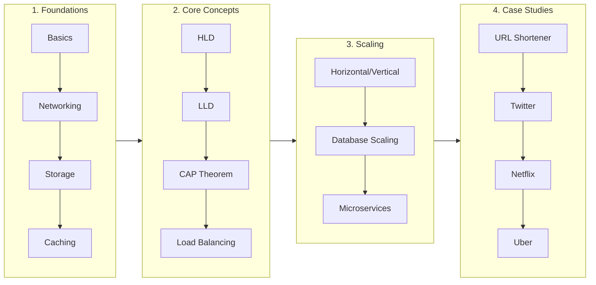
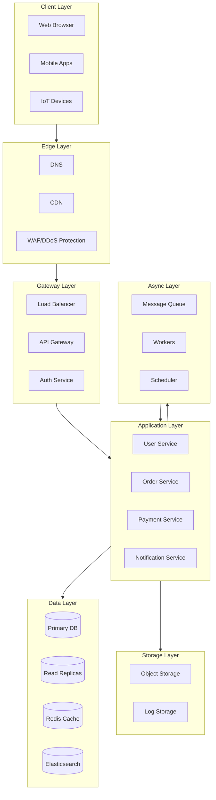

<div align="center">

# 🏗️ System Design Guide

### The Complete Guide to Building Large-Scale Systems

[](https://opensource.org/licenses/MIT)
[](http://makeapullrequest.com)
[](https://github.com/your-username/system-design-guide)

<br/>

**Learn how Netflix serves 200M+ users, how Uber matches millions of rides, and how WhatsApp handles 100B+ messages daily.**

*From fundamentals to FAANG-level system design interviews — with beautiful diagrams, real-world examples, and practical code.*

<br/>

[Start Learning](#-table-of-contents) • [Case Studies](#part-5-real-world-case-studies-chapters-19-26) • [Cheatsheets](./cheatsheets/) • [Interview Prep](#part-6-advanced--bonus-chapters-27-30)

</div>

---

## 🎯 What You'll Learn

```
┌─────────────────────────────────────────────────────────────────────────────┐
│                                                                             │
│   📐 HIGH LEVEL DESIGN (HLD)          🔧 LOW LEVEL DESIGN (LLD)            │
│   System architecture & components     Class diagrams & design patterns     │
│                                                                             │
│   ⚡ PERFORMANCE & SCALING             🔒 SECURITY & RELIABILITY            │
│   Handle millions of requests          Build fault-tolerant systems         │
│                                                                             │
│   🌍 REAL-WORLD CASE STUDIES           💼 INTERVIEW PREPARATION             │
│   Netflix, Uber, WhatsApp & more       FAANG-style questions & answers      │
│                                                                             │
└─────────────────────────────────────────────────────────────────────────────┘
```

---

## 🗺️ Learning Path



---

## 📚 Table of Contents

### PART 1: FOUNDATIONS (Chapters 1-4)

| Chapter | Title | Description | Difficulty |
|:-------:|-------|-------------|:----------:|
| [01](./chapters/01-introduction/) | **Introduction to System Design** | Why system design matters, thinking at scale, design process | 🟢 Beginner |
| [02](./chapters/02-networking/) | **Networking & Communication** | TCP/UDP, HTTP/HTTPS, WebSockets, gRPC, REST vs GraphQL | 🟢 Beginner |
| [03](./chapters/03-data-storage/) | **Data Storage Fundamentals** | SQL vs NoSQL, ACID, Redis, MongoDB, choosing the right DB | 🟢 Beginner |
| [04](./chapters/04-caching-cdn/) | **Caching & CDN** | Cache strategies, Redis, Memcached, CDN architecture | 🟢 Beginner |

---

### PART 2: CORE CONCEPTS (Chapters 5-9)

| Chapter | Title | Description | Difficulty |
|:-------:|-------|-------------|:----------:|
| [05](./chapters/05-hld/) | **High Level Design (HLD)** | Components, data flow, API design, capacity estimation | 🟡 Intermediate |
| [06](./chapters/06-lld/) | **Low Level Design (LLD)** | Class diagrams, SOLID principles, design patterns | 🟡 Intermediate |
| [07](./chapters/07-cap-theorem/) | **CAP Theorem & Consistency** | CAP, PACELC, eventual vs strong consistency | 🟡 Intermediate |
| [08](./chapters/08-load-balancing/) | **Load Balancing** | Algorithms, L4 vs L7, HAProxy, Nginx, health checks | 🟡 Intermediate |
| [09](./chapters/09-message-queues/) | **Message Queues & Async** | Kafka, RabbitMQ, SQS, pub/sub, event sourcing | 🟡 Intermediate |

---

### PART 3: SCALING & PERFORMANCE (Chapters 10-14)

| Chapter | Title | Description | Difficulty |
|:-------:|-------|-------------|:----------:|
| [10](./chapters/10-scaling/) | **Horizontal vs Vertical Scaling** | Scaling strategies, auto-scaling, stateless design | 🟡 Intermediate |
| [11](./chapters/11-database-scaling/) | **Database Scaling** | Sharding, partitioning, replication, read replicas | 🟠 Advanced |
| [12](./chapters/12-performance/) | **System Performance** | Latency optimization, profiling, bottleneck identification | 🟠 Advanced |
| [13](./chapters/13-microservices/) | **Microservices Architecture** | Service decomposition, API Gateway, service mesh | 🟠 Advanced |
| [14](./chapters/14-distributed-systems/) | **Distributed Systems** | Consensus, leader election, Paxos, Raft | 🔴 Expert |

---

### PART 4: SECURITY & RELIABILITY (Chapters 15-18)

| Chapter | Title | Description | Difficulty |
|:-------:|-------|-------------|:----------:|
| [15](./chapters/15-security/) | **System Security** | OAuth 2.0, JWT, encryption, HTTPS, API security | 🟡 Intermediate |
| [16](./chapters/16-rate-limiting/) | **Rate Limiting & Throttling** | Token bucket, sliding window, DDoS protection | 🟡 Intermediate |
| [17](./chapters/17-fault-tolerance/) | **Fault Tolerance** | Circuit breakers, retries, graceful degradation | 🟠 Advanced |
| [18](./chapters/18-disaster-recovery/) | **Disaster Recovery** | Backup strategies, multi-region, RPO/RTO | 🟠 Advanced |

---

### PART 5: REAL-WORLD CASE STUDIES (Chapters 19-26)

| Chapter | System | What You'll Design | Difficulty |
|:-------:|--------|-------------------|:----------:|
| [19](./chapters/19-url-shortener/) | **URL Shortener** (TinyURL/Bitly) | Hashing, Base62 encoding, analytics | 🟢 Beginner |
| [20](./chapters/20-paste-service/) | **Paste Service** (Pastebin) | Object storage, expiration, access control | 🟢 Beginner |
| [21](./chapters/21-twitter-clone/) | **Twitter/X Clone** | Feed generation, fan-out, trending topics | 🟡 Intermediate |
| [22](./chapters/22-instagram-clone/) | **Instagram Clone** | Image storage, CDN, recommendations | 🟡 Intermediate |
| [23](./chapters/23-whatsapp/) | **WhatsApp Clone** | Real-time messaging, E2E encryption, presence | 🟡 Intermediate |
| [24](./chapters/24-youtube/) | **YouTube Clone** | Video transcoding, adaptive streaming, CDN | 🟠 Advanced |
| [25](./chapters/25-uber/) | **Uber Clone** | Geospatial indexing, real-time matching, surge pricing | 🟠 Advanced |
| [26](./chapters/26-amazon/) | **Amazon Clone** | Inventory, cart, payments, recommendations | 🟠 Advanced |

---

### PART 6: ADVANCED & BONUS (Chapters 27-30)

| Chapter | Title | Description | Difficulty |
|:-------:|-------|-------------|:----------:|
| [27](./chapters/27-payment-systems/) | **Payment Systems** | Stripe/Razorpay architecture, idempotency, PCI compliance | 🟠 Advanced |
| [28](./chapters/28-search-engine/) | **Search Engine Design** | Web crawling, indexing, ranking, Elasticsearch | 🔴 Expert |
| [29](./chapters/29-notification-system/) | **Notification System** | Push, email, SMS, priority queues | 🟡 Intermediate |
| [30](./chapters/30-interview-guide/) | **Interview Preparation Guide** | Framework, time management, common mistakes | 🟢 All Levels |

---

## 🏛️ System Design Architecture Overview



---

## 📊 Quick Reference Cards

| Topic | One-Liner | Learn More |
|-------|-----------|------------|
| **CAP Theorem** | You can only have 2 of 3: Consistency, Availability, Partition Tolerance | [Chapter 7](./chapters/07-cap-theorem/) |
| **Horizontal Scaling** | Add more machines (scale out) vs bigger machines (scale up) | [Chapter 10](./chapters/10-scaling/) |
| **Sharding** | Split data across multiple databases by a shard key | [Chapter 11](./chapters/11-database-scaling/) |
| **Load Balancing** | Distribute traffic across servers (Round Robin, Least Connections, IP Hash) | [Chapter 8](./chapters/08-load-balancing/) |
| **Caching** | Store frequently accessed data in memory (Redis, Memcached) | [Chapter 4](./chapters/04-caching-cdn/) |
| **Message Queues** | Async communication between services (Kafka, RabbitMQ) | [Chapter 9](./chapters/09-message-queues/) |

---

## 🎓 How to Use This Guide

### 📖 For Learning
1. Start with **Part 1 (Foundations)** if you're new to system design
2. Follow the chapters in order — each builds on the previous
3. Practice with the **case studies** in Part 5
4. Use the **interview corner** in each chapter for Q&A practice

### 💼 For Interview Prep
1. Review the **cheatsheets** for quick reference
2. Focus on **case studies** (Chapters 19-26)
3. Practice the **interview guide** framework (Chapter 30)
4. Time yourself: 5 min requirements, 30 min design, 10 min deep dive

### 📱 For Social Media
- Each chapter has **shareable quotes** and **diagram cards**
- Check the `assets/` folder for ready-to-share images
- Use the **TL;DR sections** for quick posts

---

## 🤝 Contributing

We welcome contributions! See [CONTRIBUTING.md](./CONTRIBUTING.md) for guidelines.

Ways to contribute:
- 🐛 Report errors or typos
- 💡 Suggest new topics or case studies  
- 🎨 Improve diagrams and visuals
- 📝 Add practical code examples

---

## ⭐ Star History

If this guide helped you, please consider giving it a star! ⭐

---

## 📄 License

This project is licensed under the MIT License - see the [LICENSE](./LICENSE) file for details.

---

<div align="center">

**Made with ❤️ for the developer community**

[⬆ Back to Top](#-system-design-guide)

</div>
