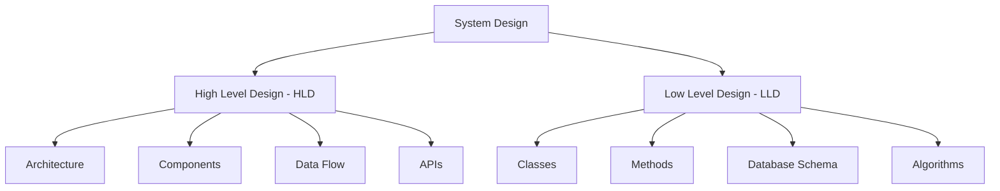
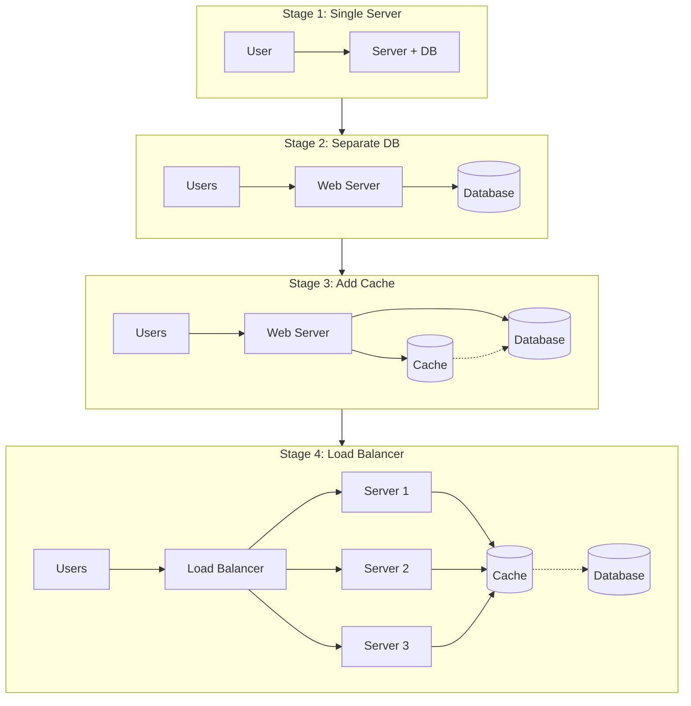
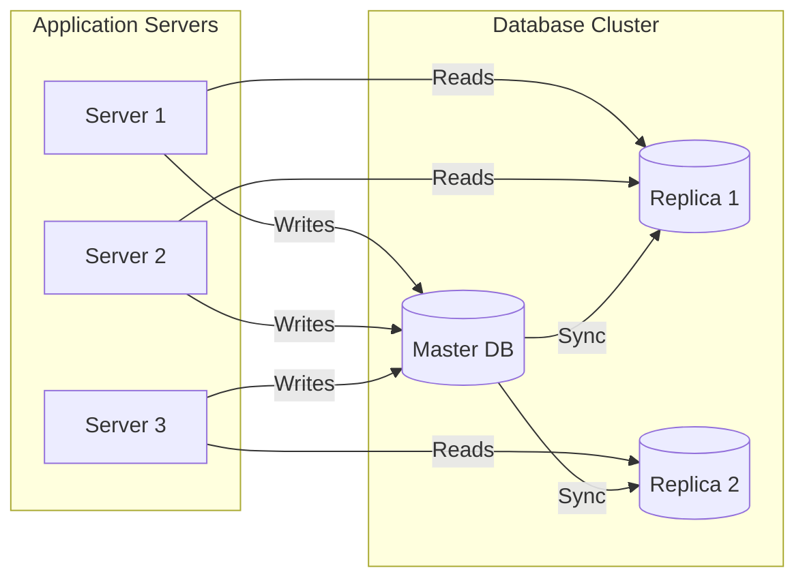
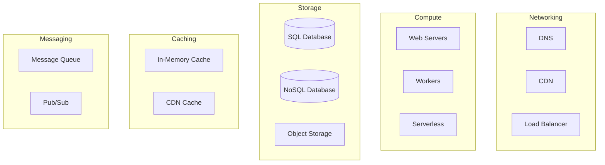
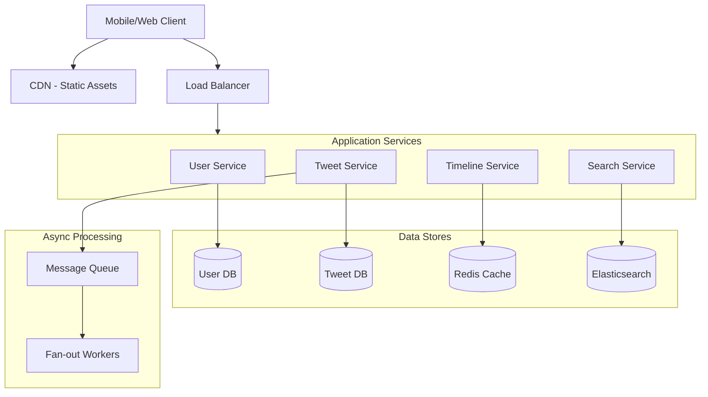
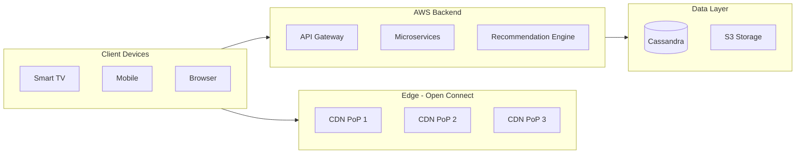
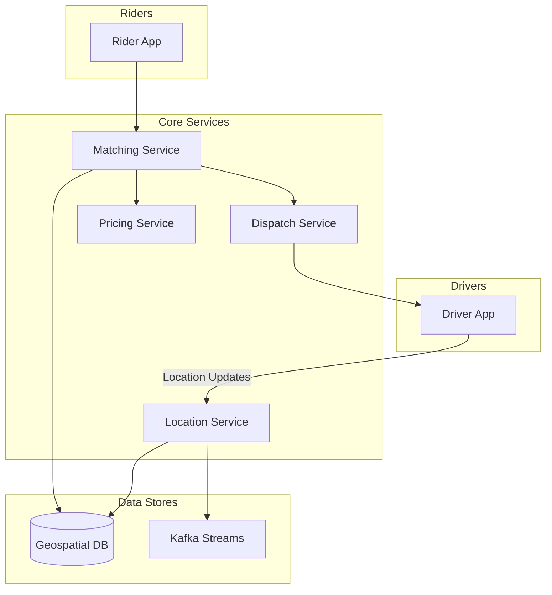
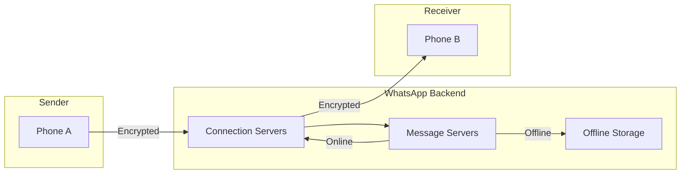

<div align="center">

# Chapter 01: Introduction to System Design

> *"How does Netflix serve 200 million users watching 1 billion hours of content every week?"*

[](../../README.md)
[](../02-networking/README.md)

</div>

---

## 🎯 What You'll Learn

By the end of this chapter, you will:

- ✅ Understand what system design is and why it matters
- ✅ Learn how to think at scale (1 user → 1 million users)
- ✅ Master the system design interview framework
- ✅ Explore real examples from Netflix, Uber, and WhatsApp
- ✅ Understand the building blocks of distributed systems

---

## 📋 Prerequisites

- Basic programming knowledge (any language)
- Understanding of client-server architecture
- Familiarity with databases (SQL basics)

---

## 📑 Table of Contents

1. [What is System Design?](#1-what-is-system-design)
2. [Why Does System Design Matter?](#2-why-does-system-design-matter)
3. [Thinking at Scale](#3-thinking-at-scale)
4. [The Building Blocks](#4-the-building-blocks)
5. [System Design Process](#5-system-design-process)
6. [Real-World Examples](#6-real-world-examples)
7. [Common Pitfalls](#7-common-pitfalls)
8. [Interview Corner](#8-interview-corner)
9. [Quick Recap](#9-quick-recap)
10. [Further Reading](#10-further-reading)

---

## 1. What is System Design?

**System Design** is the process of defining the architecture, components, modules, interfaces, and data flow of a system to satisfy specified requirements.

Think of it like building a city:
- You need roads (networks)
- Buildings (servers)
- Utilities (databases, caches)
- Traffic management (load balancers)
- Emergency services (fault tolerance)

### The Two Pillars of System Design



| Aspect | High Level Design (HLD) | Low Level Design (LLD) |
|--------|------------------------|------------------------|
| **Focus** | The "what" and "where" | The "how" |
| **Scope** | Entire system architecture | Individual components |
| **Audience** | Architects, Tech Leads | Developers |
| **Output** | Architecture diagrams | Class diagrams, code |
| **Example** | "We need a cache layer" | "Use Redis with LRU eviction" |

---

## 2. Why Does System Design Matter?

### 📈 The Scale Challenge

Consider the difference between building an app for:

| Metric | Startup (1K users) | Scale-up (1M users) | Enterprise (100M users) |
|--------|-------------------|--------------------|-----------------------|
| **Requests/sec** | 10 | 10,000 | 1,000,000 |
| **Data size** | 1 GB | 1 TB | 1 PB |
| **Servers** | 1 | 50 | 10,000+ |
| **Database** | Single MySQL | Sharded cluster | Global distributed |
| **Deployment** | Manual | CI/CD | Multi-region auto |

### 💰 The Cost of Getting It Wrong

| Company | Incident | Cost |
|---------|----------|------|
| **Amazon** | 1 second delay | 1% revenue loss (~$1.6B/year) |
| **Google** | 0.5s slower search | 20% traffic drop |
| **Knight Capital** | Bad system design | $440M loss in 45 minutes |

### 🎯 The Benefits of Good System Design

```
┌────────────────────────────────────────────────────────────────────┐
│                                                                    │
│  ⚡ PERFORMANCE          📈 SCALABILITY         💰 COST EFFICIENCY │
│  Fast response times     Handle growth           Optimize resources│
│                                                                    │
│  🔒 RELIABILITY          🛡️ SECURITY             🔧 MAINTAINABILITY│
│  Always available        Protected data          Easy to modify    │
│                                                                    │
└────────────────────────────────────────────────────────────────────┘
```

---

## 3. Thinking at Scale

### The Evolution of an Application

Let's trace how a simple app evolves from a hobby project to a global platform:



### Stage 1: The Monolith (0-100 users)

```
┌─────────────────────────────────────┐
│           Single Server             │
├─────────────────────────────────────┤
│  ┌─────────────────────────────┐   │
│  │      Web Application        │   │
│  │   (Node.js / Python / Java) │   │
│  └─────────────────────────────┘   │
│                 │                   │
│  ┌─────────────────────────────┐   │
│  │         Database            │   │
│  │      (SQLite / MySQL)       │   │
│  └─────────────────────────────┘   │
│                 │                   │
│  ┌─────────────────────────────┐   │
│  │       File Storage          │   │
│  │     (Local Disk)            │   │
│  └─────────────────────────────┘   │
└─────────────────────────────────────┘
```

**Characteristics:**
- Everything on one machine
- Simple to develop and deploy
- Fast local communication
- **Limits:** Single point of failure, can't scale

### Stage 2: Separate the Database (100-10K users)

**Why?**
- Database can be optimized independently
- Allows specialized hardware for DB
- Horizontal scaling of app servers becomes possible

### Stage 3: Add Caching (10K-100K users)

**Why?**
- Database queries are slow (disk I/O)
- Cache reads are fast (memory)
- Reduce database load by 90%+

```python
# Pseudo-code for caching pattern
def get_user(user_id):
    # Try cache first
    user = cache.get(f"user:{user_id}")
    if user:
        return user  # Cache hit! ⚡
    
    # Cache miss - fetch from DB
    user = database.query(f"SELECT * FROM users WHERE id = {user_id}")
    
    # Store in cache for next time
    cache.set(f"user:{user_id}", user, ttl=3600)
    return user
```

### Stage 4: Load Balancing (100K-1M users)

**Why?**
- Single server can't handle all requests
- Need redundancy for reliability
- Distribute traffic across multiple servers

### Stage 5: Database Replication (1M-10M users)



**Why?**
- Reads are 90%+ of traffic (usually)
- Distribute read load across replicas
- Master handles all writes

### Stage 6: Database Sharding (10M-100M+ users)

**Why?**
- Single database can't hold all data
- Split data across multiple databases
- Each shard holds a subset of data

```
                    ┌──────────────────────────────────┐
                    │          Shard Router            │
                    └──────────────────────────────────┘
                                    │
           ┌────────────────────────┼────────────────────────┐
           ▼                        ▼                        ▼
    ┌─────────────┐          ┌─────────────┐          ┌─────────────┐
    │   Shard 1   │          │   Shard 2   │          │   Shard 3   │
    │  Users A-I  │          │  Users J-R  │          │  Users S-Z  │
    └─────────────┘          └─────────────┘          └─────────────┘
```

---

## 4. The Building Blocks

Every large-scale system is composed of these fundamental building blocks:



### Quick Overview of Each Block

| Building Block | Purpose | Examples |
|----------------|---------|----------|
| **DNS** | Translate domain to IP | Route53, Cloudflare |
| **CDN** | Cache static content globally | CloudFront, Akamai |
| **Load Balancer** | Distribute traffic | Nginx, HAProxy, ALB |
| **Web Servers** | Handle HTTP requests | Node.js, Tomcat |
| **Database** | Persistent data storage | PostgreSQL, MongoDB |
| **Cache** | Fast data access | Redis, Memcached |
| **Message Queue** | Async communication | Kafka, RabbitMQ |
| **Object Storage** | Store files/media | S3, GCS |

---

## 5. System Design Process

### The RESHADE Framework

Use this framework for any system design problem:

```
┌─────────────────────────────────────────────────────────────────────────┐
│                        R E S H A D E  Framework                        │
├─────────────────────────────────────────────────────────────────────────┤
│                                                                         │
│  R - Requirements     │ Functional & Non-functional requirements        │
│                       │ "What must the system do? How well?"            │
│                                                                         │
│  E - Estimation       │ Traffic, storage, bandwidth calculations        │
│                       │ "How much data? How many requests?"             │
│                                                                         │
│  S - Storage          │ Database design, data modeling                  │
│                       │ "How do we store and retrieve data?"            │
│                                                                         │
│  H - High Level       │ Architecture, components, data flow             │
│                       │ "What are the major components?"                │
│                                                                         │
│  A - APIs             │ Interface design, endpoints                     │
│                       │ "How do components communicate?"                │
│                                                                         │
│  D - Deep Dives       │ Scaling, bottlenecks, trade-offs                │
│                       │ "What are the challenges and solutions?"        │
│                                                                         │
│  E - Edge Cases       │ Failure scenarios, security, monitoring         │
│                       │ "What could go wrong? How do we handle it?"     │
│                                                                         │
└─────────────────────────────────────────────────────────────────────────┘
```

### Step-by-Step Breakdown

#### Step 1: Requirements (5 minutes)

**Functional Requirements** - What must the system do?
- User can create an account
- User can post a tweet
- User can follow other users

**Non-Functional Requirements** - How well must it perform?
- Low latency (< 200ms response time)
- High availability (99.99% uptime)
- Scalable to 100M users
- Data durability (never lose data)

#### Step 2: Estimation (5 minutes)

```
Example: Design Twitter

Users: 500 million total, 200 million daily active (DAU)
Tweets/day: 200M DAU × 2 tweets = 400M tweets/day
Read/Write ratio: 100:1 (reads heavy)

Tweets/second (write): 400M / 86400 ≈ 5000 TPS
Reads/second: 5000 × 100 = 500,000 RPS

Storage per tweet: 280 chars × 2 bytes = 560 bytes + metadata ≈ 1 KB
Daily storage: 400M × 1 KB = 400 GB/day
Yearly storage: 400 GB × 365 = 146 TB/year
```

#### Step 3: High Level Design



---

## 6. Real-World Examples

### 🎬 Netflix: Streaming at Scale

**The Challenge:**
- 200+ million subscribers
- 1 billion hours watched per week
- Available in 190+ countries
- Peak: 15% of global internet traffic

**Key Design Decisions:**



| Component | Technology | Why? |
|-----------|------------|------|
| **CDN** | Open Connect (custom) | Store content closer to users |
| **Backend** | AWS + Microservices | 700+ services for flexibility |
| **Database** | Cassandra | High availability, no single point of failure |
| **Cache** | EVCache (memcached) | Reduce database load |
| **Video Encoding** | Custom pipeline | Multiple formats for adaptive streaming |

### 🚗 Uber: Real-Time Matching

**The Challenge:**
- 100+ million users
- 5+ million drivers
- Match rider to driver in seconds
- Handle surge pricing in real-time

**Key Design Decisions:**



| Component | Technology | Why? |
|-----------|------------|------|
| **Geospatial** | H3 + PostGIS | Efficient location queries |
| **Real-time** | Kafka | Handle millions of location updates |
| **Matching** | Ring Pop | Consistent hashing for drivers |
| **Database** | MySQL + Schemaless | Flexible data model |

### 💬 WhatsApp: Messaging Billions

**The Challenge:**
- 2+ billion users
- 100+ billion messages per day
- End-to-end encryption
- Support for media, voice, video

**Key Design Decisions:**



| Component | Technology | Why? |
|-----------|------------|------|
| **Protocol** | XMPP (modified) | Low overhead, real-time |
| **Language** | Erlang | Handles millions of connections |
| **Database** | Mnesia + SQLite | Fast in-memory operations |
| **Encryption** | Signal Protocol | End-to-end security |

---

## 7. Common Pitfalls

### ❌ Mistakes to Avoid

```
┌─────────────────────────────────────────────────────────────────────────┐
│                         COMMON PITFALLS                                 │
├─────────────────────────────────────────────────────────────────────────┤
│                                                                         │
│  ❌ Premature Optimization                                              │
│     Don't build for 1M users on day 1 when you have 100                │
│                                                                         │
│  ❌ Single Point of Failure                                             │
│     Every component should have redundancy                              │
│                                                                         │
│  ❌ Ignoring Network Latency                                            │
│     Network calls are 1000x slower than memory access                  │
│                                                                         │
│  ❌ Not Considering Failure Cases                                       │
│     Everything fails eventually - design for it                        │
│                                                                         │
│  ❌ Over-Engineering                                                    │
│     KISS - Keep It Simple, Stupid                                      │
│                                                                         │
│  ❌ Skipping Requirements Gathering                                     │
│     Understand the problem before designing the solution                │
│                                                                         │
└─────────────────────────────────────────────────────────────────────────┘
```

### ✅ Best Practices

| Practice | Description |
|----------|-------------|
| **Start Simple** | Begin with a monolith, evolve to microservices |
| **Design for Failure** | Assume anything can fail |
| **Cache Aggressively** | But know when to invalidate |
| **Use Queues** | Decouple components, handle spikes |
| **Monitor Everything** | You can't fix what you can't see |
| **Document Decisions** | Future you will thank you |

---

## 8. Interview Corner

### 🎯 Top Interview Questions

**Q1: How would you design a URL shortener like bit.ly?**

<details>
<summary>Click to see approach</summary>

**Key Points:**
- Generate unique short codes (Base62 encoding)
- Redirect with 301/302
- Analytics (click tracking)
- Handle collisions
- Scale reads (cache popular URLs)

</details>

**Q2: What's the difference between horizontal and vertical scaling?**

<details>
<summary>Click to see answer</summary>

| Vertical Scaling (Scale Up) | Horizontal Scaling (Scale Out) |
|---------------------------|------------------------------|
| Add more power to existing machine | Add more machines |
| Limited by hardware | Virtually unlimited |
| Simpler | More complex |
| Single point of failure | Distributed |
| Example: 8GB → 32GB RAM | Example: 1 server → 10 servers |

</details>

**Q3: Explain CAP theorem in simple terms.**

<details>
<summary>Click to see answer</summary>

In a distributed system, you can only guarantee 2 of 3:

- **C**onsistency: All nodes see the same data
- **A**vailability: Every request gets a response
- **P**artition tolerance: System works despite network failures

Since network partitions are unavoidable, you must choose between CP (consistency) or AP (availability).

</details>

### 💡 Interview Tips

1. **Clarify requirements** - Don't assume, ask!
2. **Think out loud** - Show your thought process
3. **Start high-level** - Then dive deep
4. **Consider trade-offs** - No solution is perfect
5. **Know your numbers** - Latency, throughput estimates

---

## 9. Quick Recap

### TL;DR Summary Card

```
┌─────────────────────────────────────────────────────────────────────────┐
│                    CHAPTER 01: QUICK RECAP                              │
├─────────────────────────────────────────────────────────────────────────┤
│                                                                         │
│  📌 System Design = Architecture + Components + Data Flow               │
│                                                                         │
│  📌 Two Types: HLD (what/where) & LLD (how)                            │
│                                                                         │
│  📌 Scaling Stages:                                                     │
│     Single Server → DB Separation → Cache → Load Balancer →            │
│     Replication → Sharding                                              │
│                                                                         │
│  📌 Building Blocks: DNS, CDN, LB, Servers, DB, Cache, Queue           │
│                                                                         │
│  📌 Use RESHADE Framework:                                              │
│     Requirements → Estimation → Storage → High Level →                 │
│     APIs → Deep Dives → Edge Cases                                     │
│                                                                         │
│  📌 Real Examples: Netflix (CDN + Microservices),                      │
│     Uber (Geospatial + Real-time), WhatsApp (Erlang + E2E)             │
│                                                                         │
└─────────────────────────────────────────────────────────────────────────┘
```

### Key Numbers to Remember

| Metric | Value |
|--------|-------|
| L1 cache reference | 0.5 ns |
| Main memory reference | 100 ns |
| SSD read | 150 μs |
| Network round trip (same datacenter) | 0.5 ms |
| Network round trip (cross-continent) | 150 ms |
| Read 1 MB from memory | 0.25 ms |
| Read 1 MB from SSD | 1 ms |
| Read 1 MB from disk | 20 ms |

---

## 10. Further Reading

### 📚 Recommended Resources

**Books:**
- "Designing Data-Intensive Applications" by Martin Kleppmann
- "System Design Interview" by Alex Xu
- "Building Microservices" by Sam Newman

**Online:**
- [System Design Primer (GitHub)](https://github.com/donnemartin/system-design-primer)
- [High Scalability Blog](http://highscalability.com/)
- [Engineering Blogs](https://github.com/kilimchoi/engineering-blogs)

**Practice:**
- [Educative.io - Grokking System Design](https://www.educative.io/)
- [ByteByteGo](https://bytebytego.com/)

---

## 📱 Share This Chapter

> *"System Design is not about memorizing solutions. It's about understanding trade-offs and making informed decisions."*

**Key Takeaways to Share:**

```
🏗️ SYSTEM DESIGN 101

1️⃣ Start simple, scale when needed
2️⃣ Cache is your best friend (but know when to invalidate)
3️⃣ Design for failure, not just success
4️⃣ Every decision is a trade-off
5️⃣ Know your numbers (latency, throughput)

#SystemDesign #SoftwareEngineering #TechInterviews
```

---

<div align="center">

## Navigation

[](../../README.md)
[](../02-networking/README.md)

---

**[⬆ Back to Top](#chapter-01-introduction-to-system-design)** | **[📚 Table of Contents](../../README.md)**

</div>

