<div align="center">

# Chapter 02: Networking & Communication

> *"Why does WhatsApp use a custom protocol while Netflix sticks to HTTP? The choice of protocol can make or break your system."*

[](../01-introduction/README.md)
[](../03-data-storage/README.md)

</div>

---

## 🎯 What You'll Learn

By the end of this chapter, you will:

- ✅ Understand TCP vs UDP and when to use each
- ✅ Master HTTP/HTTPS protocols and their evolution
- ✅ Learn WebSockets for real-time bidirectional communication
- ✅ Explore gRPC for high-performance microservices
- ✅ Compare REST vs GraphQL with practical examples
- ✅ Understand how DNS works under the hood
- ✅ Know which protocol to choose for different use cases

---

## 📋 Prerequisites

- Basic understanding of client-server architecture
- Familiarity with APIs and web requests
- Completed [Chapter 01: Introduction to System Design](../01-introduction/README.md)

---

## 📑 Table of Contents

1. [The OSI Model: Foundation of Networking](#1-the-osi-model-foundation-of-networking)
2. [TCP vs UDP: The Transport Layer](#2-tcp-vs-udp-the-transport-layer)
3. [HTTP/HTTPS: The Web's Backbone](#3-httphttps-the-webs-backbone)
4. [WebSockets: Real-Time Communication](#4-websockets-real-time-communication)
5. [gRPC: High-Performance RPC](#5-grpc-high-performance-rpc)
6. [REST vs GraphQL](#6-rest-vs-graphql)
7. [DNS: The Internet's Phone Book](#7-dns-the-internets-phone-book)
8. [Protocol Selection Guide](#8-protocol-selection-guide)
9. [Real-World Examples](#9-real-world-examples)
10. [Interview Corner](#10-interview-corner)
11. [Quick Recap](#11-quick-recap)
12. [Further Reading](#12-further-reading)

---

## 1. The OSI Model: Foundation of Networking

Before diving into specific protocols, let's understand the layered architecture of networking.

### The 7 Layers Simplified

```
┌─────────────────────────────────────────────────────────────────────────────┐
│                           OSI MODEL                                         │
├─────────────────────────────────────────────────────────────────────────────┤
│                                                                             │
│  Layer 7 │ APPLICATION  │ HTTP, HTTPS, FTP, SMTP, DNS    │ 💬 Data        │
│  Layer 6 │ PRESENTATION │ SSL/TLS, Encryption, JPEG      │ 💬 Data        │
│  Layer 5 │ SESSION      │ NetBIOS, RPC                   │ 💬 Data        │
│  Layer 4 │ TRANSPORT    │ TCP, UDP                       │ 📦 Segments    │
│  Layer 3 │ NETWORK      │ IP, ICMP, Routers              │ 📬 Packets     │
│  Layer 2 │ DATA LINK    │ Ethernet, MAC, Switches        │ 🖼️ Frames      │
│  Layer 1 │ PHYSICAL     │ Cables, Hubs, Signals          │ ⚡ Bits        │
│                                                                             │
└─────────────────────────────────────────────────────────────────────────────┘
```

### Simplified TCP/IP Model (What We Actually Use)

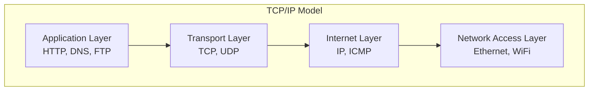

### How Data Travels Through Layers

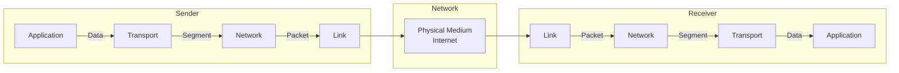

---

## 2. TCP vs UDP: The Transport Layer

The transport layer is where the critical choice between reliability and speed happens.

### TCP: Transmission Control Protocol

**TCP is like sending a registered letter** — you get confirmation of delivery, and if something's lost, it's resent.

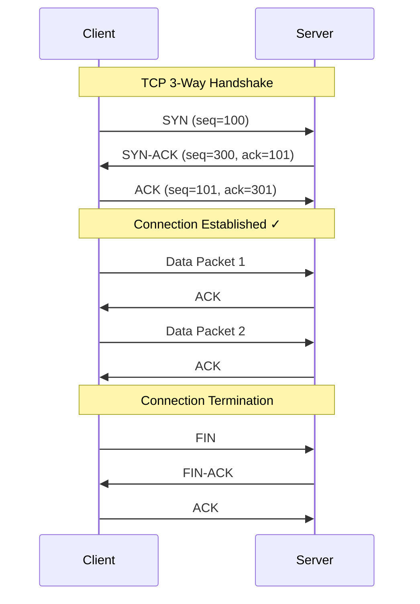

**TCP Features:**
| Feature | Description |
|---------|-------------|
| **Connection-oriented** | Must establish connection before data transfer |
| **Reliable delivery** | Guarantees all packets arrive in order |
| **Flow control** | Adjusts speed based on receiver's capacity |
| **Congestion control** | Slows down when network is congested |
| **Error checking** | Checksums and retransmission of lost packets |

### UDP: User Datagram Protocol

**UDP is like shouting in a crowd** — fast, but no guarantee anyone heard you.

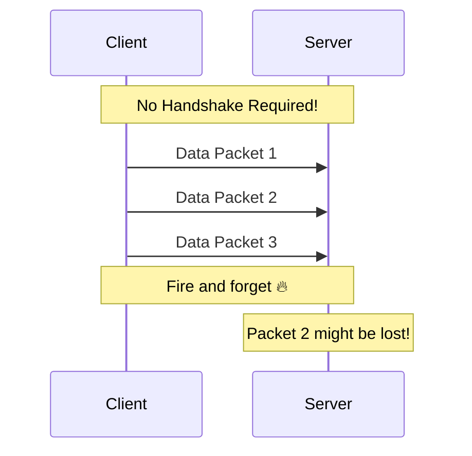

**UDP Features:**
| Feature | Description |
|---------|-------------|
| **Connectionless** | No handshake needed |
| **Unreliable** | No guarantee of delivery |
| **No ordering** | Packets may arrive out of order |
| **Fast** | Minimal overhead |
| **Broadcast/Multicast** | Can send to multiple receivers |

### TCP vs UDP: Head-to-Head Comparison

```
┌─────────────────────────────────────────────────────────────────────────────┐
│                        TCP vs UDP COMPARISON                                │
├─────────────────────────────────────────────────────────────────────────────┤
│                                                                             │
│  Aspect              │  TCP                    │  UDP                       │
│  ────────────────────┼─────────────────────────┼──────────────────────────  │
│  Connection          │  Connection-oriented    │  Connectionless            │
│  Reliability         │  Guaranteed delivery    │  Best effort               │
│  Ordering            │  Ordered                │  No ordering               │
│  Speed               │  Slower                 │  Faster                    │
│  Header Size         │  20-60 bytes            │  8 bytes                   │
│  Use Case            │  Web, Email, File       │  Gaming, Streaming, DNS    │
│                                                                             │
└─────────────────────────────────────────────────────────────────────────────┘
```

### When to Use What?

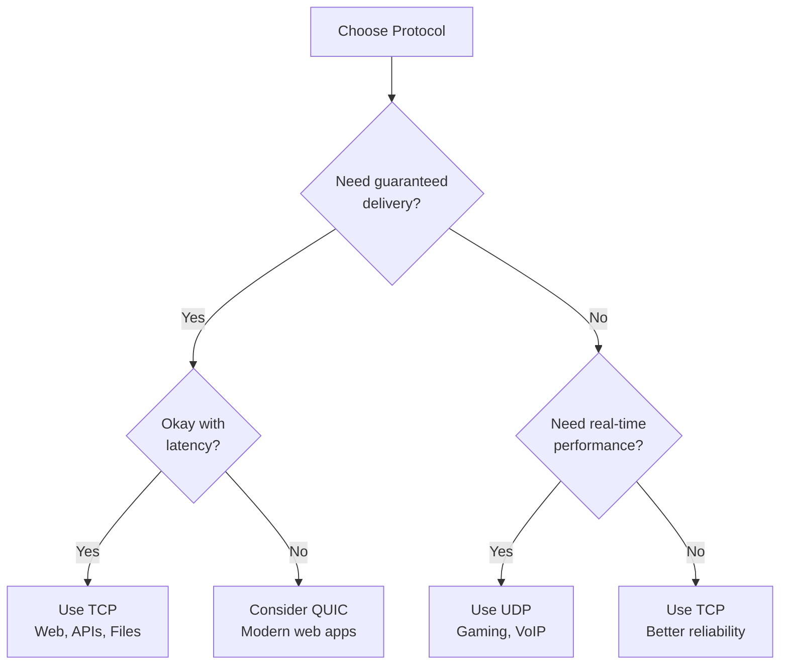

### Real-World Protocol Choices

| Application | Protocol | Why? |
|------------|----------|------|
| **Web Browsing** | TCP | Need complete, ordered data |
| **Online Gaming** | UDP | Low latency > reliability |
| **Video Streaming** | UDP (RTP) | Missing frame is okay |
| **Video Calling** | UDP (WebRTC) | Real-time > perfect quality |
| **File Download** | TCP | Every byte must arrive |
| **DNS Queries** | UDP | Small, fast queries |
| **Email (SMTP)** | TCP | Reliability is critical |

---

## 3. HTTP/HTTPS: The Web's Backbone

HTTP (Hypertext Transfer Protocol) is the foundation of data communication on the web.

### HTTP Evolution Timeline

```
┌─────────────────────────────────────────────────────────────────────────────┐
│                        HTTP EVOLUTION                                       │
├─────────────────────────────────────────────────────────────────────────────┤
│                                                                             │
│  1991 │ HTTP/0.9 │ Simple, GET only, HTML only                             │
│       │          │                                                          │
│  1996 │ HTTP/1.0 │ Headers, POST, status codes                             │
│       │          │                                                          │
│  1997 │ HTTP/1.1 │ Keep-alive, pipelining, chunked transfer                │
│       │          │ ⚠️ Head-of-line blocking                                 │
│       │          │                                                          │
│  2015 │ HTTP/2   │ Multiplexing, server push, binary, header compression   │
│       │          │ ✅ Solved HOL at HTTP layer                              │
│       │          │                                                          │
│  2022 │ HTTP/3   │ QUIC (UDP), no TCP HOL blocking                         │
│       │          │ ✅ Solved HOL at transport layer                         │
│                                                                             │
└─────────────────────────────────────────────────────────────────────────────┘
```

### HTTP/1.1 vs HTTP/2 vs HTTP/3

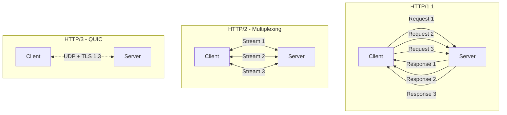

### HTTP/1.1 — The Problem: Head-of-Line Blocking

```
Request Queue: [Req1] [Req2] [Req3] [Req4]
                 │
                 ▼
            Req1 is slow...
                 │
                 ▼
       Req2, Req3, Req4 are BLOCKED! 🚫
```

### HTTP/2 — The Solution: Multiplexing

```
Single TCP Connection:
┌────────────────────────────────────────┐
│  Stream 1: ████████                    │
│  Stream 2: ██████████████              │
│  Stream 3: ████                        │
│  Stream 4: ██████████████████████      │
└────────────────────────────────────────┘
All streams share the connection simultaneously!
```

### HTTP Methods

| Method | Purpose | Idempotent | Safe | Cacheable |
|--------|---------|:----------:|:----:|:---------:|
| **GET** | Retrieve resource | ✅ | ✅ | ✅ |
| **POST** | Create resource | ❌ | ❌ | ❌ |
| **PUT** | Replace resource | ✅ | ❌ | ❌ |
| **PATCH** | Partial update | ❌ | ❌ | ❌ |
| **DELETE** | Remove resource | ✅ | ❌ | ❌ |
| **HEAD** | GET without body | ✅ | ✅ | ✅ |
| **OPTIONS** | Get allowed methods | ✅ | ✅ | ❌ |

### HTTP Status Codes Cheatsheet

```
┌─────────────────────────────────────────────────────────────────────────────┐
│                        HTTP STATUS CODES                                    │
├─────────────────────────────────────────────────────────────────────────────┤
│                                                                             │
│  1xx │ INFORMATIONAL   │ 100 Continue, 101 Switching Protocols             │
│                                                                             │
│  2xx │ SUCCESS         │ 200 OK, 201 Created, 204 No Content               │
│                                                                             │
│  3xx │ REDIRECTION     │ 301 Moved Permanently, 302 Found, 304 Not Modified│
│                                                                             │
│  4xx │ CLIENT ERROR    │ 400 Bad Request, 401 Unauthorized, 403 Forbidden  │
│      │                 │ 404 Not Found, 429 Too Many Requests              │
│                                                                             │
│  5xx │ SERVER ERROR    │ 500 Internal Error, 502 Bad Gateway               │
│      │                 │ 503 Service Unavailable, 504 Gateway Timeout      │
│                                                                             │
└─────────────────────────────────────────────────────────────────────────────┘
```

### HTTPS: HTTP + TLS

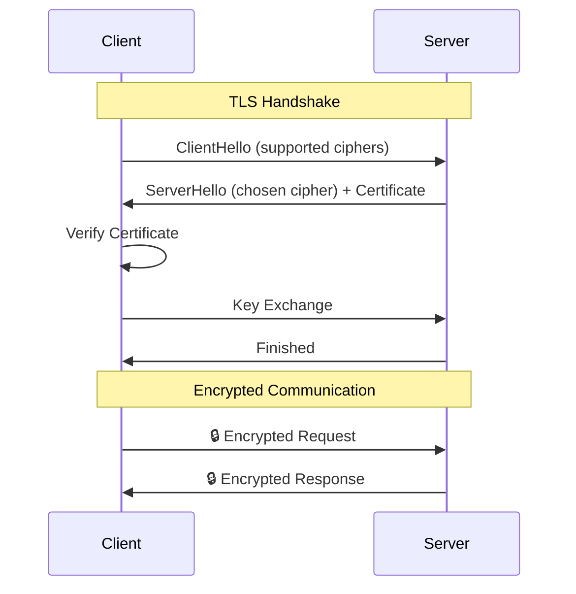

**Why HTTPS Matters:**
- 🔒 **Encryption** — Data can't be read by attackers
- ✅ **Authentication** — Verify you're talking to the right server
- 🛡️ **Integrity** — Data can't be modified in transit
- 📈 **SEO** — Google ranks HTTPS sites higher

---

## 4. WebSockets: Real-Time Communication

WebSockets provide full-duplex, bidirectional communication over a single TCP connection.

### HTTP vs WebSocket

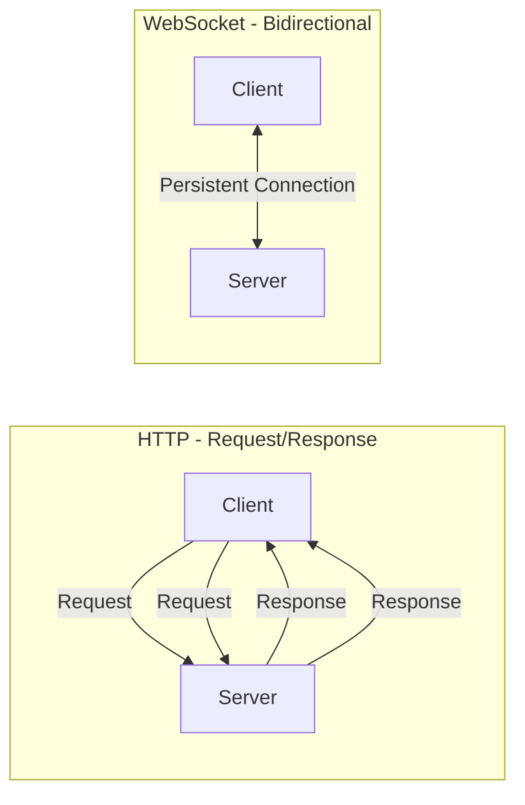

### WebSocket Handshake

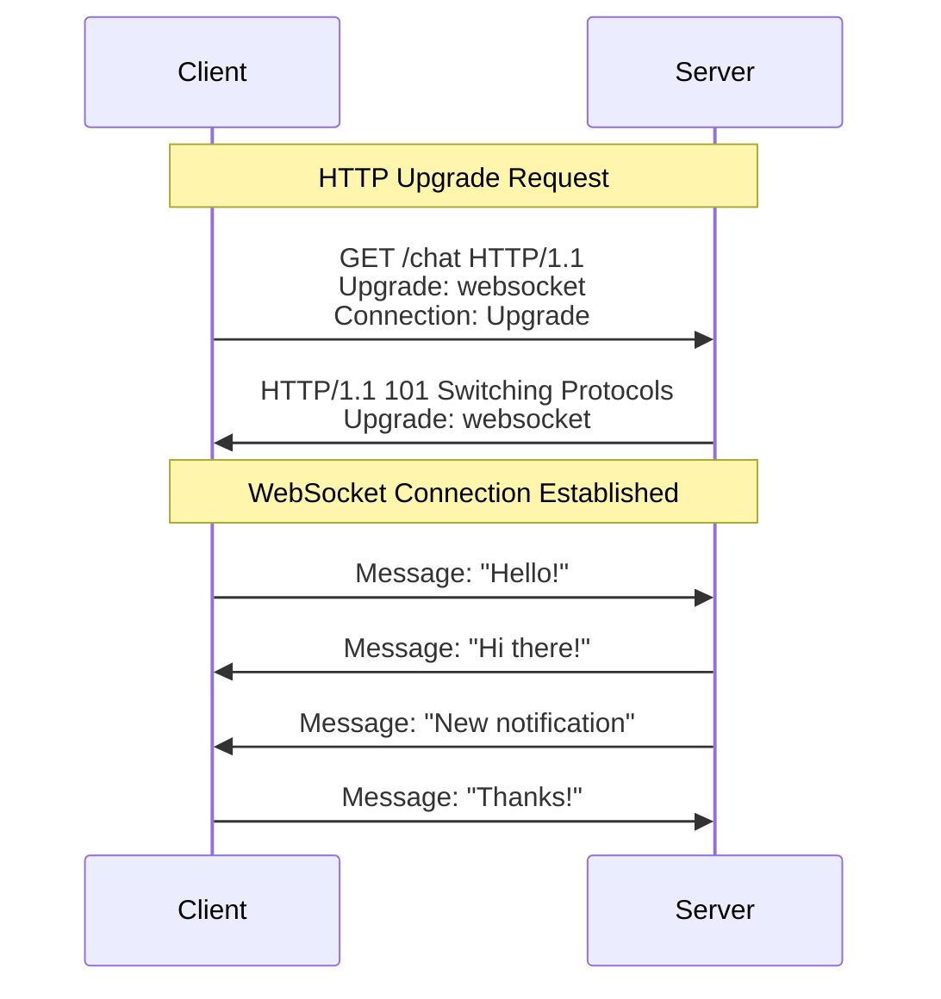

### WebSocket Frame Structure

```
 0                   1                   2                   3
 0 1 2 3 4 5 6 7 8 9 0 1 2 3 4 5 6 7 8 9 0 1 2 3 4 5 6 7 8 9 0 1
+-+-+-+-+-------+-+-------------+-------------------------------+
|F|R|R|R| opcode|M| Payload len |    Extended payload length    |
|I|S|S|S|  (4)  |A|     (7)     |             (16/64)           |
|N|V|V|V|       |S|             |   (if payload len==126/127)   |
| |1|2|3|       |K|             |                               |
+-+-+-+-+-------+-+-------------+ - - - - - - - - - - - - - - - +
|     Extended payload length continued, if payload len == 127  |
+ - - - - - - - - - - - - - - - +-------------------------------+
|                               |Masking-key, if MASK set to 1  |
+-------------------------------+-------------------------------+
| Masking-key (continued)       |          Payload Data         |
+-------------------------------- - - - - - - - - - - - - - - - +
:                     Payload Data continued ...                :
+ - - - - - - - - - - - - - - - - - - - - - - - - - - - - - - - +
|                     Payload Data continued ...                |
+---------------------------------------------------------------+
```

### WebSocket Code Example

```javascript
// Client-side WebSocket
const socket = new WebSocket('wss://chat.example.com');

// Connection opened
socket.onopen = function(event) {
    console.log('Connected to server');
    socket.send(JSON.stringify({ type: 'join', room: 'general' }));
};

// Listen for messages
socket.onmessage = function(event) {
    const data = JSON.parse(event.data);
    console.log('Received:', data);
};

// Handle errors
socket.onerror = function(error) {
    console.error('WebSocket error:', error);
};

// Connection closed
socket.onclose = function(event) {
    console.log('Disconnected from server');
};
```

```python
# Server-side WebSocket (Python with websockets library)
import asyncio
import websockets
import json

connected_clients = set()

async def handler(websocket, path):
    connected_clients.add(websocket)
    try:
        async for message in websocket:
            data = json.loads(message)
            # Broadcast to all connected clients
            for client in connected_clients:
                if client != websocket:
                    await client.send(json.dumps({
                        'type': 'message',
                        'content': data['content']
                    }))
    finally:
        connected_clients.remove(websocket)

asyncio.run(websockets.serve(handler, "localhost", 8765))
```

### When to Use WebSockets

| Use Case | Why WebSockets? |
|----------|-----------------|
| **Chat Applications** | Real-time message delivery |
| **Live Notifications** | Push updates instantly |
| **Online Gaming** | Low-latency game state sync |
| **Collaborative Editing** | Real-time document sync (Google Docs) |
| **Live Dashboards** | Stock prices, analytics |
| **IoT Data Streams** | Continuous sensor data |

### WebSocket vs Alternatives

| Feature | WebSocket | Server-Sent Events | Long Polling |
|---------|-----------|-------------------|--------------|
| Direction | Bidirectional | Server → Client | Bidirectional |
| Connection | Persistent | Persistent | Repeated requests |
| Overhead | Low | Low | High |
| Browser Support | Excellent | Good | Universal |
| Use Case | Chat, Gaming | Notifications, Feeds | Fallback option |

---

## 5. gRPC: High-Performance RPC

gRPC (Google Remote Procedure Call) is a high-performance, open-source RPC framework.

### What is RPC?

```mermaid
flowchart LR
    subgraph client [Client Service]
        CODE[client.GetUser&#40;123&#41;]
    end
    
    subgraph network [Network]
        SERIALIZE[Serialize]
        TRANSPORT[Transport]
        DESERIALIZE[Deserialize]
    end
    
    subgraph server [Server Service]
        IMPL[GetUser Implementation]
    end
    
    CODE --> SERIALIZE
    SERIALIZE --> TRANSPORT
    TRANSPORT --> DESERIALIZE
    DESERIALIZE --> IMPL
    IMPL --> DESERIALIZE
```

**RPC makes a remote function call look like a local one!**

### gRPC Architecture

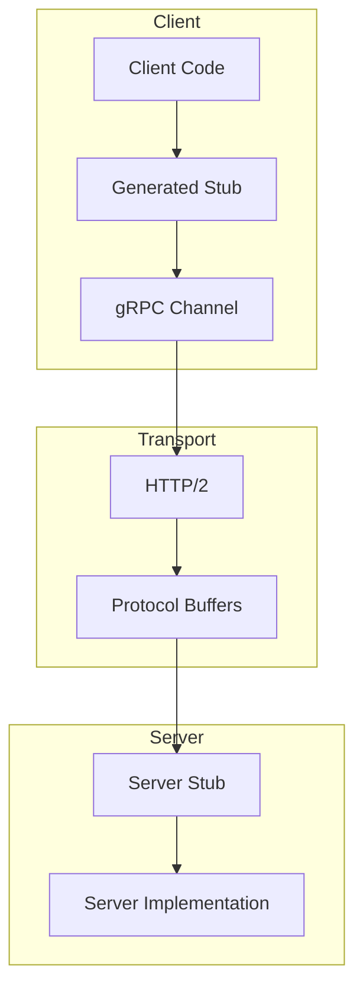

### Protocol Buffers (Protobuf)

gRPC uses Protocol Buffers for serialization — a binary format that's smaller and faster than JSON.

```protobuf
// user.proto - Define your service and messages

syntax = "proto3";

package user;

// The user service definition
service UserService {
  // Get a user by ID
  rpc GetUser (GetUserRequest) returns (User);
  
  // Create a new user
  rpc CreateUser (CreateUserRequest) returns (User);
  
  // Stream all users
  rpc ListUsers (ListUsersRequest) returns (stream User);
}

// Request message
message GetUserRequest {
  int32 user_id = 1;
}

message CreateUserRequest {
  string name = 1;
  string email = 2;
  int32 age = 3;
}

message ListUsersRequest {
  int32 page_size = 1;
}

// Response message
message User {
  int32 id = 1;
  string name = 2;
  string email = 3;
  int32 age = 4;
  repeated string roles = 5;
}
```

### gRPC Communication Patterns

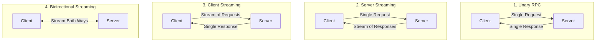

| Pattern | Use Case | Example |
|---------|----------|---------|
| **Unary** | Simple request-response | GetUser, CreateOrder |
| **Server Streaming** | Large data downloads | ListAllProducts |
| **Client Streaming** | File uploads | UploadChunks |
| **Bidirectional** | Real-time chat | ChatService |

### gRPC vs REST

```
┌─────────────────────────────────────────────────────────────────────────────┐
│                        gRPC vs REST                                         │
├─────────────────────────────────────────────────────────────────────────────┤
│                                                                             │
│  Aspect              │  gRPC                   │  REST                      │
│  ────────────────────┼─────────────────────────┼──────────────────────────  │
│  Protocol            │  HTTP/2                 │  HTTP/1.1 or HTTP/2        │
│  Payload             │  Protobuf (binary)      │  JSON (text)               │
│  Contract            │  Strict (.proto)        │  Loose (OpenAPI optional)  │
│  Browser Support     │  Limited                │  Native                    │
│  Streaming           │  Built-in               │  Workarounds needed        │
│  Performance         │  Faster                 │  Slower                    │
│  Human Readable      │  No (binary)            │  Yes (JSON)                │
│  Learning Curve      │  Steeper                │  Gentle                    │
│                                                                             │
│  Best For            │  Microservices,         │  Public APIs,              │
│                      │  Internal services      │  Web clients               │
│                                                                             │
└─────────────────────────────────────────────────────────────────────────────┘
```

### gRPC Code Example

```python
# server.py
from concurrent import futures
import grpc
import user_pb2
import user_pb2_grpc

class UserService(user_pb2_grpc.UserServiceServicer):
    def GetUser(self, request, context):
        # Simulate database lookup
        return user_pb2.User(
            id=request.user_id,
            name="John Doe",
            email="john@example.com",
            age=30,
            roles=["admin", "user"]
        )

def serve():
    server = grpc.server(futures.ThreadPoolExecutor(max_workers=10))
    user_pb2_grpc.add_UserServiceServicer_to_server(UserService(), server)
    server.add_insecure_port('[::]:50051')
    server.start()
    server.wait_for_termination()

if __name__ == '__main__':
    serve()
```

```python
# client.py
import grpc
import user_pb2
import user_pb2_grpc

def run():
    with grpc.insecure_channel('localhost:50051') as channel:
        stub = user_pb2_grpc.UserServiceStub(channel)
        response = stub.GetUser(user_pb2.GetUserRequest(user_id=123))
        print(f"User: {response.name}, Email: {response.email}")

if __name__ == '__main__':
    run()
```

---

## 6. REST vs GraphQL

Two dominant paradigms for building APIs — each with distinct philosophies.

### REST: Resource-Based Architecture

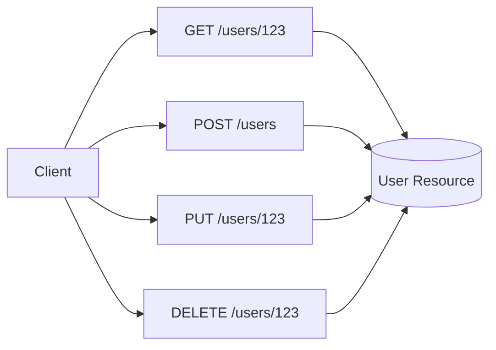

**REST Principles:**
1. **Stateless** — Each request contains all needed information
2. **Resource-Based** — Everything is a resource with a URL
3. **HTTP Methods** — Use GET, POST, PUT, DELETE meaningfully
4. **Uniform Interface** — Consistent URL patterns

### REST Example

```bash
# Get all users
GET /api/v1/users

# Get specific user
GET /api/v1/users/123

# Get user's orders
GET /api/v1/users/123/orders

# Create user
POST /api/v1/users
{
  "name": "John Doe",
  "email": "john@example.com"
}

# Update user
PUT /api/v1/users/123
{
  "name": "John Smith"
}

# Delete user
DELETE /api/v1/users/123
```

### The REST Problem: Over-fetching & Under-fetching

```
┌─────────────────────────────────────────────────────────────────────────────┐
│                        THE REST PROBLEM                                     │
├─────────────────────────────────────────────────────────────────────────────┤
│                                                                             │
│  OVER-FETCHING: Getting more data than you need                            │
│  ─────────────────────────────────────────────────────────────────────────  │
│  Mobile app needs: user.name, user.avatar                                  │
│  REST returns: user.name, avatar, email, phone, address, preferences...   │
│                                                                             │
│  UNDER-FETCHING: Multiple requests for related data                        │
│  ─────────────────────────────────────────────────────────────────────────  │
│  To show a user profile page:                                              │
│    Request 1: GET /users/123                                               │
│    Request 2: GET /users/123/posts                                         │
│    Request 3: GET /users/123/followers                                     │
│    Request 4: GET /users/123/following                                     │
│                                                                             │
└─────────────────────────────────────────────────────────────────────────────┘
```

### GraphQL: Query Language for APIs

```mermaid
flowchart LR
    CLIENT[Client] -->|Single Endpoint| GQL[/graphql]
    GQL --> RESOLVER[Resolvers]
    RESOLVER --> DB[(Data Sources)]
```

**GraphQL Philosophy:**
1. **Single Endpoint** — One URL for everything
2. **Client Specifies Shape** — Ask for exactly what you need
3. **Strongly Typed** — Schema defines all types
4. **Introspective** — Query the schema itself

### GraphQL Example

```graphql
# Schema Definition
type User {
  id: ID!
  name: String!
  email: String!
  posts: [Post!]!
  followers: [User!]!
}

type Post {
  id: ID!
  title: String!
  content: String!
  author: User!
  comments: [Comment!]!
}

type Query {
  user(id: ID!): User
  users: [User!]!
  post(id: ID!): Post
}

type Mutation {
  createUser(name: String!, email: String!): User!
  createPost(title: String!, content: String!, authorId: ID!): Post!
}
```

```graphql
# Client Query — Get exactly what you need!
query GetUserProfile {
  user(id: "123") {
    name
    avatar
    posts(limit: 5) {
      title
      createdAt
    }
    followersCount
  }
}
```

```json
// Response — Exactly what was requested
{
  "data": {
    "user": {
      "name": "John Doe",
      "avatar": "https://...",
      "posts": [
        { "title": "My First Post", "createdAt": "2024-01-15" },
        { "title": "GraphQL is Awesome", "createdAt": "2024-01-20" }
      ],
      "followersCount": 1234
    }
  }
}
```

### REST vs GraphQL Comparison

| Aspect | REST | GraphQL |
|--------|------|---------|
| **Endpoints** | Multiple (per resource) | Single (/graphql) |
| **Data Fetching** | Server decides response | Client specifies exact needs |
| **Over-fetching** | Common problem | Solved by design |
| **Under-fetching** | Requires multiple calls | Single query |
| **Versioning** | /v1/, /v2/ in URL | Deprecate fields in schema |
| **Caching** | HTTP caching built-in | More complex |
| **File Upload** | Native support | Requires workarounds |
| **Learning Curve** | Lower | Higher |

### When to Use What?

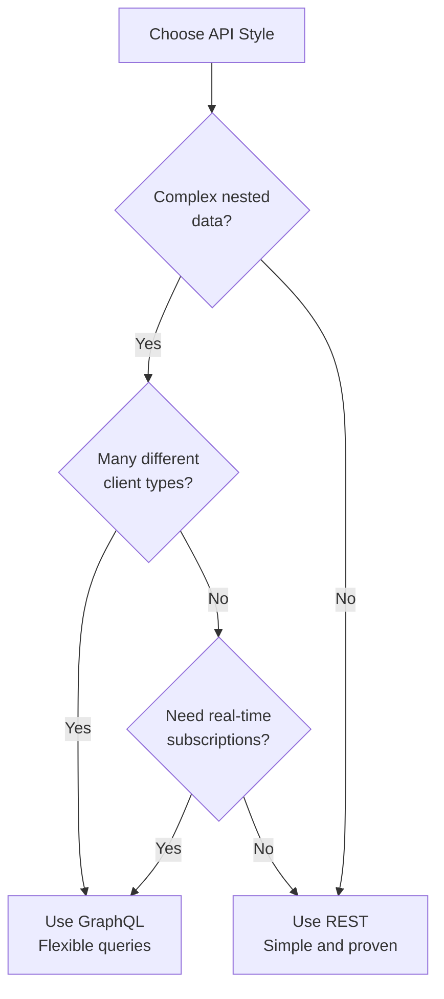

---

## 7. DNS: The Internet's Phone Book

DNS (Domain Name System) translates human-readable domain names to IP addresses.

### Why DNS?

```
Without DNS:                  With DNS:
http://142.250.190.78   →    http://google.com
http://157.240.1.35     →    http://facebook.com
http://52.94.236.248    →    http://amazon.com

Which would you rather remember? 🤔
```

### DNS Resolution Process

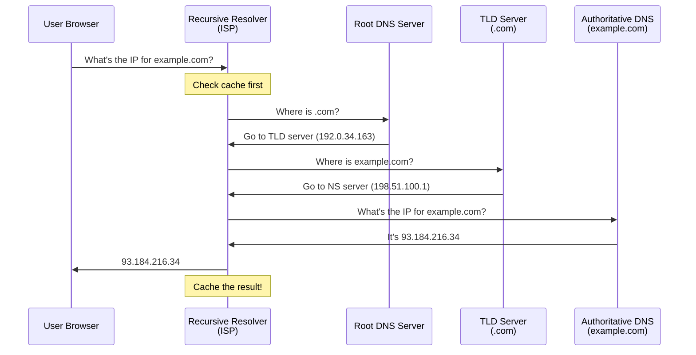

### DNS Hierarchy

```
                        ┌─────────────────┐
                        │  Root Servers   │
                        │   (13 clusters) │
                        └────────┬────────┘
                                 │
           ┌─────────────────────┼─────────────────────┐
           │                     │                     │
    ┌──────┴──────┐       ┌──────┴──────┐       ┌──────┴──────┐
    │  .com TLD   │       │  .org TLD   │       │  .io TLD    │
    └──────┬──────┘       └──────┬──────┘       └──────┬──────┘
           │                     │                     │
    ┌──────┴──────┐       ┌──────┴──────┐       ┌──────┴──────┐
    │  google.com │       │ wikipedia.org│       │  github.io  │
    │    NS       │       │     NS       │       │     NS      │
    └─────────────┘       └─────────────┘       └─────────────┘
```

### DNS Record Types

| Record | Purpose | Example |
|--------|---------|---------|
| **A** | IPv4 address | `example.com → 93.184.216.34` |
| **AAAA** | IPv6 address | `example.com → 2606:2800:220:1:...` |
| **CNAME** | Alias to another domain | `www.example.com → example.com` |
| **MX** | Mail server | `example.com → mail.example.com (priority 10)` |
| **TXT** | Text data (verification, SPF) | `example.com → "v=spf1 include:..."` |
| **NS** | Name server | `example.com → ns1.example.com` |
| **SOA** | Start of Authority | Zone admin info |

### DNS Caching Layers

```
┌─────────────────────────────────────────────────────────────────────────────┐
│                        DNS CACHING LAYERS                                   │
├─────────────────────────────────────────────────────────────────────────────┤
│                                                                             │
│  Layer 1: Browser Cache        │ Chrome caches for session                 │
│           TTL: ~1 minute       │                                           │
│                                                                             │
│  Layer 2: OS Cache             │ Windows/Mac DNS cache                     │
│           TTL: varies          │                                           │
│                                                                             │
│  Layer 3: ISP Resolver Cache   │ Your ISP's DNS server                     │
│           TTL: per record      │                                           │
│                                                                             │
│  Layer 4: Authoritative Server │ The source of truth                       │
│           TTL: configured      │                                           │
│                                                                             │
└─────────────────────────────────────────────────────────────────────────────┘

TTL (Time To Live): How long to cache before re-querying
```

### DNS in System Design

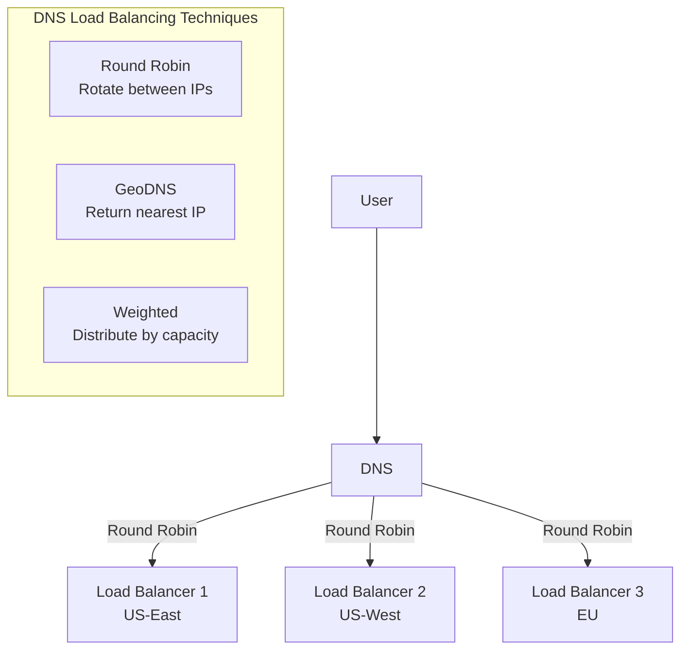

**DNS-based Load Balancing:**
- **Round Robin** — Return different IPs in rotation
- **GeoDNS** — Return IP based on user's location
- **Weighted** — Direct more traffic to powerful servers
- **Latency-based** — Return lowest latency server

---

## 8. Protocol Selection Guide

### Decision Matrix

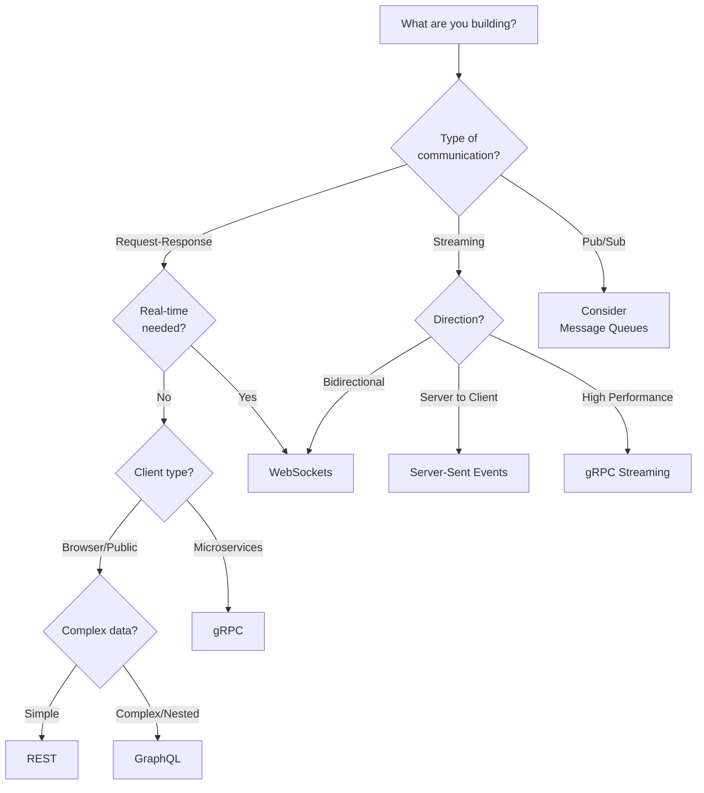

### Quick Reference Table

| Scenario | Recommended Protocol | Why? |
|----------|---------------------|------|
| Public Web API | REST + JSON | Universal support, caching |
| Mobile App with complex data | GraphQL | Reduce over-fetching |
| Internal Microservices | gRPC | Performance, type safety |
| Real-time Chat | WebSockets | Bidirectional, low latency |
| Live Notifications | SSE or WebSockets | Server push |
| File Transfer | HTTP + REST | Chunked upload, resume |
| Video Streaming | HTTP (HLS/DASH) | Adaptive bitrate |
| Online Gaming | UDP (custom) | Lowest latency |
| IoT Sensors | MQTT | Lightweight, pub/sub |

---

## 9. Real-World Examples

### 🎬 Netflix: Multi-Protocol Architecture

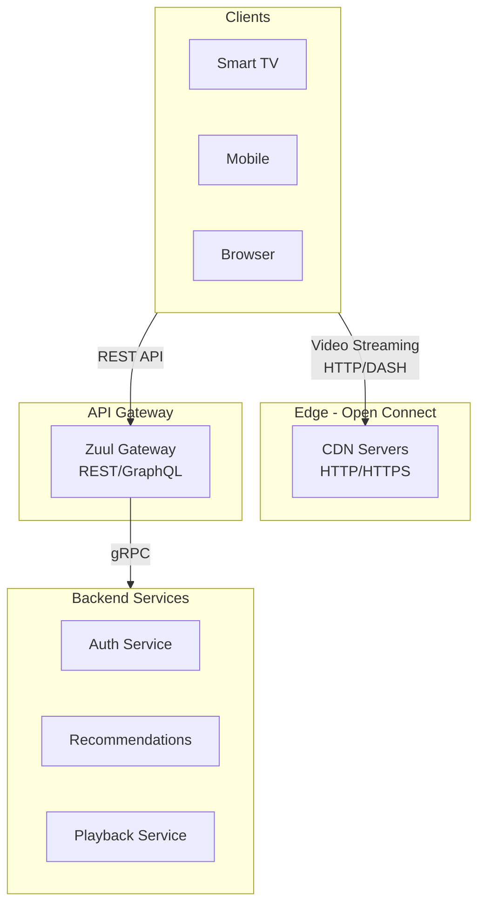

**Netflix's Protocol Choices:**
| Layer | Protocol | Why? |
|-------|----------|------|
| Client API | REST → GraphQL (Federated) | Flexibility for diverse clients |
| Video Delivery | HTTP (DASH) | Adaptive streaming |
| Internal Services | gRPC | Performance |
| Service Discovery | Eureka (REST) | Simplicity |

### 💬 WhatsApp: Real-Time Messaging

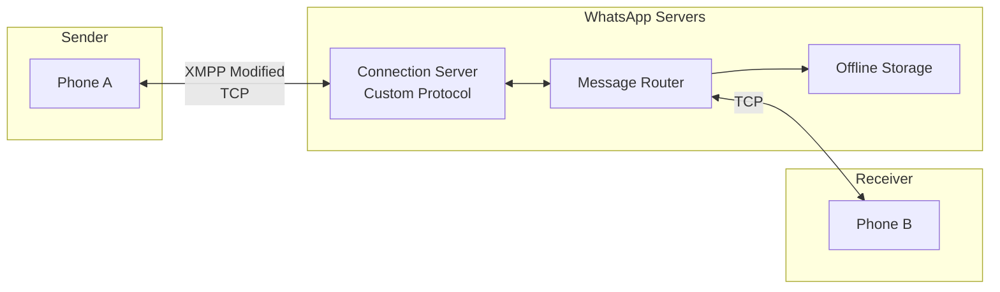

**WhatsApp's Protocol Choices:**
| Purpose | Protocol | Why? |
|---------|----------|------|
| Connection | Custom XMPP over TCP | Low overhead, real-time |
| Encryption | Signal Protocol | End-to-end security |
| Media | HTTP/HTTPS | Reliability for files |
| Presence | Custom | Efficient status updates |

### 🚗 Uber: Location-Heavy System

```mermaid
flowchart TB
    subgraph riders [Rider App]
        R_APP[Mobile App]
    end
    
    subgraph drivers [Driver App]
        D_APP[Driver App]
    end
    
    subgraph uber [Uber Backend]
        GATEWAY[API Gateway<br/>REST]
        DISPATCH[Dispatch Service<br/>gRPC]
        LOCATION[Location Service<br/>gRPC + Kafka]
        MAPS[Maps Service<br/>gRPC]
    end
    
    R_APP -->|REST/HTTP2| GATEWAY
    D_APP -->|REST + WebSocket| GATEWAY
    GATEWAY --> DISPATCH
    DISPATCH --> LOCATION
    DISPATCH --> MAPS
    D_APP -.->|Location Stream<br/>WebSocket| LOCATION
```

**Uber's Protocol Choices:**
| Feature | Protocol | Why? |
|---------|----------|------|
| Public API | REST over HTTP/2 | Compatibility |
| Internal Services | gRPC | Low latency |
| Location Updates | WebSocket + Kafka | Real-time streaming |
| Maps | gRPC | High throughput |

---

## 10. Interview Corner

### 🎯 Top Interview Questions

**Q1: Explain the difference between HTTP and WebSocket. When would you use each?**

<details>
<summary>Click to see answer</summary>

**HTTP:**
- Request-response model
- Client initiates all communication
- Stateless (each request is independent)
- Best for: REST APIs, file downloads, web pages

**WebSocket:**
- Full-duplex, bidirectional
- Both client and server can initiate
- Persistent connection
- Best for: Chat apps, live updates, gaming

**Decision Guide:**
- Use HTTP for standard CRUD operations
- Use WebSocket when you need real-time, bidirectional communication
- Consider SSE for server-to-client only streaming

</details>

**Q2: Why does gRPC use Protocol Buffers instead of JSON?**

<details>
<summary>Click to see answer</summary>

**Protocol Buffers Advantages:**

1. **Smaller Size** — Binary format is 3-10x smaller than JSON
2. **Faster Parsing** — No text parsing overhead
3. **Schema Enforcement** — .proto files ensure type safety
4. **Code Generation** — Auto-generate client/server code
5. **Backward Compatibility** — Easy field additions

**JSON Advantages:**
- Human readable
- Universal browser support
- No compilation step

**Choose Protobuf when:** Performance matters, internal services
**Choose JSON when:** Public APIs, debugging ease needed

</details>

**Q3: How does DNS work? What happens when you type google.com in your browser?**

<details>
<summary>Click to see answer</summary>

1. **Browser Cache Check** — Is google.com cached?
2. **OS Cache Check** — Check system DNS cache
3. **Recursive Resolver** — Query ISP's DNS server
4. **Root Server** — "Where is .com?" → TLD server IP
5. **TLD Server** — "Where is google.com?" → Authoritative NS IP
6. **Authoritative Server** — "google.com = 142.250.190.78"
7. **Cache & Return** — Store result, return to browser
8. **TCP Connection** — Browser connects to IP

**Key concepts:**
- TTL determines cache duration
- DNS uses UDP (port 53) for speed
- DNSSEC adds security against spoofing

</details>

**Q4: Compare REST and GraphQL. When would you choose one over the other?**

<details>
<summary>Click to see answer</summary>

**Choose REST when:**
- Simple CRUD operations
- HTTP caching is important
- Team is familiar with REST
- Public API with diverse clients
- File uploads are needed

**Choose GraphQL when:**
- Complex, nested data relationships
- Multiple client types (web, mobile, TV)
- Bandwidth optimization matters
- Rapidly evolving data requirements
- Need real-time subscriptions

**Hybrid Approach:**
Many companies use both! REST for simple operations, GraphQL for complex queries.

</details>

### 💡 Tips for Networking Questions

1. **Know the trade-offs** — Every protocol has pros and cons
2. **Think about scale** — What works for 100 users may not work for 100M
3. **Consider failure cases** — What happens when the network is unreliable?
4. **Real-world examples** — Reference how big companies solved similar problems
5. **Performance numbers** — Know latency/throughput implications

---

## 11. Quick Recap

### TL;DR Summary Card

```
┌─────────────────────────────────────────────────────────────────────────────┐
│                    CHAPTER 02: QUICK RECAP                                  │
├─────────────────────────────────────────────────────────────────────────────┤
│                                                                             │
│  📌 TCP vs UDP                                                              │
│     TCP = Reliable, ordered, slower (web, files)                           │
│     UDP = Fast, unreliable, connectionless (gaming, streaming)             │
│                                                                             │
│  📌 HTTP Evolution                                                          │
│     HTTP/1.1 → HTTP/2 (multiplexing) → HTTP/3 (QUIC/UDP)                   │
│                                                                             │
│  📌 WebSockets                                                              │
│     Bidirectional, persistent connection for real-time apps                │
│                                                                             │
│  📌 gRPC                                                                    │
│     High-performance RPC with Protocol Buffers, great for microservices    │
│                                                                             │
│  📌 REST vs GraphQL                                                         │
│     REST = Simple, cacheable, multiple endpoints                           │
│     GraphQL = Flexible queries, single endpoint, client specifies data     │
│                                                                             │
│  📌 DNS                                                                     │
│     Translates domains to IPs, hierarchical caching system                 │
│                                                                             │
└─────────────────────────────────────────────────────────────────────────────┘
```

### Protocol Selection Cheatsheet

| Need | Protocol |
|------|----------|
| Simple web API | REST |
| Complex nested data | GraphQL |
| Internal microservices | gRPC |
| Real-time bidirectional | WebSocket |
| Server push notifications | SSE |
| Video streaming | HTTP (HLS/DASH) |
| Online gaming | UDP |
| Reliable file transfer | TCP |

---

## 12. Further Reading

### 📚 Recommended Resources

**RFCs & Standards:**
- [RFC 2616 - HTTP/1.1](https://tools.ietf.org/html/rfc2616)
- [RFC 7540 - HTTP/2](https://tools.ietf.org/html/rfc7540)
- [RFC 6455 - WebSocket Protocol](https://tools.ietf.org/html/rfc6455)
- [RFC 9000 - QUIC (HTTP/3)](https://tools.ietf.org/html/rfc9000)

**Tools:**
- [Postman](https://www.postman.com/) — API testing
- [Wireshark](https://www.wireshark.org/) — Network packet analysis
- [grpcurl](https://github.com/fullstorydev/grpcurl) — gRPC testing
- [GraphQL Playground](https://github.com/graphql/graphql-playground) — GraphQL IDE

**Tutorials:**
- [gRPC Official Guide](https://grpc.io/docs/)
- [GraphQL Learn](https://graphql.org/learn/)
- [WebSocket API - MDN](https://developer.mozilla.org/en-US/docs/Web/API/WebSocket)

---

## 📱 Share This Chapter

> *"The internet is just a series of tubes... TCP tubes, UDP tubes, and WebSocket tubes. Know which one to use!"*

**Key Takeaways to Share:**

```
🌐 NETWORKING PROTOCOLS 101

1️⃣ TCP = Reliable, UDP = Fast (pick your trade-off)
2️⃣ HTTP/2 & HTTP/3 solved head-of-line blocking
3️⃣ WebSockets for real-time, REST for CRUD
4️⃣ gRPC for microservices, GraphQL for flexible queries
5️⃣ DNS is cached at multiple layers - use TTL wisely

#SystemDesign #Networking #WebDevelopment
```

---

<div align="center">

## Navigation

[](../01-introduction/README.md)
[](../03-data-storage/README.md)

---

**[⬆ Back to Top](#chapter-02-networking--communication)** | **[📚 Table of Contents](../../README.md)**

</div>
