<div align="center">

# Chapter 03: Data Storage Fundamentals

> *"Why did Discord switch from MongoDB to Cassandra? Why does Uber use both MySQL and Schemaless? Your database choice will define your system's future."*

[](../02-networking/README.md)
[](../04-caching-cdn/README.md)

</div>

---

## 🎯 What You'll Learn

By the end of this chapter, you will:

- ✅ Understand SQL vs NoSQL and when to use each
- ✅ Master ACID vs BASE consistency models
- ✅ Explore different database types and their use cases
- ✅ Learn data modeling strategies for scale
- ✅ Understand replication and partitioning basics
- ✅ Choose the right database for your system
- ✅ Study real-world database architectures

---

## 📋 Prerequisites

- Basic SQL knowledge (SELECT, INSERT, JOIN)
- Understanding of data structures
- Completed [Chapter 02: Networking & Communication](../02-networking/README.md)

---

## 📑 Table of Contents

1. [Why Database Choice Matters](#1-why-database-choice-matters)
2. [SQL Databases: The Relational World](#2-sql-databases-the-relational-world)
3. [NoSQL Databases: Beyond Tables](#3-nosql-databases-beyond-tables)
4. [ACID vs BASE: Consistency Models](#4-acid-vs-base-consistency-models)
5. [Database Types Deep Dive](#5-database-types-deep-dive)
6. [Data Modeling Strategies](#6-data-modeling-strategies)
7. [Replication & Partitioning Basics](#7-replication--partitioning-basics)
8. [Choosing the Right Database](#8-choosing-the-right-database)
9. [Real-World Examples](#9-real-world-examples)
10. [Interview Corner](#10-interview-corner)
11. [Quick Recap](#11-quick-recap)
12. [Further Reading](#12-further-reading)

---

## 1. Why Database Choice Matters

### The Database is Your System's Foundation

```
┌─────────────────────────────────────────────────────────────────────────────┐
│                     DATABASE = SYSTEM FOUNDATION                            │
├─────────────────────────────────────────────────────────────────────────────┤
│                                                                             │
│   Wrong database choice can lead to:                                        │
│                                                                             │
│   ❌ Performance bottlenecks that can't be fixed                           │
│   ❌ Scaling limitations that require complete rewrites                    │
│   ❌ Data consistency issues causing business problems                     │
│   ❌ Operational nightmares with maintenance                               │
│                                                                             │
│   Right database choice enables:                                            │
│                                                                             │
│   ✅ Linear scaling as your user base grows                                │
│   ✅ Predictable performance under load                                    │
│   ✅ Flexibility to evolve your data model                                 │
│   ✅ Lower operational costs                                               │
│                                                                             │
└─────────────────────────────────────────────────────────────────────────────┘
```

### Real Migration Stories

| Company | From | To | Why? |
|---------|------|-----|------|
| **Discord** | MongoDB | Cassandra | Messages grew to billions, MongoDB couldn't handle |
| **Twitter** | MySQL | Manhattan | Needed global distribution, custom consistency |
| **Uber** | PostgreSQL | MySQL + Schemaless | Needed schema flexibility at scale |
| **Instagram** | PostgreSQL | PostgreSQL + Cassandra | Added Cassandra for high-write workloads |
| **Netflix** | Oracle | Cassandra + MySQL | Cloud migration, cost, scalability |

### The Database Landscape

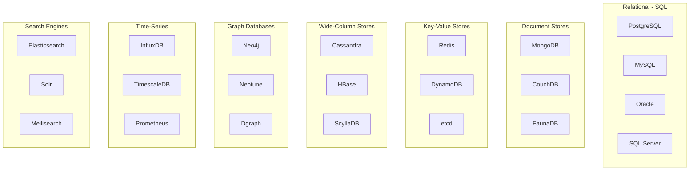

---

## 2. SQL Databases: The Relational World

### What is a Relational Database?

A relational database organizes data into **tables** (relations) with **rows** (records) and **columns** (attributes), linked through **keys**.

```
┌─────────────────────────────────────────────────────────────────────────────┐
│                         RELATIONAL MODEL                                    │
├─────────────────────────────────────────────────────────────────────────────┤
│                                                                             │
│  USERS TABLE                         ORDERS TABLE                           │
│  ┌────┬──────────┬─────────────┐    ┌────┬─────────┬────────┬─────────┐   │
│  │ id │ name     │ email       │    │ id │ user_id │ total  │ status  │   │
│  ├────┼──────────┼─────────────┤    ├────┼─────────┼────────┼─────────┤   │
│  │ 1  │ Alice    │ alice@...   │◄───│ 1  │ 1       │ $99.99 │ shipped │   │
│  │ 2  │ Bob      │ bob@...     │◄───│ 2  │ 1       │ $49.99 │ pending │   │
│  │ 3  │ Charlie  │ charlie@... │◄───│ 3  │ 2       │ $29.99 │ shipped │   │
│  └────┴──────────┴─────────────┘    └────┴─────────┴────────┴─────────┘   │
│         ▲                                   │                               │
│         │                                   │                               │
│         └───────── FOREIGN KEY ─────────────┘                               │
│                                                                             │
└─────────────────────────────────────────────────────────────────────────────┘
```

### SQL Query Example

```sql
-- Get all orders for a user with their details
SELECT 
    u.name,
    u.email,
    o.id AS order_id,
    o.total,
    o.status,
    o.created_at
FROM users u
INNER JOIN orders o ON u.id = o.user_id
WHERE u.id = 1
ORDER BY o.created_at DESC;
```

### Key SQL Concepts

#### Primary Keys & Foreign Keys

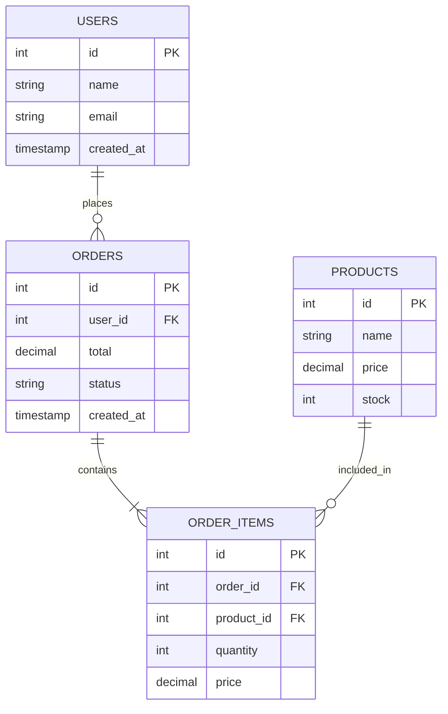

#### Indexes: Speed Up Your Queries

```sql
-- Without index: Full table scan O(n)
SELECT * FROM users WHERE email = 'alice@example.com';
-- Scans ALL rows to find match

-- With index: B-tree lookup O(log n)
CREATE INDEX idx_users_email ON users(email);
-- Now uses index for fast lookup!

-- Composite index for multiple columns
CREATE INDEX idx_orders_user_status ON orders(user_id, status);
-- Efficient for: WHERE user_id = 1 AND status = 'pending'
```

#### Index Types

| Index Type | Use Case | Example |
|------------|----------|---------|
| **B-tree** | General purpose, range queries | Most common default |
| **Hash** | Exact matches only | `WHERE id = 123` |
| **GiST** | Geometric/spatial data | PostGIS locations |
| **GIN** | Full-text search, arrays | JSONB, text search |
| **BRIN** | Large sequential data | Time-series tables |

### Popular SQL Databases Compared

```
┌─────────────────────────────────────────────────────────────────────────────┐
│                     SQL DATABASES COMPARISON                                │
├─────────────────────────────────────────────────────────────────────────────┤
│                                                                             │
│  PostgreSQL                                                                 │
│  ├─ Best for: Complex queries, JSONB, extensibility                        │
│  ├─ Strengths: Feature-rich, ACID, great for analytics                     │
│  ├─ Used by: Instagram, Spotify, Twitch                                    │
│  └─ Note: Often called "the most advanced open-source database"            │
│                                                                             │
│  MySQL                                                                      │
│  ├─ Best for: Web applications, read-heavy workloads                       │
│  ├─ Strengths: Fast reads, replication, large community                    │
│  ├─ Used by: Facebook, Twitter, Uber                                       │
│  └─ Note: InnoDB engine provides ACID compliance                           │
│                                                                             │
│  SQLite                                                                     │
│  ├─ Best for: Embedded, mobile, single-user applications                   │
│  ├─ Strengths: Zero config, serverless, portable                           │
│  ├─ Used by: Every smartphone, browsers, many desktop apps                 │
│  └─ Note: Most deployed database in the world                              │
│                                                                             │
│  SQL Server                                                                 │
│  ├─ Best for: Enterprise Windows environments                              │
│  ├─ Strengths: BI integration, .NET ecosystem                              │
│  └─ Used by: Enterprise, Fortune 500 companies                             │
│                                                                             │
└─────────────────────────────────────────────────────────────────────────────┘
```

### SQL Strengths & Weaknesses

| ✅ Strengths | ❌ Weaknesses |
|-------------|---------------|
| Strong consistency (ACID) | Rigid schema (harder to evolve) |
| Complex queries with JOINs | Horizontal scaling is complex |
| Mature ecosystem & tooling | Can be slower for simple key lookups |
| Data integrity enforcement | Schema migrations can be painful |
| Standardized query language | May need denormalization at scale |

---

## 3. NoSQL Databases: Beyond Tables

### What is NoSQL?

NoSQL = "Not Only SQL" — databases that don't use the traditional relational model.

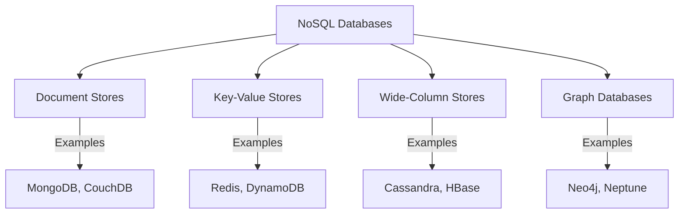

### Why NoSQL Emerged

```
┌─────────────────────────────────────────────────────────────────────────────┐
│                     THE RISE OF NoSQL                                       │
├─────────────────────────────────────────────────────────────────────────────┤
│                                                                             │
│  2000s Web Scale Challenges:                                                │
│                                                                             │
│  📈 Explosive data growth (petabytes)                                       │
│  👥 Millions of concurrent users                                            │
│  🌍 Global distribution requirements                                        │
│  ⚡ Sub-millisecond response times                                          │
│  📊 Semi-structured/unstructured data                                       │
│                                                                             │
│  Traditional SQL couldn't easily handle:                                    │
│                                                                             │
│  ❌ Horizontal scaling across servers                                       │
│  ❌ Schema flexibility for rapid development                                │
│  ❌ Massive write throughput                                                │
│  ❌ Geographic distribution                                                 │
│                                                                             │
│  Google (Bigtable), Amazon (Dynamo), Facebook (Cassandra) built their own  │
│                                                                             │
└─────────────────────────────────────────────────────────────────────────────┘
```

### NoSQL Data Models Overview

#### 1. Document Store (MongoDB)

```javascript
// A single document contains all related data
{
  "_id": ObjectId("507f1f77bcf86cd799439011"),
  "name": "Alice Johnson",
  "email": "alice@example.com",
  "orders": [
    {
      "order_id": "ORD-001",
      "total": 99.99,
      "status": "shipped",
      "items": [
        { "product": "Laptop Stand", "qty": 1, "price": 49.99 },
        { "product": "USB Cable", "qty": 2, "price": 25.00 }
      ]
    },
    {
      "order_id": "ORD-002",
      "total": 29.99,
      "status": "pending",
      "items": [
        { "product": "Mouse Pad", "qty": 1, "price": 29.99 }
      ]
    }
  ],
  "preferences": {
    "newsletter": true,
    "theme": "dark"
  }
}
```

**Characteristics:**
- Flexible schema (schemaless or schema-on-read)
- Nested documents reduce JOINs
- Great for content management, catalogs
- JSON-like structure

#### 2. Key-Value Store (Redis)

```
┌─────────────────────────────────────────────────────────────────────────────┐
│                        KEY-VALUE STORE                                      │
├─────────────────────────────────────────────────────────────────────────────┤
│                                                                             │
│  KEY                          VALUE                                         │
│  ─────────────────────────    ─────────────────────────────────────────    │
│  user:1001                 →  {"name": "Alice", "email": "..."}            │
│  session:abc123            →  {"user_id": 1001, "expires": "..."}          │
│  cart:user:1001            →  ["item1", "item2", "item3"]                  │
│  rate_limit:ip:1.2.3.4     →  42                                           │
│  cache:product:5001        →  {"name": "Laptop", "price": 999}             │
│                                                                             │
│  Operations: GET, SET, DELETE, INCREMENT, EXPIRE                           │
│  Time Complexity: O(1) for basic operations                                │
│                                                                             │
└─────────────────────────────────────────────────────────────────────────────┘
```

```python
# Redis example
import redis
r = redis.Redis()

# Simple key-value
r.set("user:1001:name", "Alice")
r.get("user:1001:name")  # "Alice"

# With expiration (sessions, cache)
r.setex("session:abc123", 3600, "user_data")  # Expires in 1 hour

# Atomic increment (rate limiting, counters)
r.incr("page:views:homepage")  # 1, 2, 3, ...

# Lists (queues, recent items)
r.lpush("recent:user:1001", "product:5001")
r.lrange("recent:user:1001", 0, 9)  # Last 10 items
```

#### 3. Wide-Column Store (Cassandra)

```
┌─────────────────────────────────────────────────────────────────────────────┐
│                     WIDE-COLUMN STORE                                       │
├─────────────────────────────────────────────────────────────────────────────┤
│                                                                             │
│  Row Key        │ Column1      │ Column2      │ Column3      │ ...         │
│  ────────────────────────────────────────────────────────────────────────  │
│  user:1001      │ name:Alice   │ email:a@...  │ age:25       │             │
│  user:1002      │ name:Bob     │ city:NYC     │              │             │
│  user:1003      │ name:Charlie │ email:c@...  │ phone:555... │ age:30      │
│                                                                             │
│  Key Features:                                                              │
│  • Each row can have different columns                                      │
│  • Columns are sorted within a row                                          │
│  • Optimized for writes and range queries on columns                        │
│  • Horizontally scalable across nodes                                       │
│                                                                             │
└─────────────────────────────────────────────────────────────────────────────┘
```

```cql
-- Cassandra CQL example
CREATE TABLE messages (
    channel_id UUID,
    message_id TIMEUUID,
    author_id UUID,
    content TEXT,
    PRIMARY KEY (channel_id, message_id)
) WITH CLUSTERING ORDER BY (message_id DESC);

-- Efficient query: Get recent messages for a channel
SELECT * FROM messages 
WHERE channel_id = ? 
LIMIT 50;
```

#### 4. Graph Database (Neo4j)

```
┌─────────────────────────────────────────────────────────────────────────────┐
│                        GRAPH DATABASE                                       │
├─────────────────────────────────────────────────────────────────────────────┤
│                                                                             │
│                    ┌─────────┐                                              │
│                    │  Alice  │                                              │
│                    └────┬────┘                                              │
│                         │ FOLLOWS                                           │
│              ┌──────────┼──────────┐                                        │
│              ▼          ▼          ▼                                        │
│         ┌────────┐ ┌────────┐ ┌────────┐                                   │
│         │  Bob   │ │ Charlie│ │  Dave  │                                   │
│         └───┬────┘ └────┬───┘ └───┬────┘                                   │
│             │ LIKES     │         │ FOLLOWS                                 │
│             ▼           │         ▼                                         │
│        ┌─────────┐      │    ┌─────────┐                                   │
│        │ Post #1 │◄─────┘    │  Eve    │                                   │
│        └─────────┘ LIKES     └─────────┘                                   │
│                                                                             │
│  Query: "Find friends of friends who liked posts I created"                │
│  → Natural and efficient in graph databases!                                │
│                                                                             │
└─────────────────────────────────────────────────────────────────────────────┘
```

```cypher
// Neo4j Cypher query
// Find friends of friends who liked my posts
MATCH (me:User {name: 'Alice'})-[:FOLLOWS]->(friend)-[:FOLLOWS]->(fof)
MATCH (fof)-[:LIKES]->(post:Post)<-[:CREATED]-(me)
RETURN DISTINCT fof.name, post.title
```

---

## 4. ACID vs BASE: Consistency Models

### ACID Properties (SQL Databases)

```
┌─────────────────────────────────────────────────────────────────────────────┐
│                           ACID PROPERTIES                                   │
├─────────────────────────────────────────────────────────────────────────────┤
│                                                                             │
│  A - ATOMICITY                                                              │
│  ─────────────────────────────────────────────────────────────────────────  │
│  "All or nothing" — Transaction either completes fully or not at all       │
│                                                                             │
│  Example: Bank transfer                                                     │
│  ┌────────────────────────────────────────────┐                            │
│  │ BEGIN TRANSACTION                          │                            │
│  │   UPDATE accounts SET balance = balance - 100 WHERE id = 'Alice';       │
│  │   UPDATE accounts SET balance = balance + 100 WHERE id = 'Bob';         │
│  │ COMMIT;  -- Both succeed OR both fail                                   │
│  └────────────────────────────────────────────┘                            │
│                                                                             │
│  C - CONSISTENCY                                                            │
│  ─────────────────────────────────────────────────────────────────────────  │
│  Database moves from one valid state to another valid state                │
│  Constraints, triggers, and rules are always enforced                      │
│                                                                             │
│  I - ISOLATION                                                              │
│  ─────────────────────────────────────────────────────────────────────────  │
│  Concurrent transactions don't interfere with each other                   │
│  Each transaction sees a consistent snapshot                                │
│                                                                             │
│  D - DURABILITY                                                             │
│  ─────────────────────────────────────────────────────────────────────────  │
│  Once committed, data survives system failures (power outage, crash)       │
│  Written to persistent storage (disk, SSD)                                 │
│                                                                             │
└─────────────────────────────────────────────────────────────────────────────┘
```

### Transaction Isolation Levels

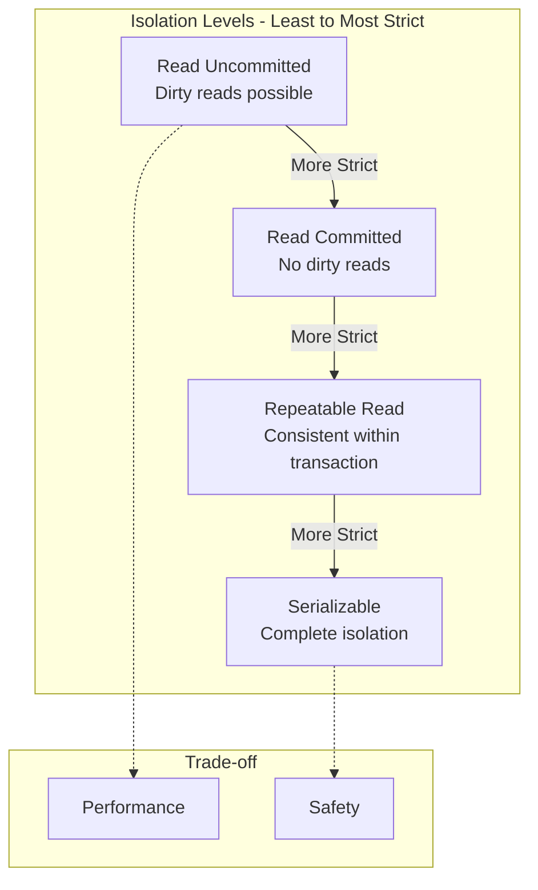

| Level | Dirty Read | Non-Repeatable Read | Phantom Read | Performance |
|-------|:----------:|:-------------------:|:------------:|:-----------:|
| Read Uncommitted | ✅ Possible | ✅ Possible | ✅ Possible | Fastest |
| Read Committed | ❌ No | ✅ Possible | ✅ Possible | Fast |
| Repeatable Read | ❌ No | ❌ No | ✅ Possible | Medium |
| Serializable | ❌ No | ❌ No | ❌ No | Slowest |

### BASE Properties (NoSQL Databases)

```
┌─────────────────────────────────────────────────────────────────────────────┐
│                           BASE PROPERTIES                                   │
├─────────────────────────────────────────────────────────────────────────────┤
│                                                                             │
│  BA - BASICALLY AVAILABLE                                                   │
│  ─────────────────────────────────────────────────────────────────────────  │
│  System guarantees availability — will always respond (may be stale data)  │
│  Prioritizes responding over having the latest data                        │
│                                                                             │
│  S - SOFT STATE                                                             │
│  ─────────────────────────────────────────────────────────────────────────  │
│  State may change over time, even without input                            │
│  Data may be in flux as it propagates across nodes                         │
│                                                                             │
│  E - EVENTUALLY CONSISTENT                                                  │
│  ─────────────────────────────────────────────────────────────────────────  │
│  Given enough time without updates, all replicas will converge             │
│  Reads may not reflect the most recent write immediately                   │
│                                                                             │
│  Timeline Example:                                                          │
│  ┌──────────────────────────────────────────────────────────────────────┐  │
│  │ T0: Write "balance=100" to Node A                                    │  │
│  │ T1: Node B still shows "balance=0" (stale)                          │  │
│  │ T2: Node C still shows "balance=0" (stale)                          │  │
│  │ T3: Replication completes...                                         │  │
│  │ T4: All nodes show "balance=100" (eventually consistent!)           │  │
│  └──────────────────────────────────────────────────────────────────────┘  │
│                                                                             │
└─────────────────────────────────────────────────────────────────────────────┘
```

### ACID vs BASE Comparison

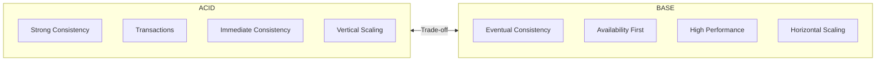

| Aspect | ACID | BASE |
|--------|------|------|
| **Priority** | Consistency | Availability |
| **Consistency** | Immediate | Eventual |
| **Scaling** | Harder (vertical) | Easier (horizontal) |
| **Use Case** | Financial, inventory | Social media, analytics |
| **Example** | Bank transfers | Like counts, view counts |

### When to Choose Which?

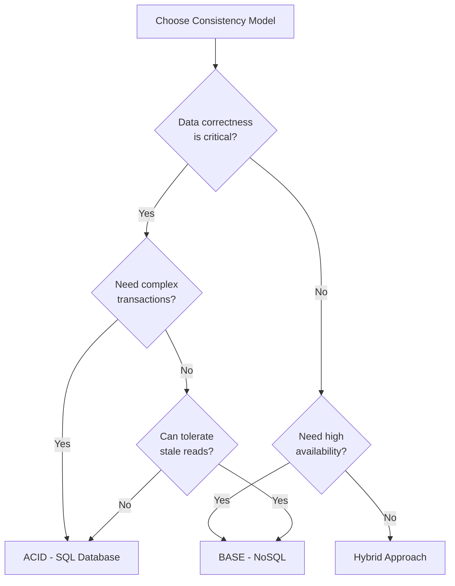

**Use ACID when:**
- Money is involved (banking, payments)
- Inventory management (can't oversell)
- Booking systems (no double-booking)
- Regulatory compliance required

**Use BASE when:**
- Social media interactions (likes, comments)
- Analytics and metrics
- Content delivery
- High-write throughput needed

---

## 5. Database Types Deep Dive

### Complete Comparison Matrix

```
┌─────────────────────────────────────────────────────────────────────────────┐
│                     DATABASE TYPES COMPARISON                               │
├─────────────────────────────────────────────────────────────────────────────┤
│                                                                             │
│  Type          │ Best For              │ Examples           │ Scale        │
│  ──────────────┼───────────────────────┼────────────────────┼────────────  │
│  Relational    │ Transactions, JOINs   │ PostgreSQL, MySQL  │ Vertical+    │
│  Document      │ Flexible schemas      │ MongoDB, CouchDB   │ Horizontal   │
│  Key-Value     │ Caching, sessions     │ Redis, DynamoDB    │ Horizontal   │
│  Wide-Column   │ Time-series, logs     │ Cassandra, HBase   │ Horizontal   │
│  Graph         │ Relationships         │ Neo4j, Neptune     │ Vertical     │
│  Time-Series   │ Metrics, IoT          │ InfluxDB, TimescaleDB │ Horizontal│
│  Search        │ Full-text search      │ Elasticsearch      │ Horizontal   │
│                                                                             │
└─────────────────────────────────────────────────────────────────────────────┘
```

### 1. Document Databases (MongoDB)

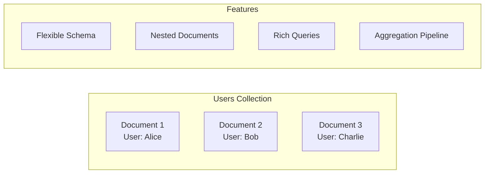

**Best For:**
- Content management systems
- E-commerce product catalogs
- User profiles with varying fields
- Rapid prototyping

**MongoDB Query Examples:**

```javascript
// Find users in New York who are premium
db.users.find({
  "address.city": "New York",
  "subscription.type": "premium"
});

// Aggregation: Average order value by city
db.orders.aggregate([
  { $lookup: { from: "users", localField: "userId", foreignField: "_id", as: "user" } },
  { $unwind: "$user" },
  { $group: { 
      _id: "$user.address.city", 
      avgOrderValue: { $avg: "$total" },
      orderCount: { $sum: 1 }
  }},
  { $sort: { avgOrderValue: -1 } }
]);
```

### 2. Key-Value Databases (Redis)

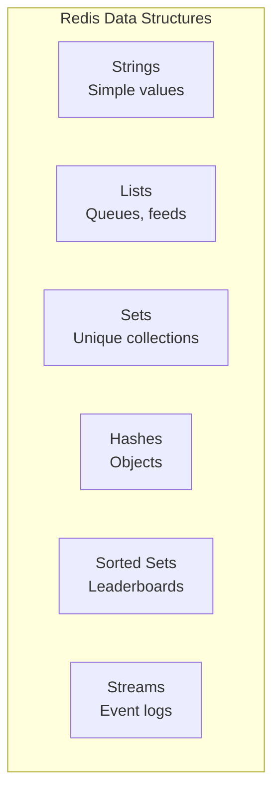

**Best For:**
- Session storage
- Caching layer
- Rate limiting
- Real-time leaderboards
- Pub/sub messaging

**Redis Data Structures:**

```python
import redis
r = redis.Redis()

# Strings - Simple caching
r.set("user:1001:profile", json.dumps(user_data))
r.expire("user:1001:profile", 3600)  # 1 hour TTL

# Hashes - Object storage
r.hset("user:1001", mapping={
    "name": "Alice",
    "email": "alice@example.com",
    "visits": 42
})
r.hincrby("user:1001", "visits", 1)

# Lists - Queues
r.lpush("queue:emails", json.dumps(email_job))
job = r.rpop("queue:emails")  # FIFO queue

# Sets - Unique items
r.sadd("user:1001:followers", "user:1002", "user:1003")
r.sinter("user:1001:followers", "user:1002:followers")  # Common followers

# Sorted Sets - Leaderboards
r.zadd("leaderboard:game1", {"player1": 1000, "player2": 850, "player3": 920})
r.zrevrange("leaderboard:game1", 0, 9, withscores=True)  # Top 10

# Streams - Event sourcing
r.xadd("events:orders", {"type": "created", "order_id": "123", "amount": "99.99"})
```

### 3. Wide-Column Databases (Cassandra)

```
┌─────────────────────────────────────────────────────────────────────────────┐
│                     CASSANDRA ARCHITECTURE                                  │
├─────────────────────────────────────────────────────────────────────────────┤
│                                                                             │
│  Partition Key determines which node stores the data                        │
│  Clustering Key determines sort order within partition                      │
│                                                                             │
│  ┌─────────────────────────────────────────────────────────────────────┐   │
│  │ Table: messages                                                      │   │
│  │ PRIMARY KEY ((channel_id), message_id)                              │   │
│  │              └─────┬─────┘  └─────┬─────┘                           │   │
│  │              Partition Key  Clustering Key                           │   │
│  └─────────────────────────────────────────────────────────────────────┘   │
│                                                                             │
│  Node 1             Node 2             Node 3                              │
│  ┌───────────┐      ┌───────────┐      ┌───────────┐                      │
│  │ Channel A │      │ Channel B │      │ Channel C │                      │
│  │ Messages  │      │ Messages  │      │ Messages  │                      │
│  └───────────┘      └───────────┘      └───────────┘                      │
│                                                                             │
│  Queries within a partition = FAST                                         │
│  Queries across partitions = SLOW (avoid!)                                 │
│                                                                             │
└─────────────────────────────────────────────────────────────────────────────┘
```

**Best For:**
- High write throughput
- Time-series data
- Chat messages (Discord uses it!)
- IoT sensor data
- Event logging

**Cassandra Example:**

```sql
-- Create a table for messages (Discord-style)
CREATE TABLE messages_by_channel (
    channel_id UUID,
    bucket INT,  -- Time bucket for partitioning
    message_id TIMEUUID,
    author_id UUID,
    content TEXT,
    created_at TIMESTAMP,
    PRIMARY KEY ((channel_id, bucket), message_id)
) WITH CLUSTERING ORDER BY (message_id DESC);

-- Efficient: Query within a partition
SELECT * FROM messages_by_channel 
WHERE channel_id = ? AND bucket = ?
LIMIT 50;

-- Inefficient: Query across partitions (avoid!)
SELECT * FROM messages_by_channel WHERE content LIKE '%hello%';
```

### 4. Graph Databases (Neo4j)

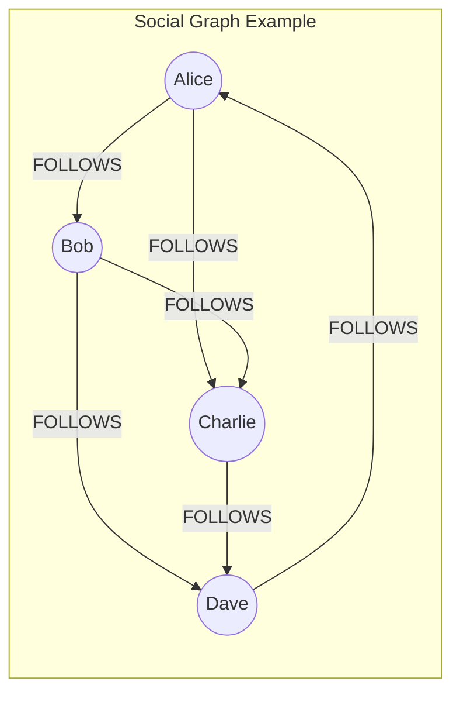

**Best For:**
- Social networks
- Recommendation engines
- Fraud detection
- Knowledge graphs
- Network analysis

**Neo4j Cypher Queries:**

```cypher
// Find friends of friends
MATCH (me:User {name: 'Alice'})-[:FOLLOWS]->()-[:FOLLOWS]->(fof:User)
WHERE NOT (me)-[:FOLLOWS]->(fof) AND me <> fof
RETURN DISTINCT fof.name AS recommendation

// Shortest path between two users
MATCH path = shortestPath(
  (start:User {name: 'Alice'})-[:FOLLOWS*]-(end:User {name: 'Dave'})
)
RETURN path

// Find influencers (users with most followers)
MATCH (u:User)<-[:FOLLOWS]-(follower)
RETURN u.name, COUNT(follower) AS followers
ORDER BY followers DESC
LIMIT 10

// Detect fraud patterns (circular transactions)
MATCH (a:Account)-[:TRANSFERRED]->(b:Account)-[:TRANSFERRED]->(c:Account)-[:TRANSFERRED]->(a)
RETURN a, b, c
```

### 5. Time-Series Databases (InfluxDB)

```
┌─────────────────────────────────────────────────────────────────────────────┐
│                     TIME-SERIES DATA                                        │
├─────────────────────────────────────────────────────────────────────────────┤
│                                                                             │
│  time                    │ host      │ cpu_usage │ memory_usage │ disk_io  │
│  ────────────────────────┼───────────┼───────────┼──────────────┼────────  │
│  2024-01-15T10:00:00Z   │ server-1  │ 45.2      │ 78.5         │ 120      │
│  2024-01-15T10:00:01Z   │ server-1  │ 47.8      │ 78.6         │ 125      │
│  2024-01-15T10:00:02Z   │ server-1  │ 43.1      │ 78.4         │ 118      │
│  2024-01-15T10:00:00Z   │ server-2  │ 62.3      │ 85.2         │ 200      │
│  2024-01-15T10:00:01Z   │ server-2  │ 61.8      │ 85.1         │ 198      │
│                                                                             │
│  Optimized for:                                                             │
│  • Append-only writes (immutable data)                                     │
│  • Time-range queries                                                       │
│  • Aggregations (avg, sum, percentiles)                                    │
│  • Automatic data retention/compression                                     │
│                                                                             │
└─────────────────────────────────────────────────────────────────────────────┘
```

**Best For:**
- Server metrics/monitoring
- IoT sensor data
- Financial tick data
- Application performance monitoring
- Log analytics

**InfluxDB Example:**

```sql
-- Write data points
INSERT cpu,host=server01,region=us-west value=0.64 1434055562000000000

-- Query: Average CPU over last hour by host
SELECT MEAN(value) 
FROM cpu 
WHERE time > now() - 1h 
GROUP BY host, time(5m)

-- Continuous query for downsampling
CREATE CONTINUOUS QUERY cq_cpu_1h ON metrics
BEGIN
  SELECT MEAN(value) INTO cpu_hourly FROM cpu GROUP BY time(1h), host
END
```

### 6. Search Engines (Elasticsearch)

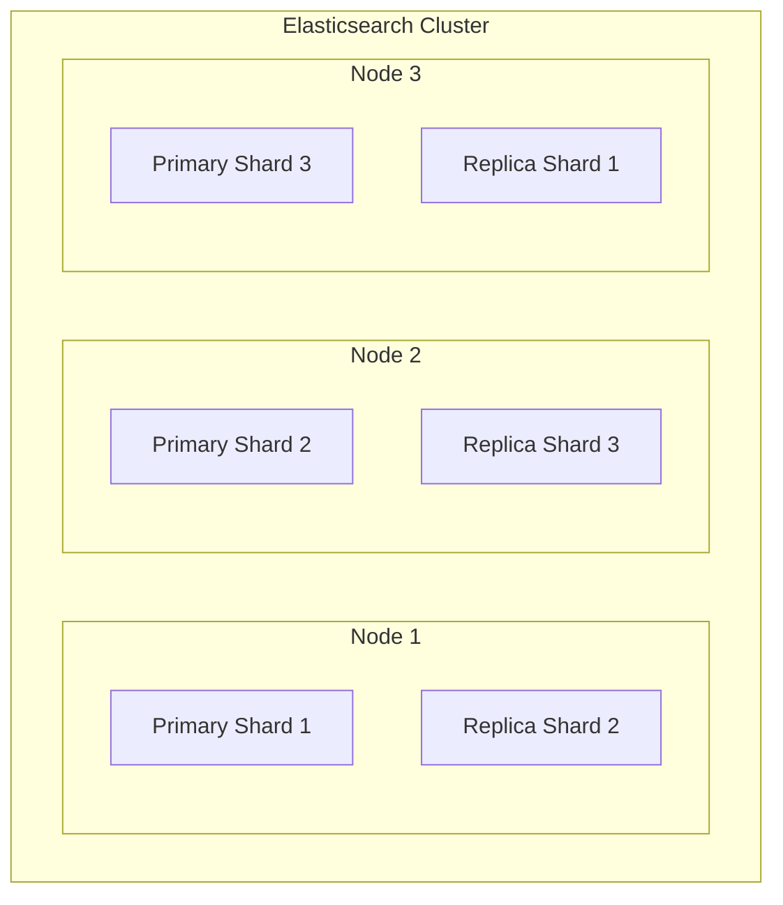

**Best For:**
- Full-text search
- Log aggregation (ELK stack)
- E-commerce product search
- Autocomplete/suggestions
- Analytics dashboards

**Elasticsearch Example:**

```json
// Index a document
PUT /products/_doc/1
{
  "name": "MacBook Pro 16-inch",
  "description": "Powerful laptop for professionals with M3 chip",
  "price": 2499,
  "category": "electronics",
  "tags": ["laptop", "apple", "professional"],
  "created_at": "2024-01-15"
}

// Full-text search with relevance scoring
GET /products/_search
{
  "query": {
    "bool": {
      "must": [
        { "match": { "description": "powerful laptop" } }
      ],
      "filter": [
        { "range": { "price": { "lte": 3000 } } },
        { "term": { "category": "electronics" } }
      ]
    }
  },
  "highlight": {
    "fields": { "description": {} }
  }
}

// Aggregations for analytics
GET /products/_search
{
  "size": 0,
  "aggs": {
    "by_category": {
      "terms": { "field": "category" },
      "aggs": {
        "avg_price": { "avg": { "field": "price" } }
      }
    }
  }
}
```

---

## 6. Data Modeling Strategies

### Normalization vs Denormalization

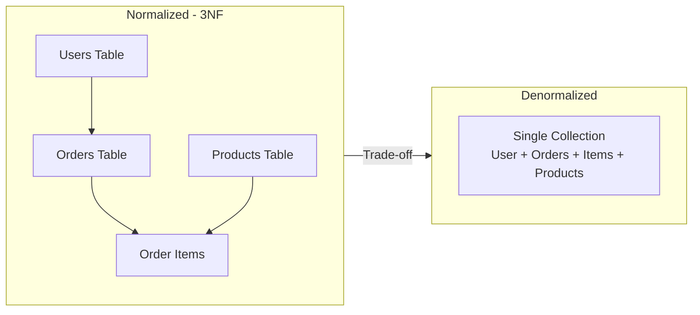

```
┌─────────────────────────────────────────────────────────────────────────────┐
│                NORMALIZATION vs DENORMALIZATION                             │
├─────────────────────────────────────────────────────────────────────────────┤
│                                                                             │
│  NORMALIZED (3NF)                    DENORMALIZED                           │
│  ─────────────────────────────       ─────────────────────────────────     │
│  ✅ No data duplication              ✅ Faster reads (no JOINs)             │
│  ✅ Easier updates (one place)       ✅ Single query for all data           │
│  ✅ Data integrity                   ✅ Better for read-heavy loads         │
│  ❌ Requires JOINs (slower reads)    ❌ Data duplication                    │
│  ❌ Complex queries                  ❌ Updates need multiple places        │
│                                                                             │
│  Best for:                           Best for:                              │
│  • Write-heavy workloads             • Read-heavy workloads                 │
│  • Data integrity is critical        • Performance is critical              │
│  • Storage is expensive              • Storage is cheap                     │
│                                                                             │
└─────────────────────────────────────────────────────────────────────────────┘
```

### Embedding vs Referencing (NoSQL)

```javascript
// EMBEDDING - Store related data together
// Good when: Data is always accessed together, 1:few relationship
{
  "_id": "user_123",
  "name": "Alice",
  "addresses": [  // Embedded array
    { "type": "home", "street": "123 Main St", "city": "NYC" },
    { "type": "work", "street": "456 Office Blvd", "city": "NYC" }
  ]
}

// REFERENCING - Store IDs, lookup separately
// Good when: Large/unbounded related data, many-to-many relationships
{
  "_id": "user_123",
  "name": "Alice",
  "order_ids": ["order_1", "order_2", "order_3"]  // References
}

// Lookup orders separately
db.orders.find({ "_id": { "$in": user.order_ids } })
```

### Data Modeling Decision Guide

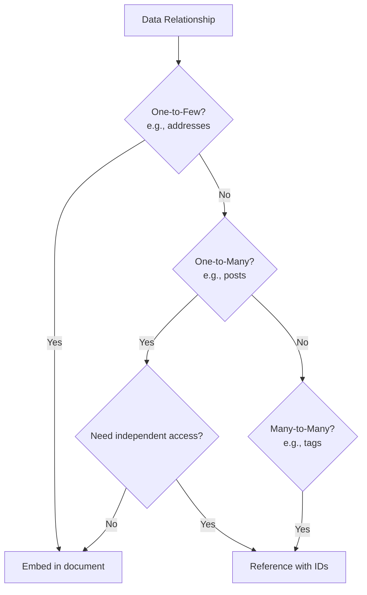

---

## 7. Replication & Partitioning Basics

### Replication Strategies

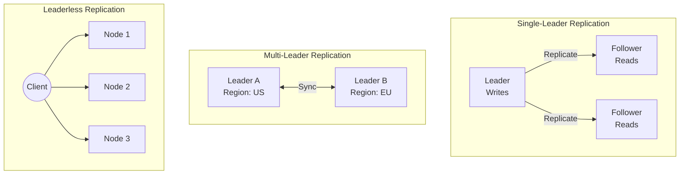

| Strategy | Use Case | Pros | Cons |
|----------|----------|------|------|
| **Single-Leader** | Most applications | Simple, consistent | Leader is bottleneck |
| **Multi-Leader** | Multi-region apps | Low latency globally | Conflict resolution needed |
| **Leaderless** | High availability | No single point of failure | Eventual consistency |

### Partitioning (Sharding) Strategies

```
┌─────────────────────────────────────────────────────────────────────────────┐
│                     PARTITIONING STRATEGIES                                 │
├─────────────────────────────────────────────────────────────────────────────┤
│                                                                             │
│  1. HASH PARTITIONING                                                       │
│  ─────────────────────────────────────────────────────────────────────────  │
│  partition = hash(key) % num_partitions                                    │
│                                                                             │
│  User ID: 12345                                                             │
│  Hash: hash(12345) = 87234                                                 │
│  Partition: 87234 % 4 = 2 → Goes to Shard 2                                │
│                                                                             │
│  ✅ Even distribution                                                       │
│  ❌ Range queries span all partitions                                       │
│                                                                             │
│  2. RANGE PARTITIONING                                                      │
│  ─────────────────────────────────────────────────────────────────────────  │
│  Shard 1: Users A-G                                                        │
│  Shard 2: Users H-N                                                        │
│  Shard 3: Users O-T                                                        │
│  Shard 4: Users U-Z                                                        │
│                                                                             │
│  ✅ Efficient range queries                                                 │
│  ❌ Risk of hotspots (e.g., names starting with 'S')                       │
│                                                                             │
│  3. DIRECTORY-BASED PARTITIONING                                            │
│  ─────────────────────────────────────────────────────────────────────────  │
│  Lookup table maps key → partition                                         │
│  ✅ Flexible                                                                │
│  ❌ Lookup table becomes single point of failure                           │
│                                                                             │
└─────────────────────────────────────────────────────────────────────────────┘
```

### Consistent Hashing

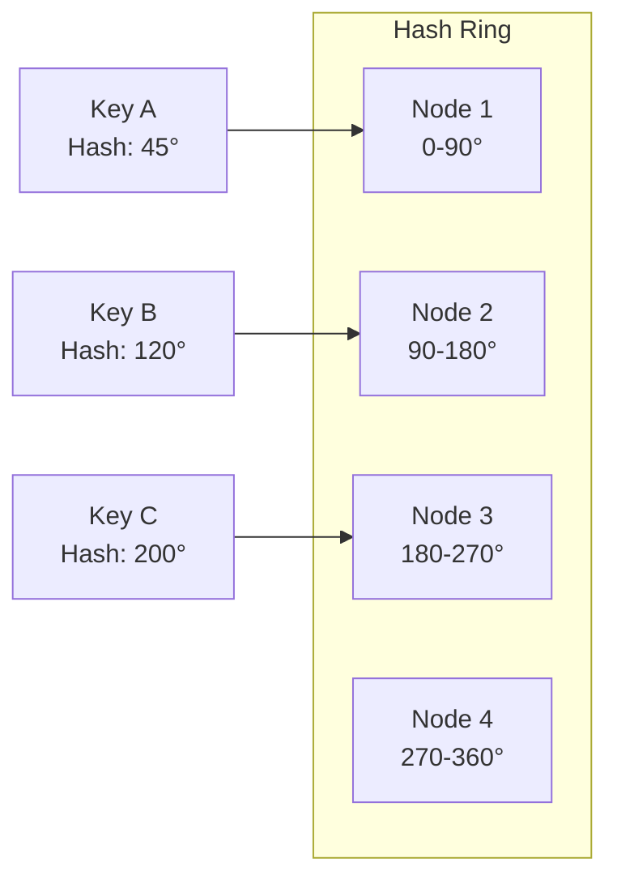

**Why Consistent Hashing?**
- Adding/removing nodes only affects K/N keys (K=keys, N=nodes)
- Regular hashing would reshuffle all keys!
- Used by: DynamoDB, Cassandra, memcached

---

## 8. Choosing the Right Database

### Decision Flowchart

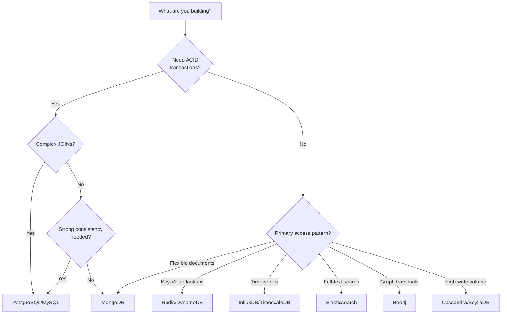

### Database Selection Matrix

| Requirement | Best Choice | Avoid |
|-------------|-------------|-------|
| **Financial transactions** | PostgreSQL, MySQL | Eventually consistent DBs |
| **Session storage** | Redis | Relational DBs |
| **Product catalog** | MongoDB, PostgreSQL | Key-Value stores |
| **Chat messages** | Cassandra, ScyllaDB | Single-node DBs |
| **Social graph** | Neo4j | Relational (complex JOINs) |
| **Metrics/monitoring** | InfluxDB, TimescaleDB | Document stores |
| **Full-text search** | Elasticsearch | Relational (LIKE queries) |
| **Caching** | Redis, Memcached | Disk-based DBs |
| **Real-time analytics** | ClickHouse, Druid | Row-based DBs |

### Polyglot Persistence Pattern

Most real-world systems use **multiple databases**:

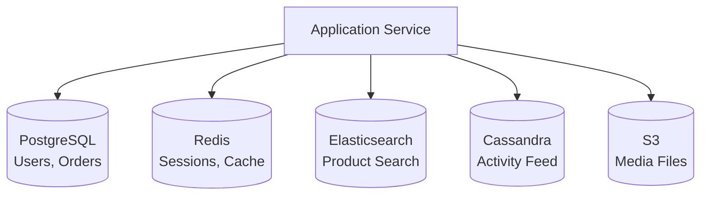

**Example: E-commerce Platform**

| Data | Database | Why? |
|------|----------|------|
| Users, Orders | PostgreSQL | ACID for transactions |
| Sessions | Redis | Fast, TTL support |
| Product Search | Elasticsearch | Full-text search |
| Activity Feed | Cassandra | High write throughput |
| Product Images | S3 | Blob storage |
| Analytics | ClickHouse | Fast aggregations |

---

## 9. Real-World Examples

### 🎮 Discord: Billions of Messages

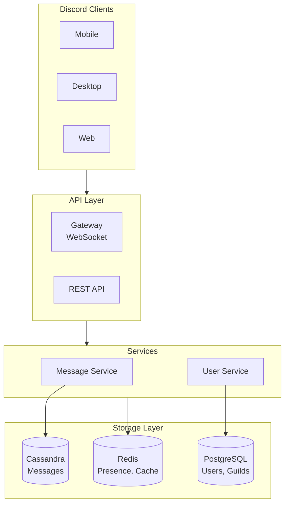

**Discord's Journey:**
1. **Started with MongoDB** — Worked for first few million messages
2. **Problems at scale** — Random I/O, read performance degraded
3. **Moved to Cassandra** — 
   - Partition by channel_id
   - Clustering by message_id (time-based)
   - Linear scaling with nodes

**Data Model:**

```sql
CREATE TABLE messages (
    channel_id bigint,
    bucket int,  -- Time bucket to limit partition size
    message_id bigint,  -- Snowflake ID (time + worker + sequence)
    author_id bigint,
    content text,
    PRIMARY KEY ((channel_id, bucket), message_id)
) WITH CLUSTERING ORDER BY (message_id DESC);
```

### 🚗 Uber: Location + Transactions

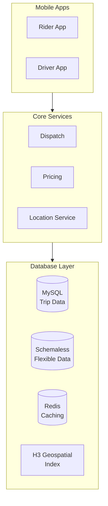

**Uber's Database Stack:**
- **MySQL** — Core transactional data (trips, payments)
- **Schemaless** — Internal NoSQL on MySQL (flexible schema)
- **Redis** — Caching, rate limiting
- **H3** — Geospatial indexing for location

### 📺 Netflix: Global Streaming

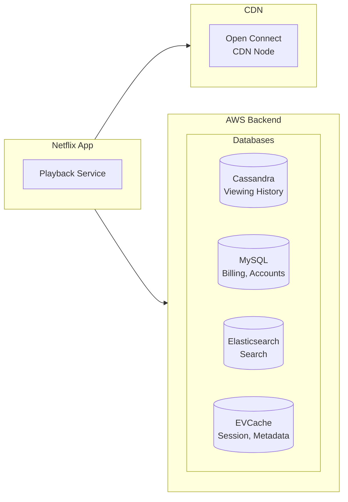

**Netflix's Database Choices:**

| Use Case | Database | Why? |
|----------|----------|------|
| Viewing history | Cassandra | Massive writes, globally distributed |
| User accounts | MySQL | ACID for billing |
| Recommendations | Cassandra + Custom | ML pipeline integration |
| Search | Elasticsearch | Full-text search |
| Caching | EVCache (Memcached) | Sub-millisecond latency |

### 🐦 Twitter: Timeline at Scale

```
┌─────────────────────────────────────────────────────────────────────────────┐
│                     TWITTER'S DATABASE EVOLUTION                            │
├─────────────────────────────────────────────────────────────────────────────┤
│                                                                             │
│  2006: Started with MySQL                                                   │
│        └─ Worked for a few million tweets                                  │
│                                                                             │
│  2010: MySQL + Memcached                                                    │
│        └─ Cache everything, still hitting limits                           │
│                                                                             │
│  2012: Developed Manhattan (custom distributed DB)                          │
│        └─ Twitter's internal key-value store                               │
│        └─ Strong consistency where needed                                  │
│        └─ Eventual consistency for timelines                               │
│                                                                             │
│  2014+: FlockDB (graph), Gizzard (sharding), Manhattan                     │
│         └─ Different DBs for different use cases                           │
│                                                                             │
│  Timeline Fan-out Strategy:                                                 │
│  ┌────────────────────────────────────────────────────────────────────┐    │
│  │ User tweets → Write to 1 place                                      │    │
│  │ Follower timelines → Fan-out to N follower caches (async)          │    │
│  │ Celebrity tweets (10M+ followers) → Fetched on-demand               │    │
│  └────────────────────────────────────────────────────────────────────┘    │
│                                                                             │
└─────────────────────────────────────────────────────────────────────────────┘
```

---

## 10. Interview Corner

### 🎯 Top Interview Questions

**Q1: SQL vs NoSQL — When would you choose each?**

<details>
<summary>Click to see answer</summary>

**Choose SQL when:**
- Need ACID transactions (banking, inventory)
- Complex relationships requiring JOINs
- Data integrity is critical
- Schema is well-defined and stable
- Need complex queries and reporting

**Choose NoSQL when:**
- Need horizontal scaling
- Schema flexibility is important
- Simple key-based access patterns
- High write throughput required
- Eventual consistency is acceptable

**Many systems use both!** Example: E-commerce uses PostgreSQL for orders (ACID) and Redis for caching (speed).

</details>

**Q2: Explain database sharding. What are the challenges?**

<details>
<summary>Click to see answer</summary>

**Sharding** = Splitting data across multiple databases based on a shard key.

**Strategies:**
1. **Hash-based**: `shard = hash(user_id) % num_shards`
2. **Range-based**: `shard = user_id 1-1M → shard1, 1M-2M → shard2`
3. **Directory-based**: Lookup table maps keys to shards

**Challenges:**
- **Cross-shard queries**: JOINs across shards are expensive
- **Hotspots**: Uneven data distribution
- **Resharding**: Adding shards requires data migration
- **Transactions**: Cross-shard transactions are complex
- **Operational complexity**: More databases to manage

**Solutions:**
- Consistent hashing (minimize resharding impact)
- Virtual shards (logical shards map to physical)
- Application-level sharding logic

</details>

**Q3: How would you design a database schema for a social media feed?**

<details>
<summary>Click to see answer</summary>

**Two approaches:**

**1. Pull Model (Read-heavy)**
```sql
-- When user opens feed, pull from all followed users
SELECT posts.* FROM posts
JOIN follows ON posts.author_id = follows.following_id
WHERE follows.follower_id = ?
ORDER BY created_at DESC
LIMIT 50;
```
- Pros: Simple, no fan-out
- Cons: Slow for users following many people

**2. Push Model (Write-heavy) — Used by Twitter**
```sql
-- When user posts, push to all followers' timelines
CREATE TABLE user_timeline (
  user_id BIGINT,
  post_id BIGINT,
  created_at TIMESTAMP,
  PRIMARY KEY (user_id, created_at DESC)
);
```
- Pros: Fast reads (pre-computed timeline)
- Cons: Expensive writes for celebrities (10M+ followers)

**Hybrid approach:**
- Push to regular users (< 10K followers)
- Pull for celebrities on-demand

</details>

**Q4: What is CAP theorem? Give examples of CP and AP systems.**

<details>
<summary>Click to see answer</summary>

**CAP Theorem:** In a distributed system, you can only guarantee 2 of 3:
- **Consistency**: All nodes see the same data
- **Availability**: Every request gets a response
- **Partition Tolerance**: System works despite network failures

Since network partitions are unavoidable, choose between:

**CP Systems (Consistency + Partition Tolerance):**
- MongoDB (single-master), HBase, Redis Cluster
- Behavior: May reject requests during partition
- Use case: Banking, inventory systems

**AP Systems (Availability + Partition Tolerance):**
- Cassandra, DynamoDB, CouchDB
- Behavior: Always responds, may return stale data
- Use case: Social media, analytics

</details>

**Q5: Explain database indexing. What are the trade-offs?**

<details>
<summary>Click to see answer</summary>

**Index = Data structure that speeds up data retrieval**

**How it works:**
```
Without index: O(n) — scan every row
With B-tree index: O(log n) — binary search
With hash index: O(1) — direct lookup
```

**Trade-offs:**

| Benefit | Cost |
|---------|------|
| Faster reads | Slower writes (index updates) |
| Efficient WHERE clauses | Extra storage space |
| Sorted data access | Index maintenance overhead |

**Best Practices:**
- Index columns used in WHERE, JOIN, ORDER BY
- Don't over-index (slows writes)
- Use composite indexes for multi-column queries
- Consider partial indexes for large tables
- Monitor index usage, remove unused indexes

</details>

---

## 11. Quick Recap

### TL;DR Summary Card

```
┌─────────────────────────────────────────────────────────────────────────────┐
│                    CHAPTER 03: QUICK RECAP                                  │
├─────────────────────────────────────────────────────────────────────────────┤
│                                                                             │
│  📌 SQL vs NoSQL                                                            │
│     SQL = ACID, JOINs, structured (PostgreSQL, MySQL)                      │
│     NoSQL = Flexible, scalable, distributed (MongoDB, Cassandra)           │
│                                                                             │
│  📌 ACID vs BASE                                                            │
│     ACID = Atomicity, Consistency, Isolation, Durability                   │
│     BASE = Basically Available, Soft state, Eventually consistent          │
│                                                                             │
│  📌 Database Types                                                          │
│     Document: MongoDB (flexible schemas)                                    │
│     Key-Value: Redis (caching, sessions)                                   │
│     Wide-Column: Cassandra (time-series, high writes)                      │
│     Graph: Neo4j (relationships, networks)                                 │
│     Time-Series: InfluxDB (metrics, IoT)                                   │
│     Search: Elasticsearch (full-text search)                               │
│                                                                             │
│  📌 Data Modeling                                                           │
│     Normalize for write-heavy, data integrity                              │
│     Denormalize for read-heavy, performance                                │
│                                                                             │
│  📌 Polyglot Persistence                                                    │
│     Use multiple databases for different needs                             │
│                                                                             │
└─────────────────────────────────────────────────────────────────────────────┘
```

### Database Selection Cheatsheet

| Need | Choose |
|------|--------|
| ACID transactions | PostgreSQL, MySQL |
| Flexible documents | MongoDB |
| Caching/sessions | Redis |
| High write throughput | Cassandra, ScyllaDB |
| Social graph | Neo4j |
| Time-series/metrics | InfluxDB, TimescaleDB |
| Full-text search | Elasticsearch |
| Blob/file storage | S3, GCS |

---

## 12. Further Reading

### 📚 Recommended Resources

**Books:**
- "Designing Data-Intensive Applications" by Martin Kleppmann
- "Database Internals" by Alex Petrov
- "Seven Databases in Seven Weeks" by Redmond & Wilson

**Papers:**
- [Amazon Dynamo Paper](https://www.allthingsdistributed.com/files/amazon-dynamo-sosp2007.pdf)
- [Google Bigtable Paper](https://static.googleusercontent.com/media/research.google.com/en//archive/bigtable-osdi06.pdf)
- [Facebook TAO Paper](https://www.usenix.org/system/files/conference/atc13/atc13-bronson.pdf)

**Engineering Blogs:**
- [Discord: How Discord Stores Billions of Messages](https://discord.com/blog/how-discord-stores-billions-of-messages)
- [Uber: Schemaless](https://eng.uber.com/schemaless-part-one/)
- [Netflix: Database Architecture](https://netflixtechblog.com/)

---

## 📱 Share This Chapter

> *"The right database isn't about SQL vs NoSQL — it's about understanding your access patterns and choosing accordingly."*

**Key Takeaways to Share:**

```
🗄️ DATABASE SELECTION 101

1️⃣ ACID for transactions, BASE for scale
2️⃣ SQL for complex queries, NoSQL for flexibility
3️⃣ Most systems use multiple databases (polyglot)
4️⃣ Index wisely — faster reads, slower writes
5️⃣ Know your access patterns before choosing

#SystemDesign #Databases #SoftwareEngineering
```

---

<div align="center">

## Navigation

[](../02-networking/README.md)
[](../04-caching-cdn/README.md)

---

**[⬆ Back to Top](#chapter-03-data-storage-fundamentals)** | **[📚 Table of Contents](../../README.md)**

</div>
