<div align="center">

# Chapter 04: Caching & CDN

> *"There are only two hard things in Computer Science: cache invalidation and naming things." — Phil Karlton*

[](../03-data-storage/README.md)
[](../05-hld/README.md)

</div>

---

## 🎯 What You'll Learn

By the end of this chapter, you will:

- ✅ Understand why caching is critical for performance
- ✅ Master caching patterns (Cache-aside, Read/Write-through, Write-back)
- ✅ Deep dive into Redis data structures and use cases
- ✅ Compare Redis vs Memcached
- ✅ Learn cache invalidation strategies
- ✅ Understand CDN architecture and edge caching
- ✅ Design multi-layer caching strategies
- ✅ Study real-world caching from Netflix, Facebook, and Twitter

---

## 📋 Prerequisites

- Understanding of databases ([Chapter 03](../03-data-storage/README.md))
- Basic knowledge of HTTP and networking
- Familiarity with key-value data structures

---

## 📑 Table of Contents

1. [Why Caching Matters](#1-why-caching-matters)
2. [Caching Fundamentals](#2-caching-fundamentals)
3. [Caching Patterns](#3-caching-patterns)
4. [Redis Deep Dive](#4-redis-deep-dive)
5. [Redis vs Memcached](#5-redis-vs-memcached)
6. [Cache Invalidation Strategies](#6-cache-invalidation-strategies)
7. [CDN: Content Delivery Networks](#7-cdn-content-delivery-networks)
8. [Multi-Layer Caching](#8-multi-layer-caching)
9. [Real-World Examples](#9-real-world-examples)
10. [Common Pitfalls](#10-common-pitfalls)
11. [Interview Corner](#11-interview-corner)
12. [Quick Recap](#12-quick-recap)
13. [Further Reading](#13-further-reading)

---

## 1. Why Caching Matters

### The Speed Gap

```
┌─────────────────────────────────────────────────────────────────────────────┐
│                     LATENCY COMPARISON                                      │
├─────────────────────────────────────────────────────────────────────────────┤
│                                                                             │
│  Operation                    │ Latency        │ Relative Speed             │
│  ─────────────────────────────┼────────────────┼──────────────────────────  │
│  L1 Cache Reference           │ 0.5 ns         │ ████ (baseline)            │
│  L2 Cache Reference           │ 7 ns           │ ██████                     │
│  RAM Reference                │ 100 ns         │ █████████████              │
│  Redis/Memcached (network)    │ 0.5-1 ms       │ ████████████████           │
│  SSD Random Read              │ 150 μs         │ ███████████████████        │
│  Database Query (indexed)     │ 1-10 ms        │ █████████████████████████  │
│  Database Query (full scan)   │ 100-1000 ms    │ ██████████████████████████ │
│  Cross-continent Network      │ 150 ms         │ ██████████████████████████ │
│                                                                             │
│  💡 Redis is ~100x faster than a typical database query!                   │
│                                                                             │
└─────────────────────────────────────────────────────────────────────────────┘
```

### The Business Impact

| Metric | Impact |
|--------|--------|
| **Amazon** | 100ms latency = 1% sales loss (~$1.6B/year) |
| **Google** | 500ms delay = 20% traffic drop |
| **Walmart** | Every 1s improvement = 2% conversion increase |
| **Pinterest** | 40% reduction in wait time = 15% more sign-ups |

### What Can Be Cached?

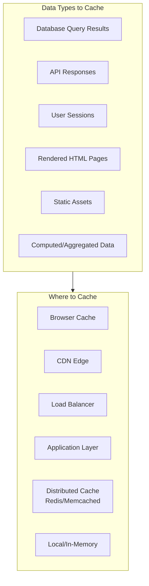

---

## 2. Caching Fundamentals

### Cache Hit vs Cache Miss

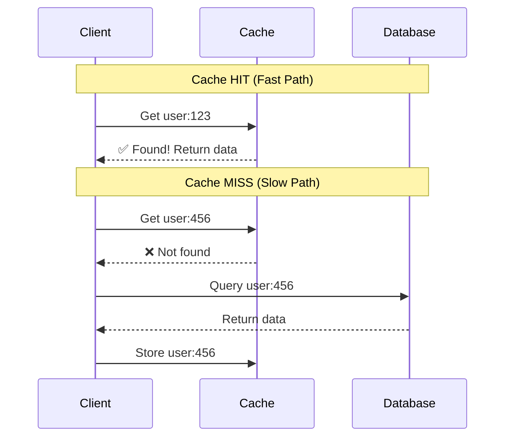

### Key Cache Metrics

```
┌─────────────────────────────────────────────────────────────────────────────┐
│                        CACHE METRICS                                        │
├─────────────────────────────────────────────────────────────────────────────┤
│                                                                             │
│  HIT RATE = Cache Hits / (Cache Hits + Cache Misses)                       │
│  ─────────────────────────────────────────────────────────────────────────  │
│  Target: 95%+ for most applications                                        │
│  90% hit rate = 10x fewer database queries                                 │
│  99% hit rate = 100x fewer database queries                                │
│                                                                             │
│  MISS RATE = 1 - Hit Rate                                                  │
│  ─────────────────────────────────────────────────────────────────────────  │
│  Every miss = database query + network latency + cache write               │
│                                                                             │
│  EVICTION RATE = Number of items evicted / Time period                     │
│  ─────────────────────────────────────────────────────────────────────────  │
│  High eviction = cache too small or TTL too short                          │
│                                                                             │
│  LATENCY = Time to retrieve from cache                                     │
│  ─────────────────────────────────────────────────────────────────────────  │
│  Redis: < 1ms for most operations                                          │
│  Local cache: < 0.1ms                                                      │
│                                                                             │
└─────────────────────────────────────────────────────────────────────────────┘
```

### Cache Eviction Policies

When cache is full, which items do we remove?

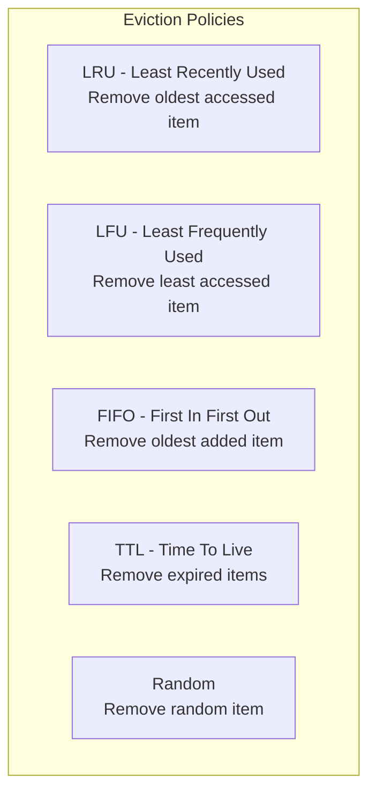

| Policy | Best For | How It Works |
|--------|----------|--------------|
| **LRU** | General purpose | Removes item not accessed longest |
| **LFU** | Hot data patterns | Removes least frequently accessed |
| **FIFO** | Simple scenarios | Removes oldest added item |
| **TTL** | Time-sensitive data | Removes expired items |
| **Random** | Simple, uniform access | Randomly evicts |

**LRU Example:**

```
Cache capacity: 3

Access sequence: A, B, C, A, D, B, E

Step 1: [A] 
Step 2: [A, B]
Step 3: [A, B, C]
Step 4: [B, C, A]      ← A accessed, moves to end
Step 5: [C, A, D]      ← B evicted (LRU), D added
Step 6: [A, D, B]      ← B accessed, C evicted
Step 7: [D, B, E]      ← A evicted (LRU), E added
```

---

## 3. Caching Patterns

### Pattern 1: Cache-Aside (Lazy Loading)

The **most common** caching pattern. Application manages both cache and database.

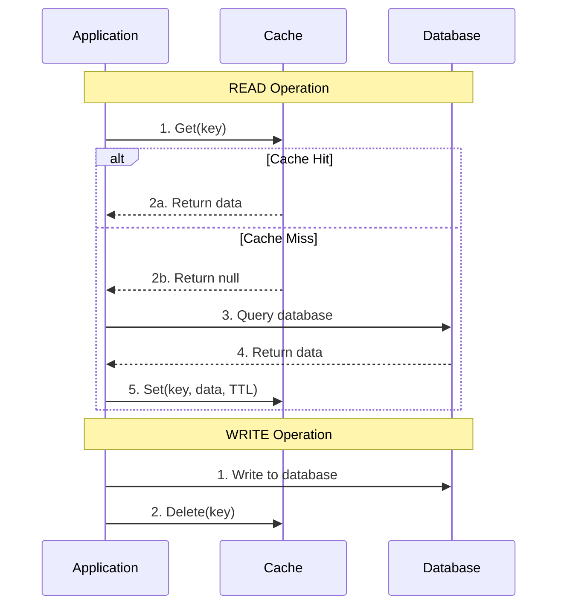

```python
# Cache-Aside Pattern Implementation
class CacheAsideService:
    def __init__(self, cache, database):
        self.cache = cache
        self.db = database
    
    def get_user(self, user_id: str) -> dict:
        # Step 1: Try cache first
        cache_key = f"user:{user_id}"
        cached = self.cache.get(cache_key)
        
        if cached:
            return cached  # Cache HIT
        
        # Step 2: Cache MISS - query database
        user = self.db.query(f"SELECT * FROM users WHERE id = {user_id}")
        
        if user:
            # Step 3: Populate cache for next time
            self.cache.set(cache_key, user, ttl=3600)  # 1 hour TTL
        
        return user
    
    def update_user(self, user_id: str, data: dict):
        # Step 1: Update database
        self.db.update("users", user_id, data)
        
        # Step 2: Invalidate cache
        self.cache.delete(f"user:{user_id}")
```

**Pros:**
- ✅ Simple to implement
- ✅ Only caches data that's actually used
- ✅ Cache failures don't break the application

**Cons:**
- ❌ First request always hits database (cold cache)
- ❌ Data can become stale between TTL refreshes

---

### Pattern 2: Read-Through

Cache sits between application and database. Cache handles misses automatically.

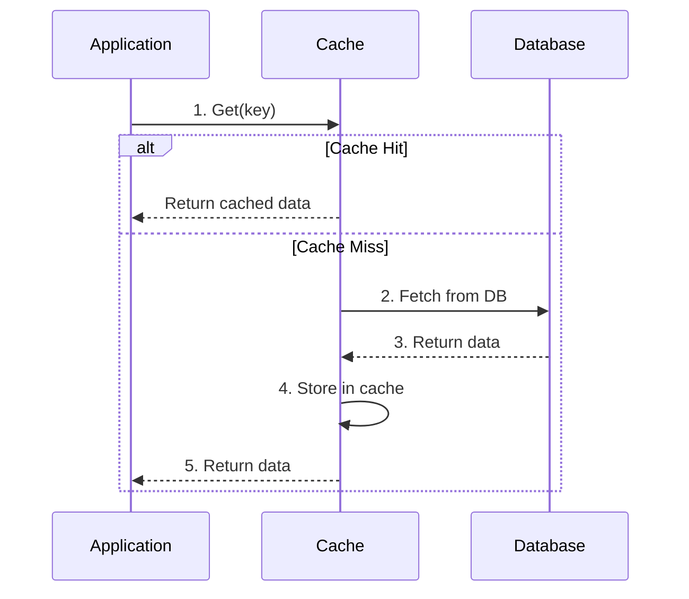

```python
# Read-Through Pattern (Cache handles DB fetch)
class ReadThroughCache:
    def __init__(self, cache, database):
        self.cache = cache
        self.db = database
    
    def get(self, key: str, loader_fn=None) -> any:
        # Try cache first
        value = self.cache.get(key)
        
        if value is None and loader_fn:
            # Cache handles the database fetch
            value = loader_fn()
            if value:
                self.cache.set(key, value)
        
        return value

# Usage
cache = ReadThroughCache(redis, postgres)
user = cache.get(
    f"user:{user_id}", 
    loader_fn=lambda: db.query(f"SELECT * FROM users WHERE id = {user_id}")
)
```

**Pros:**
- ✅ Application code is simpler (cache handles loading)
- ✅ Centralized caching logic

**Cons:**
- ❌ Cache library must understand how to load data
- ❌ Less flexibility in loading logic

---

### Pattern 3: Write-Through

Data is written to cache AND database synchronously.

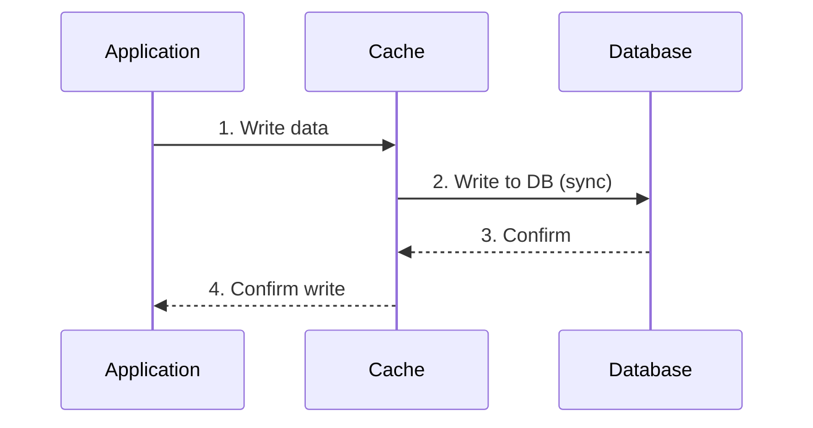

```python
# Write-Through Pattern
class WriteThroughCache:
    def __init__(self, cache, database):
        self.cache = cache
        self.db = database
    
    def write(self, key: str, value: any):
        # Write to both synchronously
        self.db.write(key, value)
        self.cache.set(key, value)
        # Only return after both succeed
```

**Pros:**
- ✅ Cache is always consistent with database
- ✅ No stale data issues

**Cons:**
- ❌ Higher write latency (must write to both)
- ❌ Cache may store data that's never read

---

### Pattern 4: Write-Behind (Write-Back)

Data is written to cache immediately, database is updated asynchronously.

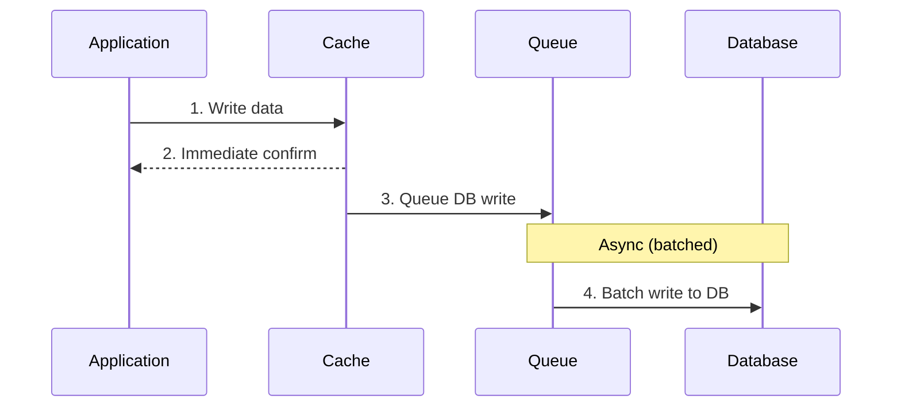

```python
# Write-Behind Pattern
class WriteBehindCache:
    def __init__(self, cache, queue):
        self.cache = cache
        self.queue = queue
    
    def write(self, key: str, value: any):
        # Write to cache immediately
        self.cache.set(key, value)
        
        # Queue async database write
        self.queue.enqueue({
            "operation": "write",
            "key": key,
            "value": value,
            "timestamp": time.now()
        })
        
        # Return immediately (don't wait for DB)
        return True

# Background worker processes queue
class DBWriter:
    def process_batch(self, operations: list):
        # Batch multiple writes for efficiency
        self.db.bulk_insert(operations)
```

**Pros:**
- ✅ Fastest write performance
- ✅ Can batch database writes for efficiency
- ✅ Absorbs traffic spikes

**Cons:**
- ❌ Risk of data loss if cache fails before DB write
- ❌ Complex to implement correctly
- ❌ Eventual consistency between cache and DB

---

### Pattern Comparison

```
┌─────────────────────────────────────────────────────────────────────────────┐
│                     CACHING PATTERNS COMPARISON                             │
├─────────────────────────────────────────────────────────────────────────────┤
│                                                                             │
│  Pattern          │ Read     │ Write    │ Consistency │ Complexity         │
│  ─────────────────┼──────────┼──────────┼─────────────┼──────────────────  │
│  Cache-Aside      │ Fast*    │ Moderate │ Eventual    │ Low                │
│  Read-Through     │ Fast*    │ Moderate │ Eventual    │ Medium             │
│  Write-Through    │ Fast     │ Slow     │ Strong      │ Medium             │
│  Write-Behind     │ Fast     │ Fast     │ Eventual    │ High               │
│                                                                             │
│  * First read is slow (cache miss)                                         │
│                                                                             │
│  RECOMMENDATIONS:                                                           │
│  • Most apps: Cache-Aside (simple, effective)                              │
│  • Read-heavy: Read-Through                                                │
│  • Write-heavy with consistency: Write-Through                             │
│  • Write-heavy, speed critical: Write-Behind                               │
│                                                                             │
└─────────────────────────────────────────────────────────────────────────────┘
```

---

## 4. Redis Deep Dive

### What is Redis?

**Redis** = **RE**mote **DI**ctionary **S**erver

An in-memory data structure store that can be used as:
- Cache
- Database
- Message broker
- Queue

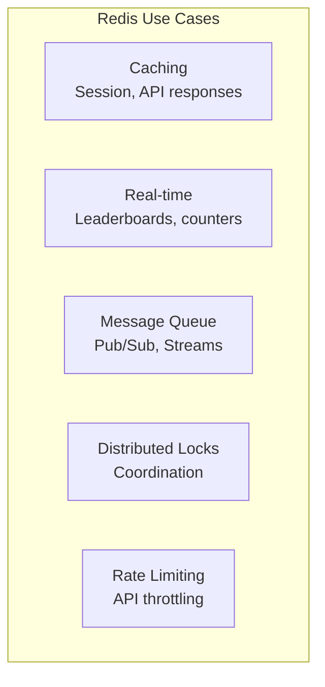

### Redis Data Structures

```
┌─────────────────────────────────────────────────────────────────────────────┐
│                     REDIS DATA STRUCTURES                                   │
├─────────────────────────────────────────────────────────────────────────────┤
│                                                                             │
│  STRINGS           │ Simple key-value pairs                                │
│  SET key "value"   │ GET key → "value"                                     │
│                                                                             │
│  HASHES            │ Objects with fields                                    │
│  HSET user:1 name  │ HGET user:1 name → "Alice"                            │
│  "Alice" age 25    │ HGETALL user:1 → {name: "Alice", age: "25"}           │
│                                                                             │
│  LISTS             │ Ordered collections (queues)                          │
│  LPUSH queue "job" │ RPOP queue → "job"                                    │
│                                                                             │
│  SETS              │ Unique unordered elements                              │
│  SADD tags "redis" │ SMEMBERS tags → ["redis", "cache"]                    │
│                                                                             │
│  SORTED SETS       │ Ordered by score (leaderboards)                       │
│  ZADD lb 100 "p1"  │ ZRANGE lb 0 9 → Top 10 players                        │
│                                                                             │
│  STREAMS           │ Append-only log (events)                              │
│  XADD events *     │ XREAD events → Stream of events                       │
│  field value       │                                                        │
│                                                                             │
└─────────────────────────────────────────────────────────────────────────────┘
```

### Redis Use Cases with Code

#### 1. Session Storage

```python
import redis
import json

r = redis.Redis(host='localhost', port=6379, decode_responses=True)

# Store session
def create_session(user_id: str, data: dict, ttl: int = 3600):
    session_id = generate_uuid()
    r.setex(
        f"session:{session_id}",
        ttl,  # Expires in 1 hour
        json.dumps({"user_id": user_id, **data})
    )
    return session_id

# Get session
def get_session(session_id: str):
    data = r.get(f"session:{session_id}")
    return json.loads(data) if data else None

# Extend session TTL on activity
def extend_session(session_id: str, ttl: int = 3600):
    r.expire(f"session:{session_id}", ttl)
```

#### 2. Rate Limiting

```python
# Sliding window rate limiter
def is_rate_limited(user_id: str, limit: int = 100, window: int = 60) -> bool:
    key = f"rate:{user_id}"
    current = r.get(key)
    
    if current is None:
        # First request in window
        r.setex(key, window, 1)
        return False
    
    if int(current) >= limit:
        return True  # Rate limited!
    
    r.incr(key)
    return False

# Token bucket rate limiter
def token_bucket_allow(user_id: str, rate: int = 10, capacity: int = 100) -> bool:
    key = f"bucket:{user_id}"
    now = time.time()
    
    # Use Redis transaction for atomic operation
    pipe = r.pipeline()
    
    # Get current tokens and last update time
    pipe.hget(key, "tokens")
    pipe.hget(key, "last_update")
    result = pipe.execute()
    
    tokens = float(result[0] or capacity)
    last_update = float(result[1] or now)
    
    # Add tokens based on time elapsed
    elapsed = now - last_update
    tokens = min(capacity, tokens + elapsed * rate)
    
    if tokens >= 1:
        # Allow request, consume token
        pipe.hset(key, "tokens", tokens - 1)
        pipe.hset(key, "last_update", now)
        pipe.expire(key, 3600)
        pipe.execute()
        return True
    
    return False  # Rate limited
```

#### 3. Leaderboard

```python
# Real-time game leaderboard
class Leaderboard:
    def __init__(self, name: str):
        self.key = f"leaderboard:{name}"
    
    def add_score(self, player_id: str, score: int):
        # ZADD adds or updates score
        r.zadd(self.key, {player_id: score})
    
    def increment_score(self, player_id: str, delta: int):
        # Atomic increment
        r.zincrby(self.key, delta, player_id)
    
    def get_rank(self, player_id: str) -> int:
        # 0-indexed rank (reverse order, highest first)
        rank = r.zrevrank(self.key, player_id)
        return rank + 1 if rank is not None else None
    
    def get_top(self, n: int = 10) -> list:
        # Get top N players with scores
        return r.zrevrange(self.key, 0, n - 1, withscores=True)
    
    def get_around_player(self, player_id: str, n: int = 5) -> list:
        rank = r.zrevrank(self.key, player_id)
        if rank is None:
            return []
        start = max(0, rank - n)
        end = rank + n
        return r.zrevrange(self.key, start, end, withscores=True)

# Usage
lb = Leaderboard("game:season1")
lb.add_score("player:123", 1500)
lb.increment_score("player:123", 50)
print(lb.get_top(10))  # Top 10 players
print(lb.get_rank("player:123"))  # Player's current rank
```

#### 4. Distributed Lock

```python
import uuid
import time

class DistributedLock:
    def __init__(self, redis_client, lock_name: str, expire: int = 10):
        self.redis = redis_client
        self.lock_key = f"lock:{lock_name}"
        self.expire = expire
        self.lock_id = str(uuid.uuid4())
    
    def acquire(self, timeout: int = 10) -> bool:
        """Try to acquire lock with timeout"""
        end_time = time.time() + timeout
        
        while time.time() < end_time:
            # SET NX = Set if Not eXists
            if self.redis.set(self.lock_key, self.lock_id, nx=True, ex=self.expire):
                return True
            time.sleep(0.1)
        
        return False
    
    def release(self):
        """Release lock only if we own it"""
        # Lua script for atomic check-and-delete
        lua_script = """
        if redis.call("get", KEYS[1]) == ARGV[1] then
            return redis.call("del", KEYS[1])
        else
            return 0
        end
        """
        self.redis.eval(lua_script, 1, self.lock_key, self.lock_id)
    
    def __enter__(self):
        if not self.acquire():
            raise Exception("Could not acquire lock")
        return self
    
    def __exit__(self, *args):
        self.release()

# Usage
with DistributedLock(r, "payment:order:123"):
    # Only one process can execute this at a time
    process_payment(order_id="123")
```

#### 5. Pub/Sub Messaging

```python
# Publisher
def publish_event(channel: str, event: dict):
    r.publish(channel, json.dumps(event))

# Subscriber
def subscribe_to_events(channels: list):
    pubsub = r.pubsub()
    pubsub.subscribe(*channels)
    
    for message in pubsub.listen():
        if message['type'] == 'message':
            event = json.loads(message['data'])
            handle_event(event)

# Real-time notifications example
publish_event("notifications:user:123", {
    "type": "new_message",
    "from": "user:456",
    "preview": "Hey, how are you?"
})
```

### Redis Persistence Options

```
┌─────────────────────────────────────────────────────────────────────────────┐
│                     REDIS PERSISTENCE                                       │
├─────────────────────────────────────────────────────────────────────────────┤
│                                                                             │
│  RDB (Redis Database Backup)                                               │
│  ─────────────────────────────────────────────────────────────────────────  │
│  • Point-in-time snapshots                                                 │
│  • Saves every N seconds if M keys changed                                 │
│  • Fast restarts, compact files                                            │
│  • May lose data between snapshots                                         │
│                                                                             │
│  AOF (Append Only File)                                                    │
│  ─────────────────────────────────────────────────────────────────────────  │
│  • Logs every write operation                                              │
│  • Options: always, everysec, no                                           │
│  • More durable (lose max 1 second)                                        │
│  • Larger files, slower restarts                                           │
│                                                                             │
│  HYBRID (RDB + AOF)                                                        │
│  ─────────────────────────────────────────────────────────────────────────  │
│  • Best of both worlds                                                     │
│  • RDB for fast loads + AOF for recent changes                             │
│  • Recommended for production                                              │
│                                                                             │
│  Configuration:                                                             │
│  ┌──────────────────────────────────────────────────────────────────────┐  │
│  │ # redis.conf                                                         │  │
│  │ save 900 1        # Snapshot every 900s if 1 key changed            │  │
│  │ save 300 10       # Snapshot every 300s if 10 keys changed          │  │
│  │ save 60 10000     # Snapshot every 60s if 10000 keys changed        │  │
│  │                                                                      │  │
│  │ appendonly yes    # Enable AOF                                       │  │
│  │ appendfsync everysec  # Fsync every second                          │  │
│  └──────────────────────────────────────────────────────────────────────┘  │
│                                                                             │
└─────────────────────────────────────────────────────────────────────────────┘
```

### Redis Cluster Architecture

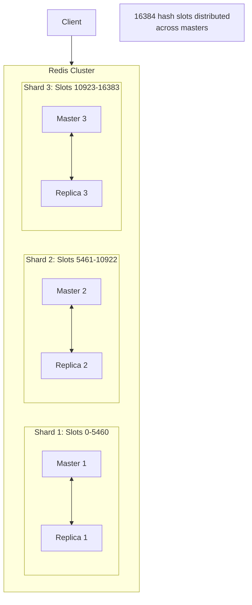

**Key Concepts:**
- **Hash Slots**: 16384 slots distributed across masters
- **Slot Assignment**: `slot = CRC16(key) mod 16384`
- **Automatic Failover**: Replica promoted if master fails
- **Horizontal Scaling**: Add nodes, rebalance slots

---

## 5. Redis vs Memcached

```
┌─────────────────────────────────────────────────────────────────────────────┐
│                     REDIS vs MEMCACHED                                      │
├─────────────────────────────────────────────────────────────────────────────┤
│                                                                             │
│  Feature              │ Redis                  │ Memcached                  │
│  ─────────────────────┼────────────────────────┼────────────────────────── │
│  Data Structures      │ Rich (strings, lists,  │ Strings only               │
│                       │ sets, hashes, etc.)    │                            │
│                       │                        │                            │
│  Persistence          │ RDB, AOF, Hybrid       │ None (pure cache)          │
│                       │                        │                            │
│  Replication          │ Master-replica         │ None built-in              │
│                       │                        │                            │
│  Clustering           │ Redis Cluster          │ Client-side sharding       │
│                       │                        │                            │
│  Pub/Sub              │ Yes                    │ No                         │
│                       │                        │                            │
│  Lua Scripting        │ Yes                    │ No                         │
│                       │                        │                            │
│  Transactions         │ MULTI/EXEC             │ CAS only                   │
│                       │                        │                            │
│  Memory Efficiency    │ Higher overhead        │ More memory efficient      │
│                       │                        │ for simple strings         │
│                       │                        │                            │
│  Multi-threading      │ Single-threaded*       │ Multi-threaded             │
│                       │ (*I/O threads in 6.0+) │                            │
│                       │                        │                            │
│  Max Value Size       │ 512 MB                 │ 1 MB                       │
│                                                                             │
└─────────────────────────────────────────────────────────────────────────────┘
```

### When to Choose Which?

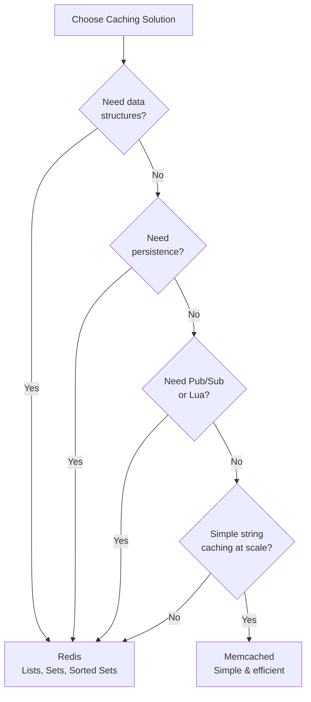

**Choose Redis when:**
- Need data structures (lists, sets, sorted sets)
- Need persistence
- Need pub/sub messaging
- Need Lua scripting
- Need transactions

**Choose Memcached when:**
- Simple key-value string caching
- Need maximum memory efficiency
- Already have multi-threaded architecture
- Pure ephemeral cache is acceptable

---

## 6. Cache Invalidation Strategies

> *"There are only two hard things in Computer Science: cache invalidation and naming things."*

### The Problem

```
┌─────────────────────────────────────────────────────────────────────────────┐
│                     THE CACHE INVALIDATION PROBLEM                          │
├─────────────────────────────────────────────────────────────────────────────┤
│                                                                             │
│  Scenario: User updates their profile                                       │
│                                                                             │
│  Database: { name: "Alice Smith" }   ← Updated                             │
│  Cache:    { name: "Alice Johnson" }  ← Still old data!                    │
│                                                                             │
│  What happens?                                                              │
│  • User sees old name until cache expires                                  │
│  • Other users see old name                                                │
│  • API returns inconsistent data                                           │
│                                                                             │
│  Solutions:                                                                 │
│  1. Time-based expiration (TTL)                                            │
│  2. Event-based invalidation                                               │
│  3. Version-based invalidation                                             │
│  4. Write-through caching                                                  │
│                                                                             │
└─────────────────────────────────────────────────────────────────────────────┘
```

### Strategy 1: TTL (Time-To-Live)

```python
# Set expiration when caching
cache.set("user:123", user_data, ttl=300)  # Expires in 5 minutes

# Pros:
# ✅ Simple to implement
# ✅ Automatic cleanup
# ✅ Memory efficient

# Cons:
# ❌ Data can be stale until TTL expires
# ❌ All items expire regardless of changes
```

**Choosing TTL Values:**

| Data Type | Suggested TTL | Reason |
|-----------|---------------|--------|
| User sessions | 1-24 hours | Security balance |
| Product catalog | 5-60 minutes | Moderate change frequency |
| Stock prices | 1-5 seconds | Highly volatile |
| Static content | 1 day - 1 week | Rarely changes |
| API rate limits | 1 minute - 1 hour | Reset window |

### Strategy 2: Event-Based Invalidation

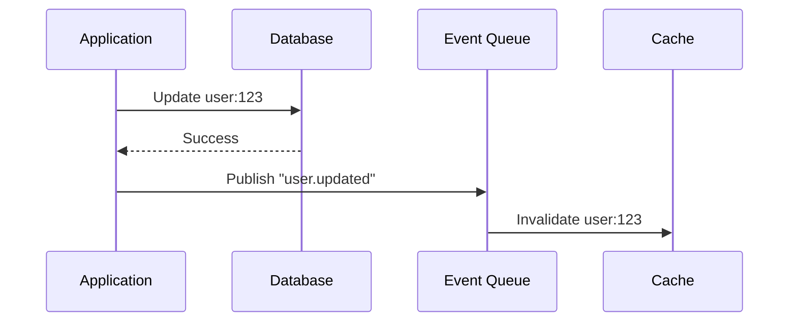

```python
# Event-based invalidation with message queue
from kafka import KafkaProducer, KafkaConsumer

# When data changes, publish event
def update_user(user_id: str, data: dict):
    db.update("users", user_id, data)
    
    # Publish invalidation event
    producer.send('cache-invalidation', {
        'type': 'user.updated',
        'key': f'user:{user_id}',
        'timestamp': time.time()
    })

# Cache invalidation worker
def invalidation_worker():
    consumer = KafkaConsumer('cache-invalidation')
    
    for message in consumer:
        event = message.value
        cache.delete(event['key'])
        
        # Also invalidate related caches
        if event['type'] == 'user.updated':
            cache.delete(f"user:{event['key']}:profile")
            cache.delete(f"user:{event['key']}:settings")
```

### Strategy 3: Version-Based (Cache Busting)

```python
# Include version in cache key
class VersionedCache:
    def __init__(self, cache):
        self.cache = cache
    
    def get_version(self, entity: str, entity_id: str) -> int:
        return self.cache.get(f"version:{entity}:{entity_id}") or 1
    
    def increment_version(self, entity: str, entity_id: str):
        return self.cache.incr(f"version:{entity}:{entity_id}")
    
    def get(self, entity: str, entity_id: str) -> any:
        version = self.get_version(entity, entity_id)
        key = f"{entity}:{entity_id}:v{version}"
        return self.cache.get(key)
    
    def set(self, entity: str, entity_id: str, value: any):
        version = self.get_version(entity, entity_id)
        key = f"{entity}:{entity_id}:v{version}"
        self.cache.set(key, value)
    
    def invalidate(self, entity: str, entity_id: str):
        # Increment version - old cached value becomes orphaned
        self.increment_version(entity, entity_id)

# Usage
vc = VersionedCache(redis)

# Cache key: user:123:v1
vc.set("user", "123", {"name": "Alice"})

# After update, version becomes 2
vc.invalidate("user", "123")

# New cache key: user:123:v2
vc.set("user", "123", {"name": "Alice Smith"})
```

### Strategy 4: Write-Through (Strong Consistency)

```python
# Update cache and DB together
def update_user(user_id: str, data: dict):
    # Start transaction
    try:
        # Update database first
        db.update("users", user_id, data)
        
        # Update cache with new data
        cache.set(f"user:{user_id}", data)
        
        # Both succeed
        return True
    except Exception as e:
        # Rollback: delete from cache if DB fails
        cache.delete(f"user:{user_id}")
        raise e
```

### Invalidation Patterns Summary

| Strategy | Consistency | Complexity | Best For |
|----------|-------------|------------|----------|
| **TTL** | Eventual | Low | General purpose |
| **Event-based** | Near real-time | Medium | Distributed systems |
| **Version-based** | Near real-time | Medium | High-read scenarios |
| **Write-through** | Strong | Low | Critical data |

---

## 7. CDN: Content Delivery Networks

### What is a CDN?

A **CDN** is a globally distributed network of servers that cache and deliver content from locations closer to users.

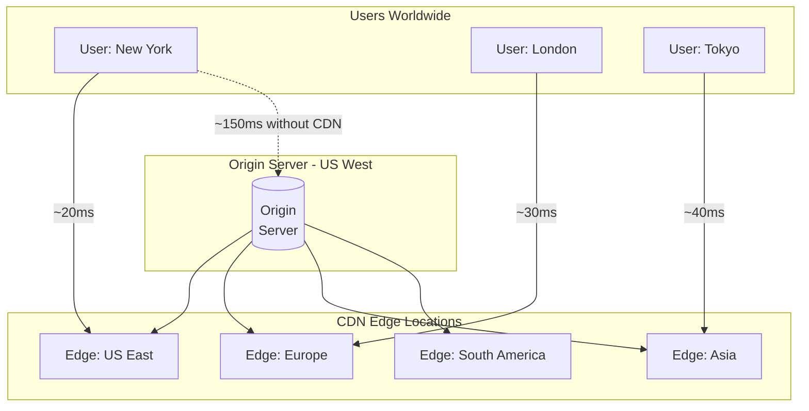

### How CDN Works

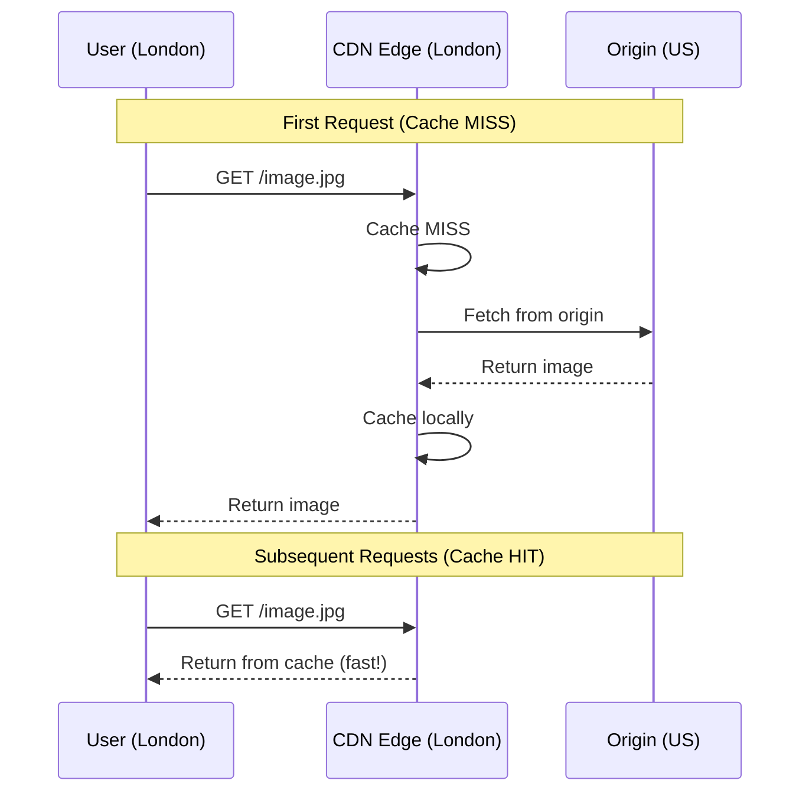

### CDN Benefits

```
┌─────────────────────────────────────────────────────────────────────────────┐
│                        CDN BENEFITS                                         │
├─────────────────────────────────────────────────────────────────────────────┤
│                                                                             │
│  ⚡ PERFORMANCE                                                             │
│  ─────────────────────────────────────────────────────────────────────────  │
│  • Reduced latency (serve from nearby edge)                                │
│  • Faster page loads (parallel downloads)                                  │
│  • Better user experience                                                   │
│                                                                             │
│  📈 SCALABILITY                                                             │
│  ─────────────────────────────────────────────────────────────────────────  │
│  • Handle traffic spikes (Black Friday, viral content)                     │
│  • Distribute load across edge servers                                     │
│  • Reduce origin server load by 80-90%                                     │
│                                                                             │
│  🛡️ RELIABILITY                                                             │
│  ─────────────────────────────────────────────────────────────────────────  │
│  • DDoS protection (absorb attacks at edge)                                │
│  • Redundancy (multiple edge locations)                                    │
│  • Origin protection (hide origin IP)                                      │
│                                                                             │
│  💰 COST SAVINGS                                                            │
│  ─────────────────────────────────────────────────────────────────────────  │
│  • Reduced bandwidth from origin                                           │
│  • Lower infrastructure costs                                              │
│  • Pay per usage (no over-provisioning)                                    │
│                                                                             │
└─────────────────────────────────────────────────────────────────────────────┘
```

### What to Cache on CDN

| Content Type | Cache Duration | Example |
|--------------|----------------|---------|
| **Static Assets** | Long (1 year) | JS, CSS, images |
| **Media** | Long (1 year) | Videos, audio |
| **Fonts** | Long (1 year) | WOFF, TTF files |
| **API Responses** | Short (seconds-minutes) | Product listings |
| **HTML Pages** | Short to Medium | Home page, category pages |
| **User-specific** | Don't cache | User profiles, carts |

### CDN Headers

```http
# Request from CDN to Origin
GET /image.jpg HTTP/1.1
Host: origin.example.com

# Response from Origin to CDN
HTTP/1.1 200 OK
Content-Type: image/jpeg
Cache-Control: public, max-age=31536000
ETag: "abc123"
Last-Modified: Wed, 15 Jan 2024 10:00:00 GMT

# CDN adds its own headers
X-Cache: HIT from edge-server-123
X-Cache-Hits: 1542
Age: 3600
CF-Cache-Status: HIT  (Cloudflare)
```

### Cache-Control Headers

```
┌─────────────────────────────────────────────────────────────────────────────┐
│                     CACHE-CONTROL DIRECTIVES                                │
├─────────────────────────────────────────────────────────────────────────────┤
│                                                                             │
│  CACHEABILITY                                                               │
│  ─────────────────────────────────────────────────────────────────────────  │
│  public         │ Can be cached by browsers and CDNs                       │
│  private        │ Only browser can cache (not CDN)                         │
│  no-cache       │ Must revalidate with origin each time                    │
│  no-store       │ Don't cache at all                                       │
│                                                                             │
│  EXPIRATION                                                                 │
│  ─────────────────────────────────────────────────────────────────────────  │
│  max-age=N      │ Cache for N seconds                                      │
│  s-maxage=N     │ CDN-specific max age (overrides max-age)                 │
│  stale-while-revalidate=N │ Serve stale while fetching fresh              │
│                                                                             │
│  VALIDATION                                                                 │
│  ─────────────────────────────────────────────────────────────────────────  │
│  must-revalidate │ Must check with origin when stale                       │
│  immutable      │ Never revalidate (for versioned assets)                  │
│                                                                             │
│  EXAMPLES                                                                   │
│  ─────────────────────────────────────────────────────────────────────────  │
│  Static assets:  Cache-Control: public, max-age=31536000, immutable        │
│  API responses:  Cache-Control: public, max-age=60, s-maxage=300           │
│  User pages:     Cache-Control: private, no-cache                          │
│  Sensitive data: Cache-Control: no-store                                   │
│                                                                             │
└─────────────────────────────────────────────────────────────────────────────┘
```

### CDN Providers Comparison

| Provider | Strengths | Best For |
|----------|-----------|----------|
| **Cloudflare** | Easy setup, DDoS protection, Workers | General purpose, security |
| **AWS CloudFront** | AWS integration, Lambda@Edge | AWS-based apps |
| **Akamai** | Largest network, enterprise | Large enterprises |
| **Fastly** | Instant purge, edge computing | Real-time invalidation |
| **Google Cloud CDN** | GCP integration | GCP-based apps |
| **Azure CDN** | Azure integration | Azure-based apps |

### CDN Cache Invalidation

```python
# Cloudflare API example
import requests

def purge_cloudflare_cache(zone_id: str, urls: list):
    """Purge specific URLs from Cloudflare cache"""
    response = requests.post(
        f"https://api.cloudflare.com/client/v4/zones/{zone_id}/purge_cache",
        headers={
            "Authorization": f"Bearer {CF_API_TOKEN}",
            "Content-Type": "application/json"
        },
        json={"files": urls}
    )
    return response.json()

# Purge everything (use sparingly!)
def purge_everything(zone_id: str):
    response = requests.post(
        f"https://api.cloudflare.com/client/v4/zones/{zone_id}/purge_cache",
        headers={"Authorization": f"Bearer {CF_API_TOKEN}"},
        json={"purge_everything": True}
    )
    return response.json()

# Better: Use cache tags for targeted invalidation
def purge_by_tag(zone_id: str, tags: list):
    response = requests.post(
        f"https://api.cloudflare.com/client/v4/zones/{zone_id}/purge_cache",
        headers={"Authorization": f"Bearer {CF_API_TOKEN}"},
        json={"tags": tags}  # e.g., ["product:123", "category:shoes"]
    )
    return response.json()
```

---

## 8. Multi-Layer Caching

### The Caching Pyramid

```
┌─────────────────────────────────────────────────────────────────────────────┐
│                     MULTI-LAYER CACHING                                     │
├─────────────────────────────────────────────────────────────────────────────┤
│                                                                             │
│                        ┌─────────┐                                         │
│                        │ Browser │  L1: Browser Cache                      │
│                        │  Cache  │  Latency: ~0ms                          │
│                        └────┬────┘                                         │
│                             │                                               │
│                    ┌────────┴────────┐                                     │
│                    │   CDN / Edge    │  L2: CDN Edge                       │
│                    │     Cache       │  Latency: 10-50ms                   │
│                    └────────┬────────┘                                     │
│                             │                                               │
│               ┌─────────────┴─────────────┐                                │
│               │    Application Cache      │  L3: Local App Cache           │
│               │     (In-Process)          │  Latency: <1ms                 │
│               └─────────────┬─────────────┘                                │
│                             │                                               │
│          ┌──────────────────┴──────────────────┐                           │
│          │       Distributed Cache             │  L4: Redis/Memcached      │
│          │       (Redis / Memcached)           │  Latency: 1-5ms           │
│          └──────────────────┬──────────────────┘                           │
│                             │                                               │
│     ┌───────────────────────┴───────────────────────┐                      │
│     │              Database                         │  L5: Database        │
│     │   (PostgreSQL / MySQL / MongoDB)              │  Latency: 5-100ms    │
│     └───────────────────────────────────────────────┘                      │
│                                                                             │
└─────────────────────────────────────────────────────────────────────────────┘
```

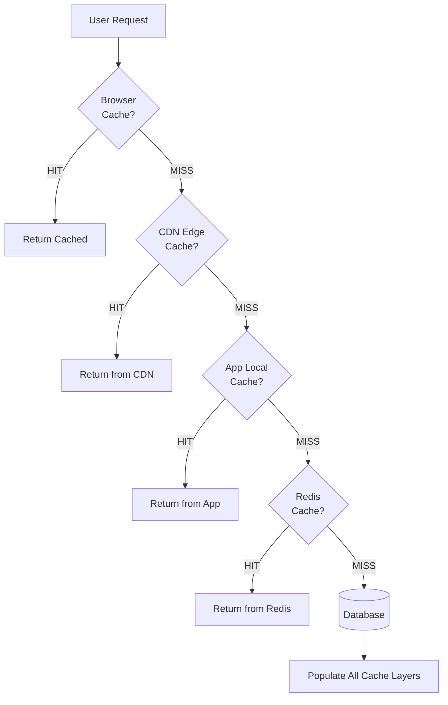

### Multi-Layer Implementation

```python
class MultiLayerCache:
    def __init__(self):
        self.local_cache = {}  # In-memory (L1)
        self.redis = redis.Redis()  # Distributed (L2)
    
    def get(self, key: str) -> any:
        # Layer 1: Local in-memory cache
        if key in self.local_cache:
            entry = self.local_cache[key]
            if entry['expires'] > time.time():
                return entry['value']
            else:
                del self.local_cache[key]
        
        # Layer 2: Distributed Redis cache
        value = self.redis.get(key)
        if value:
            # Populate L1 with shorter TTL
            self.local_cache[key] = {
                'value': value,
                'expires': time.time() + 60  # 1 min local cache
            }
            return value
        
        return None  # Cache miss - caller should fetch from DB
    
    def set(self, key: str, value: any, ttl: int = 3600):
        # Set in both layers
        self.redis.setex(key, ttl, value)
        self.local_cache[key] = {
            'value': value,
            'expires': time.time() + min(60, ttl)  # Local TTL ≤ Redis TTL
        }
    
    def delete(self, key: str):
        # Delete from both layers
        self.redis.delete(key)
        self.local_cache.pop(key, None)

# Usage
cache = MultiLayerCache()

def get_user(user_id: str):
    cache_key = f"user:{user_id}"
    
    # Check multi-layer cache
    user = cache.get(cache_key)
    if user:
        return user
    
    # Cache miss - fetch from database
    user = db.get_user(user_id)
    if user:
        cache.set(cache_key, user, ttl=3600)
    
    return user
```

### Cache Warming

Pre-populate cache before traffic hits:

```python
# Cache warming strategies

# 1. On startup
def warm_cache_on_startup():
    """Load frequently accessed data into cache"""
    # Top 1000 products
    top_products = db.query("SELECT * FROM products ORDER BY views DESC LIMIT 1000")
    for product in top_products:
        cache.set(f"product:{product.id}", product)
    
    # All categories
    categories = db.query("SELECT * FROM categories")
    for cat in categories:
        cache.set(f"category:{cat.id}", cat)

# 2. Scheduled job
@scheduler.cron("0 */4 * * *")  # Every 4 hours
def refresh_popular_items():
    """Refresh cache for trending items"""
    trending = analytics.get_trending_products(limit=100)
    for product_id in trending:
        product = db.get_product(product_id)
        cache.set(f"product:{product_id}", product)

# 3. Predictive warming
def warm_related_content(user_id: str):
    """Pre-cache content user is likely to view next"""
    # Get user's current context
    recently_viewed = get_recently_viewed(user_id)
    
    # Predict and pre-cache next items
    for item in recently_viewed[:5]:
        related = get_related_items(item)
        for related_item in related[:10]:
            cache.get_or_set(f"product:{related_item.id}", related_item)
```

---

## 9. Real-World Examples

### 🎬 Netflix: Global Streaming Infrastructure

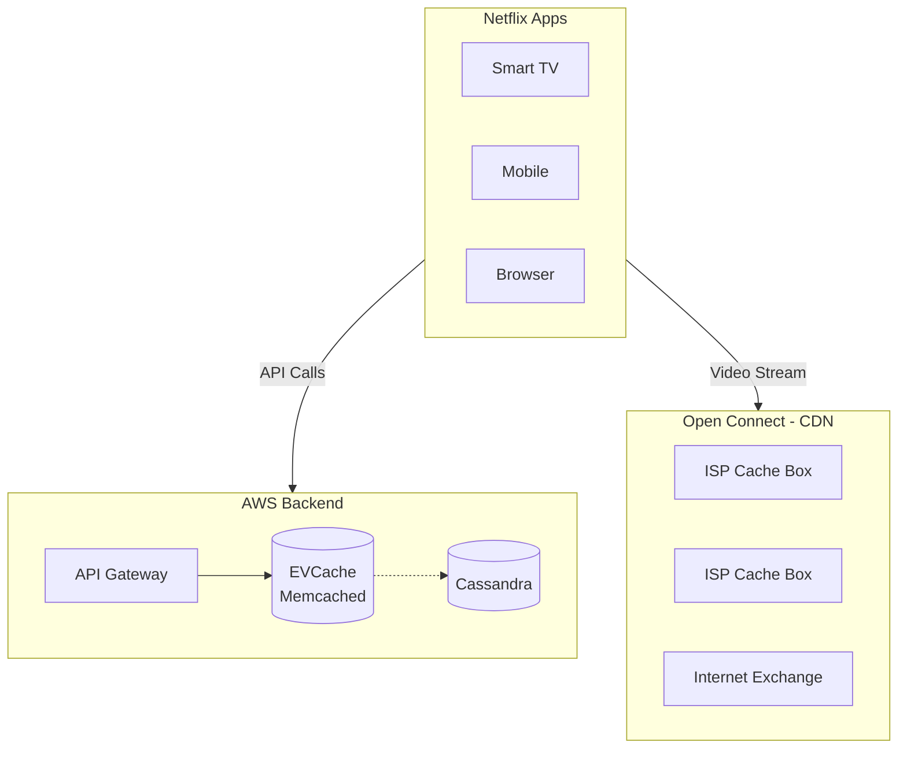

**Netflix Caching Strategy:**

| Layer | Technology | Purpose |
|-------|------------|---------|
| **Open Connect** | Custom CDN | Video streaming from ISP-local boxes |
| **EVCache** | Memcached clusters | Session, metadata, API responses |
| **Cassandra** | Distributed DB | Viewing history, preferences |

**Key Insights:**
- 95%+ of traffic served from Open Connect CDN
- EVCache handles millions of requests/second
- Multi-region caching for disaster recovery

### 📘 Facebook: Caching at Scale

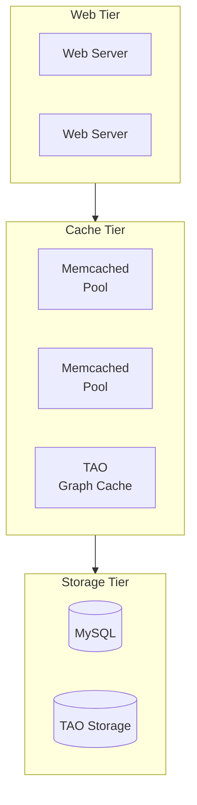

**Facebook's Multi-Layered Approach:**

1. **Memcached** — Key-value caching
   - ~1 billion requests/second
   - Distributed across data centers
   - Custom UDP protocol for efficiency

2. **TAO** — Graph-aware caching
   - Caches social graph queries
   - Understands relationships (friends, likes)
   - Read-through cache

3. **CDN** — Static assets
   - Photos, videos, JavaScript
   - Custom CDN infrastructure

### 🐦 Twitter: Timeline Caching

```
┌─────────────────────────────────────────────────────────────────────────────┐
│                     TWITTER TIMELINE CACHING                                │
├─────────────────────────────────────────────────────────────────────────────┤
│                                                                             │
│  FANOUT ON WRITE (Push Model)                                              │
│  ─────────────────────────────────────────────────────────────────────────  │
│                                                                             │
│  When @elonmusk tweets:                                                    │
│  1. Tweet stored in database                                               │
│  2. For each follower (140M+):                                             │
│     - Push tweet ID to their timeline cache (Redis)                        │
│                                                                             │
│  BUT... Celebrities break this model!                                      │
│  140M cache writes per tweet = Too expensive                               │
│                                                                             │
│  HYBRID APPROACH                                                            │
│  ─────────────────────────────────────────────────────────────────────────  │
│                                                                             │
│  For regular users (< 10K followers):                                      │
│  → Fan-out on write (push to follower timelines)                           │
│                                                                             │
│  For celebrities (> 10K followers):                                        │
│  → Fan-out on read (merge at query time)                                   │
│                                                                             │
│  Timeline = Cached tweets + Real-time celebrity tweets                     │
│                                                                             │
└─────────────────────────────────────────────────────────────────────────────┘
```

```python
# Twitter-style timeline caching

class TimelineService:
    def __init__(self, redis, db):
        self.redis = redis
        self.db = db
        self.CELEBRITY_THRESHOLD = 10000
    
    def post_tweet(self, user_id: str, tweet: dict):
        # Store tweet in database
        tweet_id = self.db.create_tweet(user_id, tweet)
        
        follower_count = self.db.get_follower_count(user_id)
        
        if follower_count < self.CELEBRITY_THRESHOLD:
            # Regular user: Fan-out on write
            self._fanout_to_followers(user_id, tweet_id)
        else:
            # Celebrity: Don't fan out (too expensive)
            # Followers will fetch on read
            pass
        
        return tweet_id
    
    def _fanout_to_followers(self, user_id: str, tweet_id: str):
        followers = self.db.get_followers(user_id)
        
        pipe = self.redis.pipeline()
        for follower_id in followers:
            pipe.lpush(f"timeline:{follower_id}", tweet_id)
            pipe.ltrim(f"timeline:{follower_id}", 0, 800)  # Keep last 800
        pipe.execute()
    
    def get_timeline(self, user_id: str, page: int = 0) -> list:
        # Get cached timeline (regular users' tweets)
        cached_ids = self.redis.lrange(
            f"timeline:{user_id}",
            page * 20,
            (page + 1) * 20 - 1
        )
        
        # Get followed celebrities' recent tweets (merged at read time)
        celebrities = self.db.get_followed_celebrities(user_id)
        celebrity_tweets = self.db.get_recent_tweets(celebrities, limit=50)
        
        # Merge and sort by time
        all_tweets = self._merge_timelines(cached_ids, celebrity_tweets)
        
        return all_tweets[:20]
```

### 🛒 Amazon: E-commerce Caching

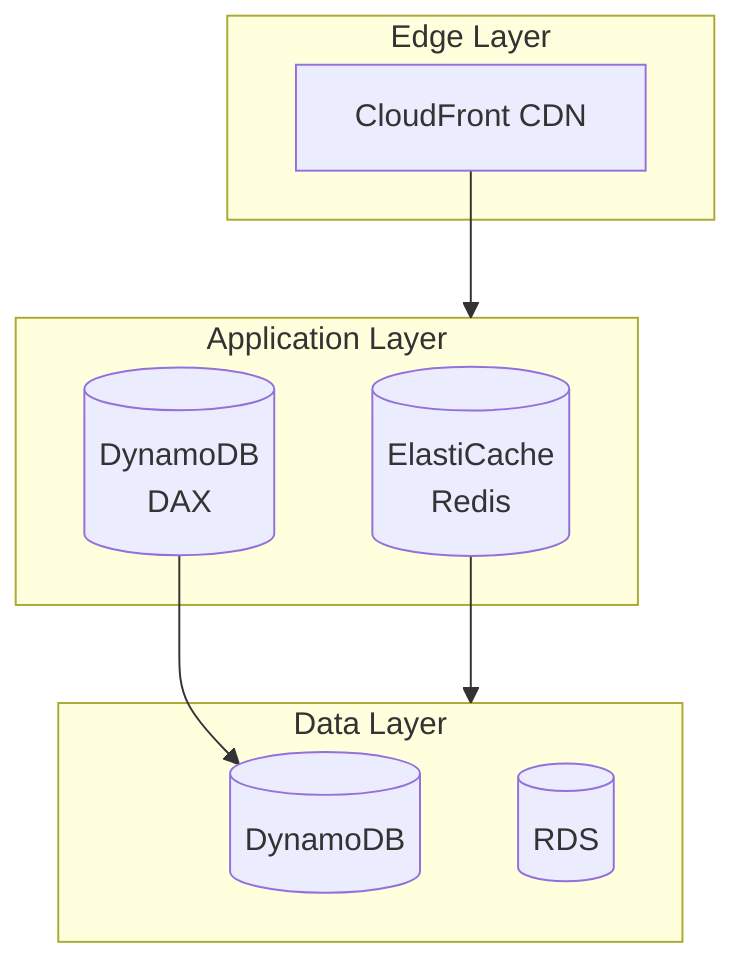

**Amazon's Caching Strategy:**

| Use Case | Cache Layer | Technology |
|----------|-------------|------------|
| Product pages | CDN | CloudFront |
| Session data | Application | ElastiCache (Redis) |
| DynamoDB reads | Database | DAX (Accelerator) |
| Search results | Application | ElastiCache |
| Recommendations | Application | Precomputed + cached |

---

## 10. Common Pitfalls

### Pitfall 1: Cache Stampede (Thundering Herd)

```
┌─────────────────────────────────────────────────────────────────────────────┐
│                        CACHE STAMPEDE                                       │
├─────────────────────────────────────────────────────────────────────────────┤
│                                                                             │
│  Problem:                                                                   │
│  Cache expires → 1000 concurrent requests → ALL hit database              │
│                                                                             │
│  Timeline:                                                                  │
│  T0: Cache expires                                                         │
│  T1: Request 1 checks cache → MISS → queries DB                           │
│  T1: Request 2 checks cache → MISS → queries DB                           │
│  T1: Request 3 checks cache → MISS → queries DB                           │
│  ...                                                                        │
│  T1: Request 1000 checks cache → MISS → queries DB                        │
│                                                                             │
│  Result: Database overwhelmed! 💥                                          │
│                                                                             │
└─────────────────────────────────────────────────────────────────────────────┘
```

**Solutions:**

```python
# Solution 1: Locking
def get_with_lock(key: str) -> any:
    value = cache.get(key)
    if value:
        return value
    
    lock_key = f"lock:{key}"
    
    # Try to acquire lock
    if cache.set(lock_key, "1", nx=True, ex=10):  # Lock for 10s
        try:
            # Only one request fetches from DB
            value = db.query(key)
            cache.set(key, value, ttl=3600)
            return value
        finally:
            cache.delete(lock_key)
    else:
        # Wait and retry
        time.sleep(0.1)
        return get_with_lock(key)

# Solution 2: Probabilistic early expiration
def get_with_early_refresh(key: str, ttl: int = 3600) -> any:
    data = cache.get_with_ttl(key)
    
    if data is None:
        return refresh_cache(key, ttl)
    
    value, remaining_ttl = data
    
    # Probabilistic early refresh
    # As TTL approaches 0, refresh probability increases
    if random.random() < (1 - remaining_ttl / ttl) * 0.1:
        # 10% chance to refresh early, scaling with TTL
        asyncio.create_task(refresh_cache_async(key, ttl))
    
    return value

# Solution 3: Stale-while-revalidate
def get_stale_while_revalidate(key: str) -> any:
    data = cache.get(key)
    
    if data is None:
        return refresh_cache(key)
    
    if is_stale(data):
        # Return stale data immediately
        asyncio.create_task(refresh_cache_async(key))
    
    return data['value']
```

### Pitfall 2: Cache Penetration

```
┌─────────────────────────────────────────────────────────────────────────────┐
│                        CACHE PENETRATION                                    │
├─────────────────────────────────────────────────────────────────────────────┤
│                                                                             │
│  Problem:                                                                   │
│  Requests for data that DOESN'T EXIST bypass cache and hit DB             │
│                                                                             │
│  Attack scenario:                                                           │
│  GET /user/999999999 (doesn't exist)                                       │
│  → Cache MISS → DB query → NULL → Not cached → Repeat forever             │
│                                                                             │
│  Solutions:                                                                 │
│  1. Cache null results (with short TTL)                                    │
│  2. Bloom filter to check existence                                        │
│  3. Input validation                                                        │
│                                                                             │
└─────────────────────────────────────────────────────────────────────────────┘
```

```python
# Solution 1: Cache null results
def get_user(user_id: str):
    cache_key = f"user:{user_id}"
    
    cached = cache.get(cache_key)
    if cached is not None:
        if cached == "__NULL__":
            return None  # Cached non-existence
        return cached
    
    user = db.get_user(user_id)
    
    if user:
        cache.set(cache_key, user, ttl=3600)
    else:
        # Cache null with shorter TTL
        cache.set(cache_key, "__NULL__", ttl=60)
    
    return user

# Solution 2: Bloom filter
from pybloom_live import BloomFilter

# Initialize with expected items and error rate
user_exists_filter = BloomFilter(capacity=10000000, error_rate=0.001)

# Populate from database
for user_id in db.get_all_user_ids():
    user_exists_filter.add(user_id)

def get_user_with_bloom(user_id: str):
    # Check bloom filter first (fast, O(1))
    if user_id not in user_exists_filter:
        return None  # Definitely doesn't exist
    
    # Might exist, check cache/DB
    return get_user(user_id)
```

### Pitfall 3: Hot Key Problem

```python
# Problem: One key gets too many requests
# Example: Viral tweet, flash sale product

# Solution 1: Local caching for hot keys
class HotKeyCache:
    def __init__(self):
        self.local_cache = {}
        self.hot_key_threshold = 1000  # requests per second
        self.request_counts = defaultdict(int)
    
    def get(self, key: str):
        # Track request frequency
        self.request_counts[key] += 1
        
        # Check if hot key
        if self._is_hot_key(key):
            # Use local cache for hot keys
            if key in self.local_cache:
                return self.local_cache[key]
        
        # Regular distributed cache
        value = redis.get(key)
        
        if self._is_hot_key(key):
            self.local_cache[key] = value
        
        return value

# Solution 2: Key replication
def get_hot_key_with_replicas(key: str, replicas: int = 3):
    # Randomly select a replica
    replica_key = f"{key}:replica:{random.randint(0, replicas - 1)}"
    
    value = redis.get(replica_key)
    if value is None:
        value = redis.get(key)  # Fallback to main key
    
    return value
```

---

## 11. Interview Corner

### 🎯 Top Interview Questions

**Q1: Design a caching strategy for an e-commerce product page.**

<details>
<summary>Click to see answer</summary>

**Multi-layer approach:**

1. **Browser Cache** (Cache-Control headers)
   - Static assets: `max-age=31536000, immutable`
   - Product data: `max-age=60, stale-while-revalidate=300`

2. **CDN Layer**
   - Cache product images, CSS, JS
   - Edge cache API responses (vary by no auth)

3. **Application Cache (Redis)**
   - Product details: `product:{id}` with 5-minute TTL
   - Inventory counts: `inventory:{id}` with 30-second TTL
   - Reviews: `reviews:{id}` with 10-minute TTL

4. **Cache Invalidation**
   - Product update → invalidate `product:{id}`
   - Order placed → decrement `inventory:{id}`

**Code structure:**
```python
def get_product_page(product_id):
    # Check Redis first
    product = cache.get(f"product:{product_id}")
    if not product:
        product = db.get_product(product_id)
        cache.set(f"product:{product_id}", product, ttl=300)
    
    # Inventory has shorter TTL (frequently changing)
    inventory = cache.get(f"inventory:{product_id}")
    if not inventory:
        inventory = db.get_inventory(product_id)
        cache.set(f"inventory:{product_id}", inventory, ttl=30)
    
    return {**product, "inventory": inventory}
```

</details>

**Q2: How would you handle cache invalidation in a distributed system?**

<details>
<summary>Click to see answer</summary>

**Strategies:**

1. **Event-driven invalidation**
   - Publish events on data changes
   - Cache services subscribe and invalidate
   - Example: Kafka topic `cache-invalidation`

2. **TTL-based with early refresh**
   - Set reasonable TTLs
   - Refresh before expiration probabilistically

3. **Version-based**
   - Include version in cache key
   - Increment version on update
   - Old versions become orphaned

4. **Write-through**
   - Update cache synchronously with database
   - Strongest consistency

**Best practices:**
- Use short TTLs for frequently changing data
- Batch invalidations when possible
- Use cache tags for group invalidation
- Monitor cache hit rates and invalidation patterns

</details>

**Q3: Explain the difference between Redis and Memcached.**

<details>
<summary>Click to see answer</summary>

| Feature | Redis | Memcached |
|---------|-------|-----------|
| Data structures | Rich (lists, sets, hashes, sorted sets) | Strings only |
| Persistence | RDB, AOF | None |
| Replication | Built-in | None |
| Clustering | Redis Cluster | Client-side |
| Pub/Sub | Yes | No |
| Lua scripting | Yes | No |
| Memory efficiency | Higher overhead | More efficient |
| Multi-threading | Single-threaded* | Multi-threaded |

**Choose Redis when:** Need data structures, persistence, or pub/sub
**Choose Memcached when:** Simple string caching, maximum memory efficiency

</details>

**Q4: What is cache stampede and how do you prevent it?**

<details>
<summary>Click to see answer</summary>

**Cache Stampede:** When cached item expires and many concurrent requests all try to regenerate it, overwhelming the database.

**Prevention strategies:**

1. **Locking** — Only one request regenerates cache
2. **Probabilistic early expiration** — Random requests refresh before expiration
3. **Stale-while-revalidate** — Serve stale data while refreshing
4. **External refresh** — Background job refreshes popular items

```python
# Locking example
def get_with_lock(key):
    value = cache.get(key)
    if value:
        return value
    
    if acquire_lock(f"lock:{key}"):
        try:
            value = db.query(key)
            cache.set(key, value)
            return value
        finally:
            release_lock(f"lock:{key}")
    else:
        time.sleep(0.1)
        return get_with_lock(key)  # Retry
```

</details>

---

## 12. Quick Recap

### TL;DR Summary Card

```
┌─────────────────────────────────────────────────────────────────────────────┐
│                    CHAPTER 04: QUICK RECAP                                  │
├─────────────────────────────────────────────────────────────────────────────┤
│                                                                             │
│  📌 CACHING PATTERNS                                                        │
│     Cache-Aside: App manages cache (most common)                           │
│     Read-Through: Cache handles DB fetch                                   │
│     Write-Through: Sync write to cache + DB                                │
│     Write-Behind: Async DB write (fastest)                                 │
│                                                                             │
│  📌 REDIS                                                                   │
│     Data structures: Strings, Lists, Sets, Hashes, Sorted Sets             │
│     Use cases: Caching, sessions, rate limiting, leaderboards              │
│     Persistence: RDB (snapshots), AOF (log), Hybrid                        │
│                                                                             │
│  📌 CACHE INVALIDATION                                                      │
│     TTL: Simple, eventual consistency                                      │
│     Event-based: Near real-time, needs message queue                       │
│     Version-based: Change key on update                                    │
│     Write-through: Strong consistency                                      │
│                                                                             │
│  📌 CDN                                                                     │
│     Cache static assets at edge locations                                  │
│     Reduce latency and origin load                                         │
│     Use Cache-Control headers                                              │
│                                                                             │
│  📌 PITFALLS                                                                │
│     Stampede: Use locking or probabilistic refresh                         │
│     Penetration: Cache null values, use bloom filters                      │
│     Hot keys: Local cache, key replication                                 │
│                                                                             │
└─────────────────────────────────────────────────────────────────────────────┘
```

---

## 13. Further Reading

### 📚 Recommended Resources

**Papers:**
- [Scaling Memcache at Facebook](https://www.usenix.org/system/files/conference/nsdi13/nsdi13-final170_update.pdf)
- [TAO: Facebook's Distributed Data Store](https://www.usenix.org/system/files/conference/atc13/atc13-bronson.pdf)

**Documentation:**
- [Redis Documentation](https://redis.io/documentation)
- [Cloudflare Learning Center](https://www.cloudflare.com/learning/)
- [AWS ElastiCache Best Practices](https://docs.aws.amazon.com/AmazonElastiCache/latest/red-ug/BestPractices.html)

**Tools:**
- [Redis Insight](https://redis.com/redis-enterprise/redis-insight/) — Redis GUI
- [Memcached](https://memcached.org/)
- [Varnish Cache](https://varnish-cache.org/) — HTTP accelerator

---

## 📱 Share This Chapter

> *"The fastest database query is the one you don't have to make."*

**Key Takeaways to Share:**

```
⚡ CACHING ESSENTIALS

1️⃣ Cache-Aside is your default pattern
2️⃣ Redis > Memcached for most use cases
3️⃣ Cache invalidation is HARD - plan for it
4️⃣ Use CDN for static assets (80-90% of traffic)
5️⃣ Multi-layer caching for best performance

#SystemDesign #Caching #Redis #CDN
```

---

<div align="center">

## Navigation

[](../03-data-storage/README.md)
[](../05-hld/README.md)

---

**[⬆ Back to Top](#chapter-04-caching--cdn)** | **[📚 Table of Contents](../../README.md)**

</div>
